### Overview

Throughout the course of mock election week, the AOC campaign conducted a series of polls to understand voter sentiment, track shifts in candidate preference, and identify the issues most important to the people. To start, the AOC campaign drafted a benchmark poll that was published on the Google Classroom pages of all four grades. This provided the entire campaign on what issues should be covered during daily campaign breakfast and lunch events, the kickoff assembly, and the mock election debate. 

Each following poll served a distinct strategic purpose. The Post-Kickoff Poll, subject to non-partisan restrictions set by Mr. Gilligan, focused on understanding the electorate's issue priorities and awareness of the candidates. The poll was intended to identify the issues voters cared most about, gauge how politically informed the student body was, and determine what formats and events from previous mock elections had been most effective in informing voters. Each following day after the kickoff, the AOC campaign conducted polls that was based on the policy issues that AOC talked about that day. This was the start of using physical polls where AOC pollsters went to high school advisories in order to get an idea of what is and isn’t working with our daily campaign events and social media posts, as well as what the voters are most interested in having addressed during the upcoming debate.

### Initial Benchmark Polling

Data Source: Student Survey (Google Sheets)
Total Respondents (Sample Size): 43

The poll was distributed to all four grades via Google Classroom during the snow day and was designed to give the campaign a foundational understanding of the electorate before any partisan messaging had been released. A total of 43 respondents completed the poll. While not a fully representative sample of the high school, the results provided early directional data that informed how the campaign would frame its messaging during daily breakfast and lunch events and at the kickoff assembly.

#### *Chart 1A: Issue Priority by Political Leaning*
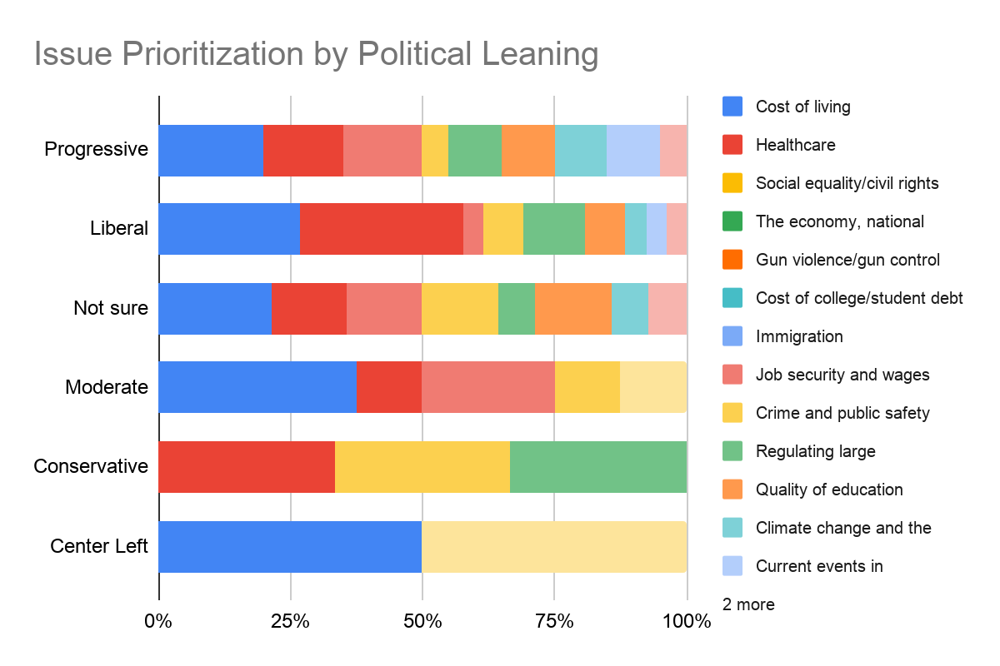

The results show the respondents had a strong left-leaning preference. Out of 43 respondents, 39.5% or 17 people identified as Liberal, while 37.2% or 16 people identified as Progressive. About 25.6% or 11 people fall under the "Not sure" category, making it the largest segment of persuadables. Moderates and Conservatives combined account for less than 15% of the total respondents.

A noteworthy observation is that people's political leanings correlate with their issue priorities. For example, Progressives prioritize Social equality and civil rights, as well as Climate change and the environment. On the other hand, "Not sure" and Moderate/Conservative prioritize the economy, national debt, inflation, crime, and public safety.

#### *Chart 1B: Demographic Breakdown of Gender, Issue Prioritizations*

  
  


The early results show a clear female engagement advantage. Female respondents account for 60.5% or 26 people, while males account for 37.2% or 16 people. One person preferred not to say.

The issues are divided into two categories: Female Priorities and Male Priorities. Female Priorities: Social and healthcare issues are the major concerns of female voters, with Social Equality and Civil Rights and Healthcare being the top issues, followed by Immigration and Gun Violence. Male Priorities: The economic issues are of utmost importance to male voters, with Cost of Living and The Economy, National Debt, and Inflation being the top issues, followed by Job Security and Wages.

#### *Chart 1C: Overall Top Issues*
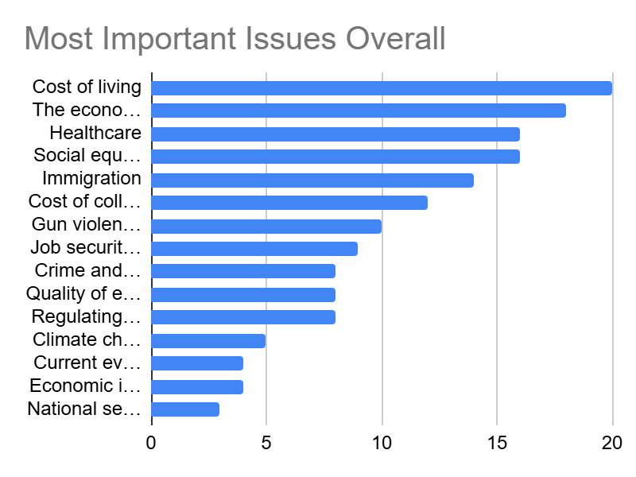

To effectively connect with the mandated electorate, campaign rhetoric, posters, and social media communications should emphasize the top issues of concern to the student body. Based on the 43 respondents choosing their Top Three issues, the top issues are:

Economic issues (Cost of living, Economy/Inflation) and fundamental social/welfare issues (Healthcare, Equality) dominate the dialogue of this election cycle.

### Post-Kickoff Assembly Poll

Following the kickoff assembly, the AOC campaign conducted a second poll to assess the immediate impact of the event on voter sentiment. This poll was partisan in nature, allowing the campaign to ask more direct questions about candidate preference, issue priorities, and initial impressions of both candidates. The poll was distributed digitally, with AOC informants encouraging participation in the auditorium following the assembly. The campaign collected responses from the electorate who were present and willing to participate.

#### *Chart 2A: Candidate Support Stability / Voter Volatility*
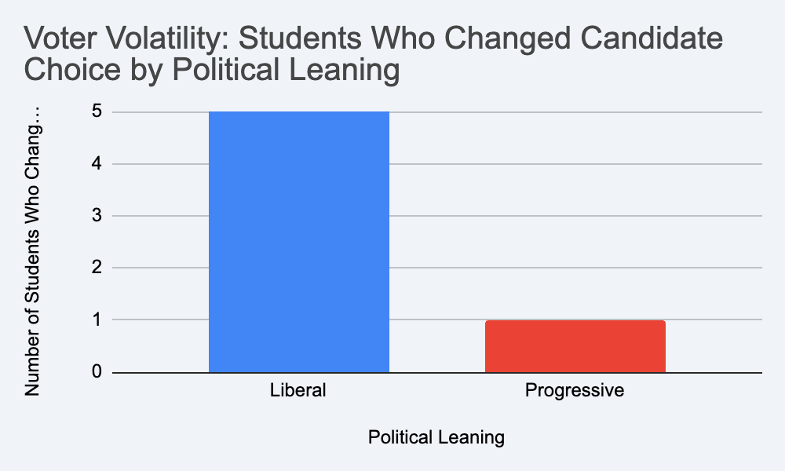

Assesses previous event knowledge levels (measured by a scale from 1 to 5), mind-changing impact levels (measured by a scale from 1 to 5), and candidate preference shifts between Josh Shapiro and Alexandria Ocasio-Cortez.

The general trend in candidate support after the kickoff event shows a "net zero" effect in candidate support shifts. Alexandria Ocasio-Cortez started and ended with precisely 16 supporters, while Josh Shapiro started and ended with precisely 11 supporters.

However, by matching initial candidate support with final candidate support after the event, it is evident that a significant amount of volatility is present in the electorate. A total of 6 students changed their votes during the event.
3 students changed from AOC to Shapiro.
3 students changed from Shapiro to AOC.
The data also points to a segment of voters from the "Liberal" demographic as being more volatile in candidate support.
5 out of 6 students changed their candidate support from initial to final.

#### *Chart 2B: Assembly Impact on Voter Perspectives*
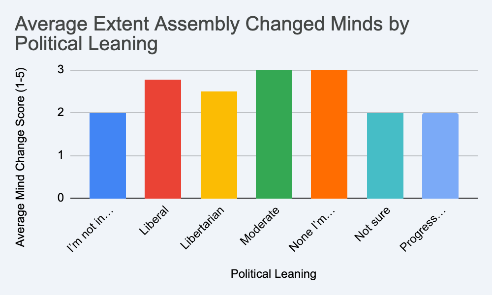

When asked to rate how much the kickoff changed their mind on a scale of 1 to 5, you can see that this figure varies according to political leaning.

In line with the volatility of the data in the candidate preference chart, the "Moderate" and "Liberal" groups were the most susceptible to the assembly's messages. This is evidenced by the fact that the former had an average "Mind Change" of 3.00, while the latter had an average of 2.77. The "Progressive" and "Not sure" groups were the least susceptible to the assembly's messages, as evidenced by their average mind change score of 2.00. 

#### *Chart 2C: How much did the people learn?*
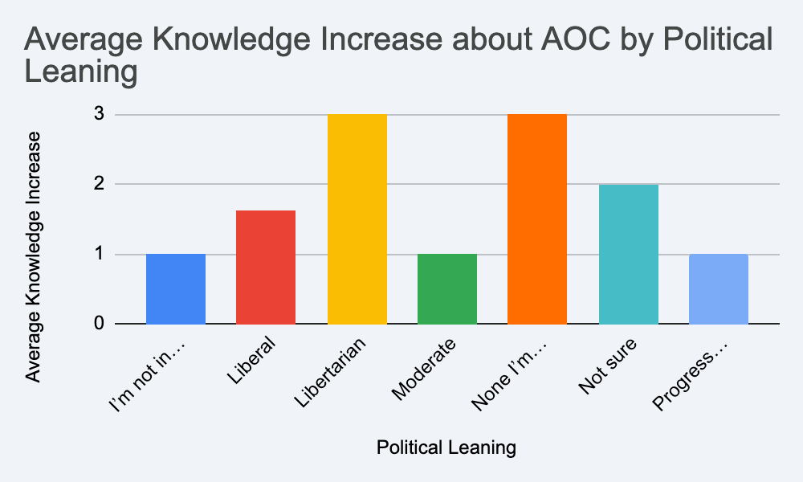

The survey also assessed the difference between what a student knew about AOC prior to the assembly and what they knew about AOC after the assembly. 

All the assessed groups had a higher average knowledge about Alexandria Ocasio-Cortez after the kickoff assembly than they did prior to the assembly. The groups with the highest increase in their knowledge about AOC were the "Libertarian" and the unaligned groups, with each having an average increase of 3.0 points. The Progressive and Moderate groups had the lowest increase in their knowledge about AOC, at 1.0 points. This may indicate that these groups had a general idea about AOC even prior to the assembly.

### Mid-Campaign Polling

Total Respondents (Sample Size): 38
This poll was conducted during the main campaign week of the mock election. The poll was intended to gauge the effectiveness of the previous day's breakfast and lunch presentations, specifically AOC’s Tuesday tax policy presentation. The poll was conducted on paper passed out to a random sample of students in different advisories on Wednesday morning.

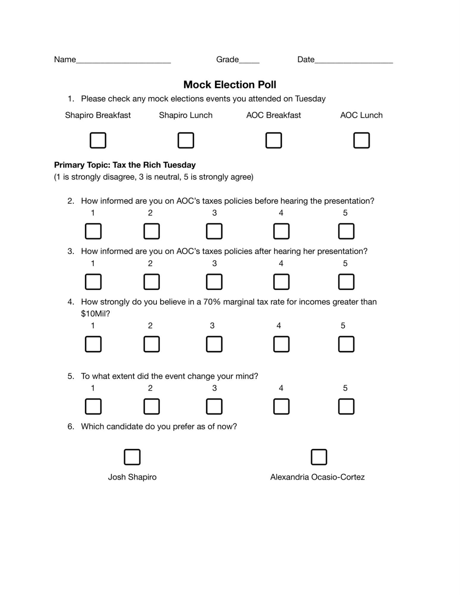

The poll consisted of 6 questions and spaces for respondents’ names and grades. The poll's first question allowed respondents to indicate which campaign events they had attended the previous day. The following questions had respondents answer questions relevant to the AOC presentation on the previous day. The poll's final question simply asked respondents to select which candidate they preferred at the time of response.

#### *Chart 3A: Preferred Candidate based on Grade Level*
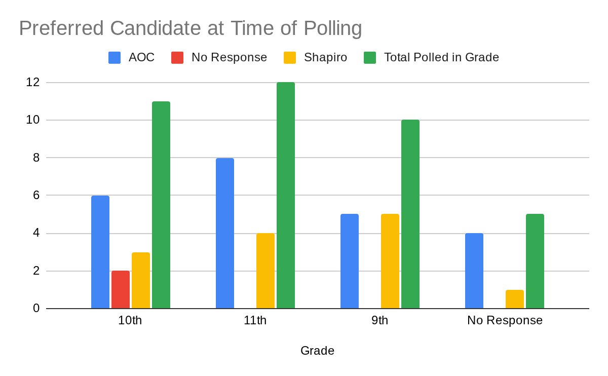

Different levels of candidate preference exist within different grade levels. For example, in the 11th grade, 66.6% of those polled preferred AOC compared to only 33.3%  preferring Shapiro. Comparatively, in the 9th grade, there was a 50-50 split in support between the two candidates. The polling results from 10th grade were also interesting, with 18.2% of voters not indicating a candidate preference. Overall, the varied level of support for different candidates between grade levels indicates that certain candidates may be more or less appealing to certain grade levels. It is also plausible that the small sample size of the poll introduced random error. This means it's possible that a larger poll could lead to more standard preference across grade levels.

#### *Chart 3B: Policy knowledge based on Preferred Candidate*
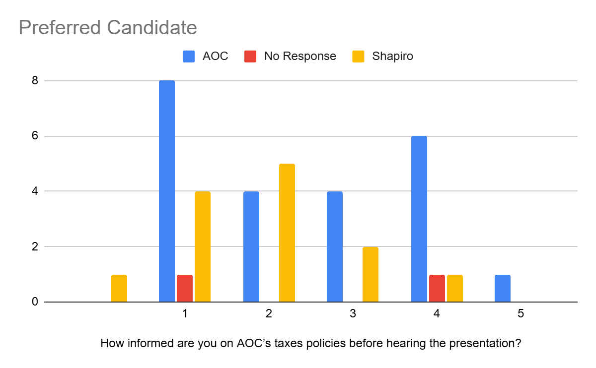

Respondents' initial knowledge of AOC’s tax policy within the sample group was different depending on the candidate they preferred. Those who preferred AOC had, on a 1-5 scale, an average initial knowledge of 2.714. Those who preferred Shapiro had an average initial knowledge of 2. Also interesting to note, those who supported AOC had a larger percentage of people on the extreme ends of the scale, meaning they felt they had very little or a great understanding of AOC’s tax policy. Comparatively, those who preferred Shapiro skewed towards the center of the scale. These results could indicate that being more initially knowledgeable about a candidate could lead to you supporting them.

#### *Chart 3C: Policy knowledge based on Events Attended*
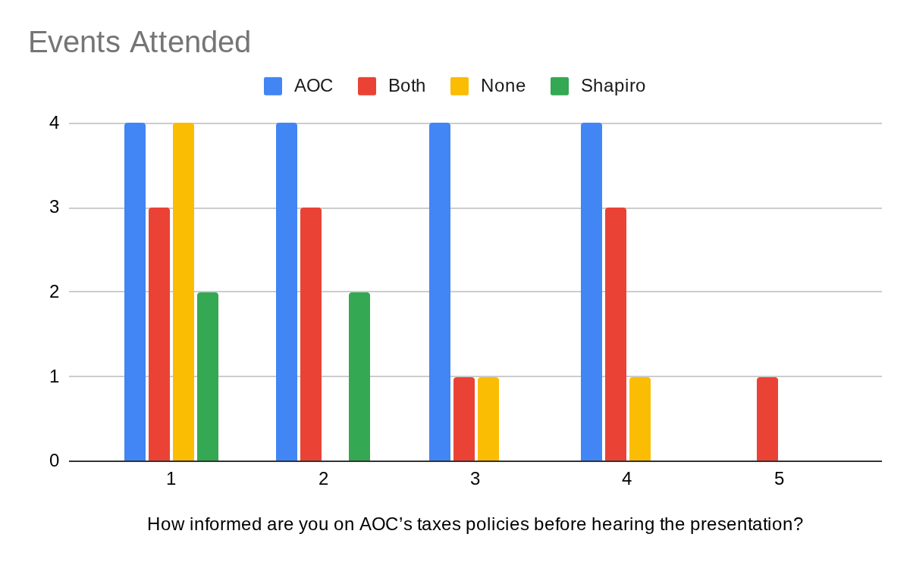

Initial knowledge about AOC’s tax policy varied based on the events attended by respondents. The average initial knowledge on the 1-5 scale for someone who attended at least 1 AOC event was 2.56. The average initial knowledge of someone who attended no AOC events was 1.7. This indicates that voters' decision to attend an event generally does not relate to their desire to learn more about a candidate's policy that they are unfamiliar with, and must be caused by something else. Also of note, on the 1-5 scale, the average initial knowledge of those who attended only AOC events was 2.5.

#### *Chart 3D: Policy knowledge based on attending the AOC Tuesday Event*
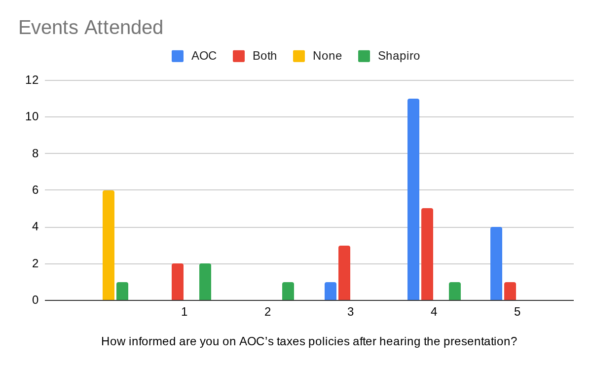

Those who attended AOC’s Tuesday events generally felt like they were informed about AOC’s tax policy. The average indicated knowledge on the 1-5 scale for someone who attended at least 1 AOC event after the event was 3.81. For those who attended only AOC events, the average indicated knowledge was 4.19. These are increases from the initial averages of 2.56 and 2.5 for the same groups. This indicates that respondents who attended the events felt they were effective in informing them about AOC’s tax policy. Interesting to note that some respondents who only attended Shapiro responded to the questions with different answers than theirs for before the event. This could indicate that they did their own research on AOC’s policy or possible unreliability in respondents' answers.

#### *Chart 3E: Candidate Preference based on Events*
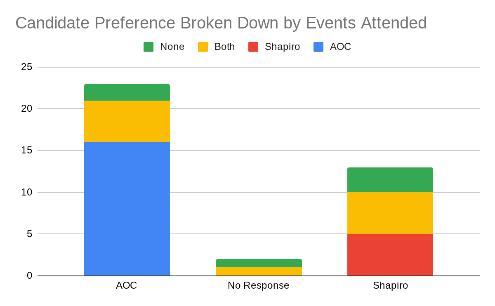

The poll helps us to understand the relationship between which events voters are attending and which candidate they support. At the time of polling, 60.5% of those polled indicated that they preferred AOC, 34.2% indicated that they preferred Shapiro, and 5.3% didn’t indicate a preference for either candidate. This shows a strong preference for AOC and lead in the campaign at the time of polling. Something of note is that of those who only attended AOC events or only attended Shapiro events, no respondent indicated a preference for the other candidate. Both candidates split the preference of respondents who attended both campaign events. However, since the Shapiro campaign yielded less overall preference, their percentage of preference from those who attended both events is much greater than that of the AOC campaign. Of the respondents who had no events, 60% preferred Shapiro and 40% preferred AOC.

### Pre-Debate Preparation Polling

Total Respondents (Sample Size): 36
This poll was conducted during the main campaign week on the Thursday prior to the debate. The poll was intended to get a final understanding of voter views and concerns so they could be addressed within the debate. The poll was conducted digitally through Google Form.

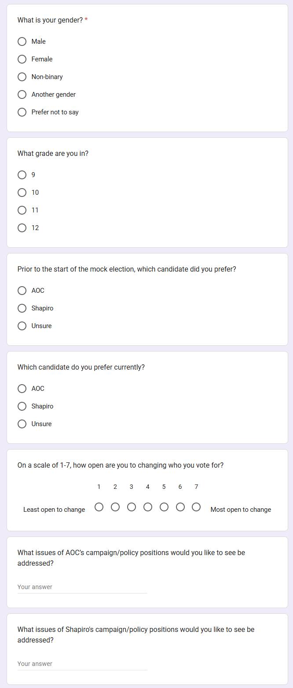

The poll consisted of 7 total questions. The poll's first two questions allow respondents to input relevant demographic info. The next two questions allow respondents to indicate both their current and initial candidate preference. Then, respondents are asked to rate how possible it would be for their candidate preference to change.

#### *Chart 4A: Preferred Candidate based on Gender before Election*
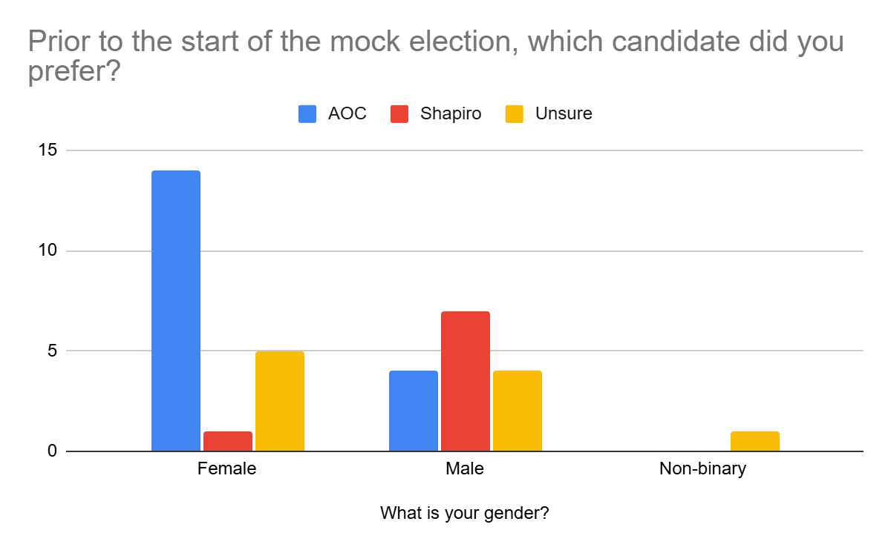

Before the start of the mock election, 50% of those polled preferred AOC, 22.2% preferred Shapiro, and 27.8% were unsure. Of the group surveyed, 55.6% were female, 41.7% were male, and 2.8% were non-binary. Initial preference among those surveyed varied greatly based on gender. Of the women surveyed, 70% said they initially preferred AOC, only 5% said they initially preferred Shapiro, and 25% said they were unsure. Of the men surveyed, 26.7% said they initially preferred AOC, 46.7% said they initially preferred Shapiro, and 26.7% were unsure. The one non-binary voter indicated they were unsure. This large divide in initial candidate preference based on gender could possibly indicate that voters are more likely to prefer candidates of their own gender, or that voters of certain genders are more likely to prefer candidates of certain ideologies.

#### *Chart 4B: Preferred Candidate based on Gender Pre-Debate Day*
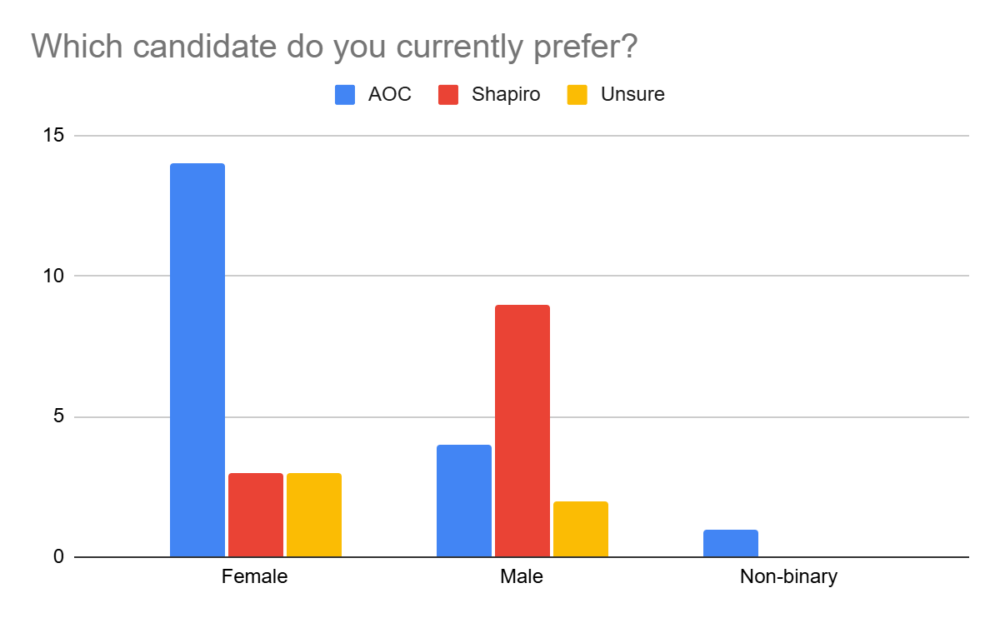

By the time of polling, 52.8% of those polled preferred AOC, 33.3% preferred Shapiro, and 13.9% were unsure. Of the women surveyed, 70% said they preferred AOC, 15% said they preferred Shapiro, and 15% said they were unsure. Of the men, 26.7% said they preferred AOC, 60% said they preferred Shapiro, and 13.3% were unsure. The one non-binary voter preferred AOC. 50% percent of the voters who were unsure at the start of the mock election indicated a preference by the time of polling. Of this 50%, 80% of them preferred Shapiro, and only 20% of them preferred AOC. There was no change in the number of male or female voters who preferred AOC. This could indicate that the AOC campaign struggled to win over unsure voters despite being able to hold its lead in the polls.

#### *Chart 4C: Voter Volatility Pre-Debate based on Preferred Candidate*
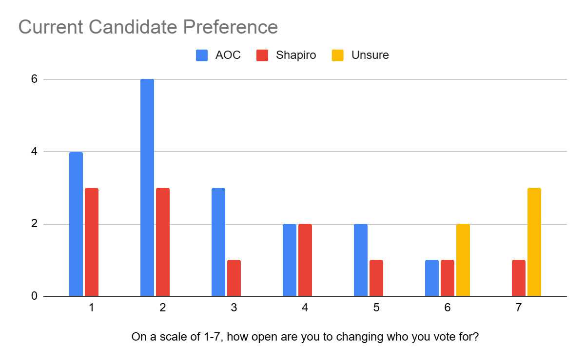

Among those who were polled, openness to change candidate preference related to which candidate they currently preferred. Those who preferred AOC on a 1-7 scale had an average response of 2.72 in terms of openness to changing candidate preference. Those who preferred Shapiro had an average response of 3.17. Unsure voters had an average response of 6.6. The results indicate that unsure voters are most open to a change in preference, which makes sense since they do not have a preference yet. Those polled who preferred Shapiro at the time of polling were more open to changing their candidate preference than those who supported AOC. The differences were affected by outliers, so a larger sample size could possibly reinforce this poll's findings or show a more even distribution between AOC and Shapiro.