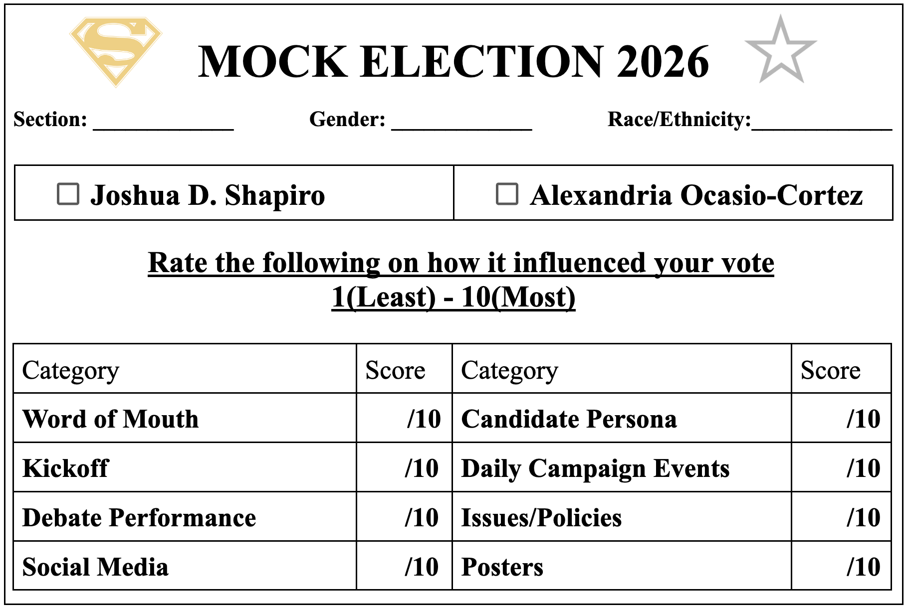
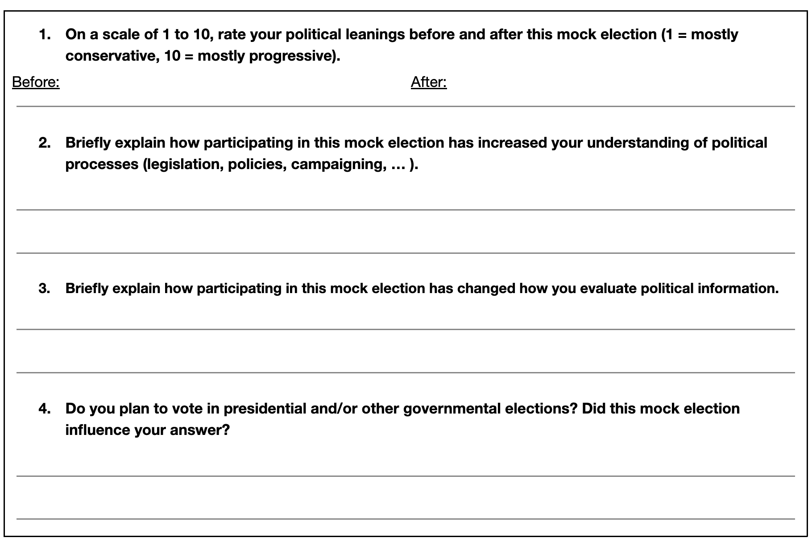
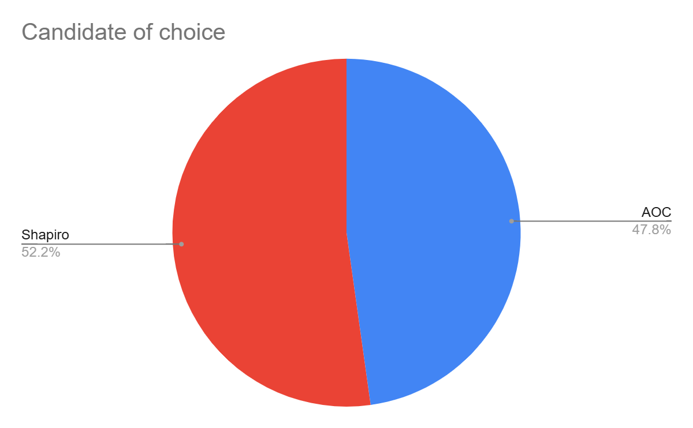

Attached above is a copy of the ballot used during the 2026 Masterman Mock Election on Election Day. The ballot was designed with logos on either side of the title to represent Shapiro and AOC, the candidates, respectively. Right underneath, a section area was added in order to help better track those who showed up to vote and also for easier recounting of the ballots later as needed by grade level. The voters were then asked for their gender and race/ethnicity, which would be analyzed below to determine what campaign aspects mattered most to voters based on certain demographics. As this mock election was meant to emulate an ideal election, there is no name required on the ballot as voting is anonymous, just like the Australian ballot. 

The respondents then need to mark down which candidate they vote for, whether that be Joshua D. Shapiro or Alexandria Ocasio-Cortez, and rank each category on a one to ten scale to indicate the scale to which each one influenced their decision when it came to which candidate they voted for. The categories included are: word of mouth, the kickoff assembly, debate assembly performance, social media posts, candidate personas, daily campaign events, their issues and/or policies, and finally, the posters from each campaign.

On the back of the ballot, four questions were asked in order to determine whether or not the mock election had truly been successful in informing voters about current issues and candidates, as in accordance with what the Student Voices project had meant to do. The first question asked voters their political leanings both before and after the election, with one being mostly conservative and ten being mostly liberal. The next question then asked voters to explain how participating in this mock election, whether that be heading to daily campaign events or reading posters around the school, has increased their understanding of political processes such as passing legislation and campaigning. The third question honed in on asking how the mock election has changed the way they evaluate political information. Finally, as a way to figure out whether this mock election had increased the likelihood of civic engagement and political involvement, the last question asked whether the voter planned on voting in governmental elections and whether this mock election played a part in influencing their answer. In total, we had 406 votes out of 547 high schoolers, which translates to roughly a 74.22% voter turnout rate.

Out of 406 voters, 212 (52.2%) voted for Joshua Shapiro and 194 (47.8%) voted for Alexandria Ocasio-Cortez. This meant that there was a mere eighteen vote (4.4%) difference for the winning candidate, making this mock election to be a rather close one instead of by a wide margin as both campaigns had previously thought. This was also shocking as traditionally, with Masterman being a rather liberal leaning school as shown in the question analysis later on, the winning candidate tends to be more liberal than the other candidate.