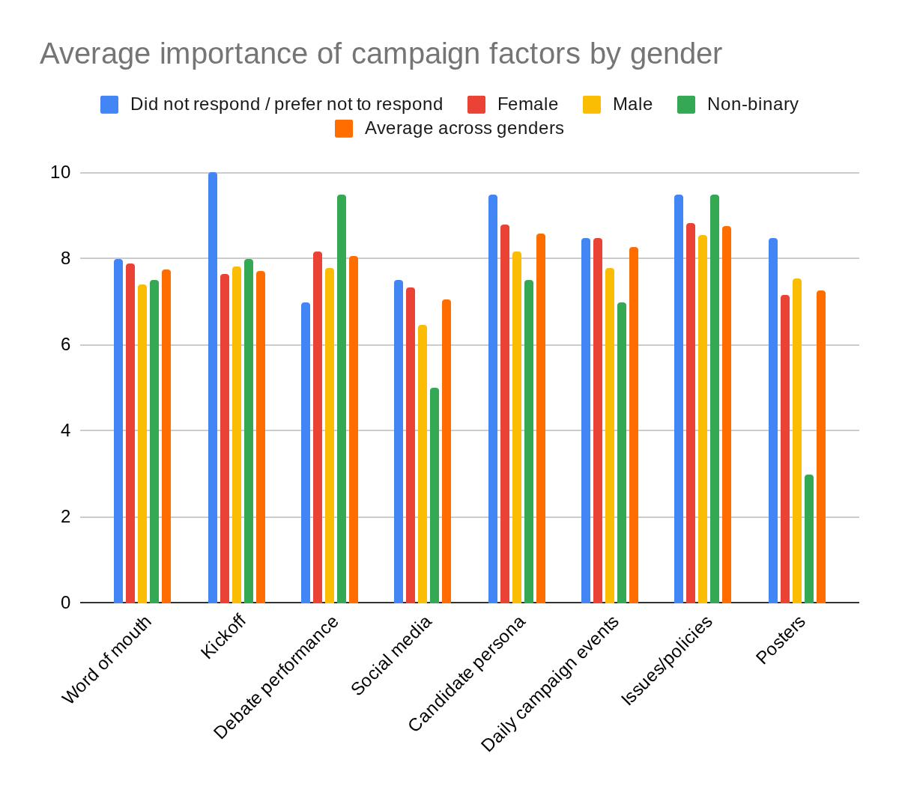
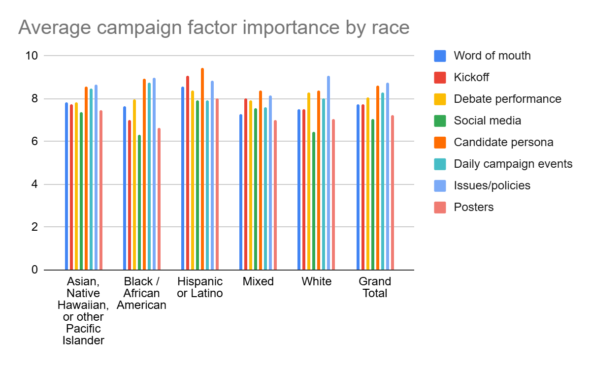
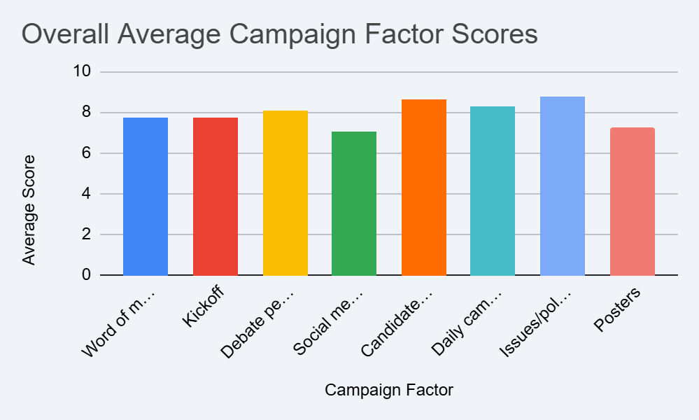
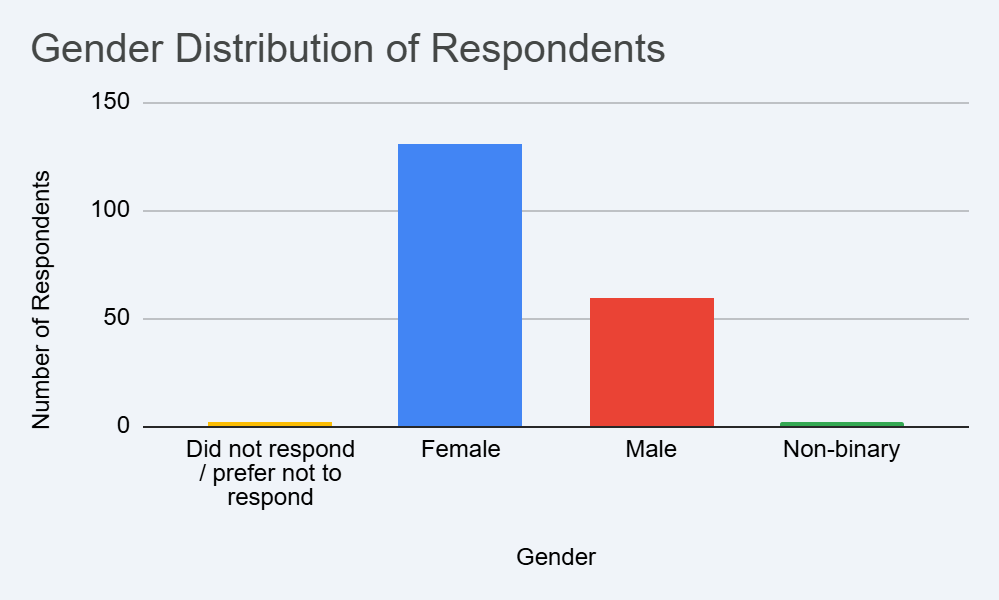
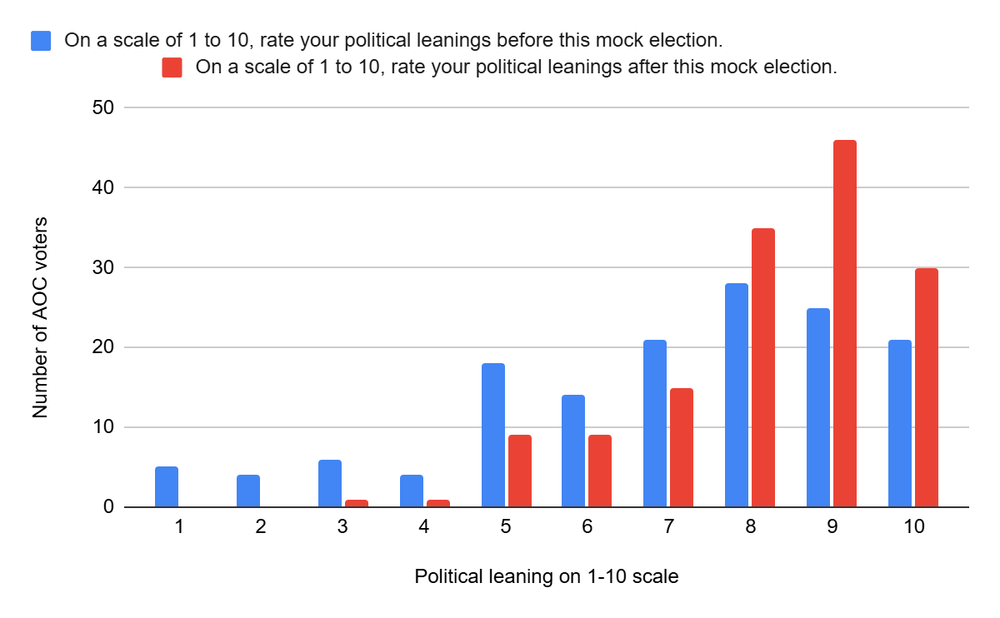
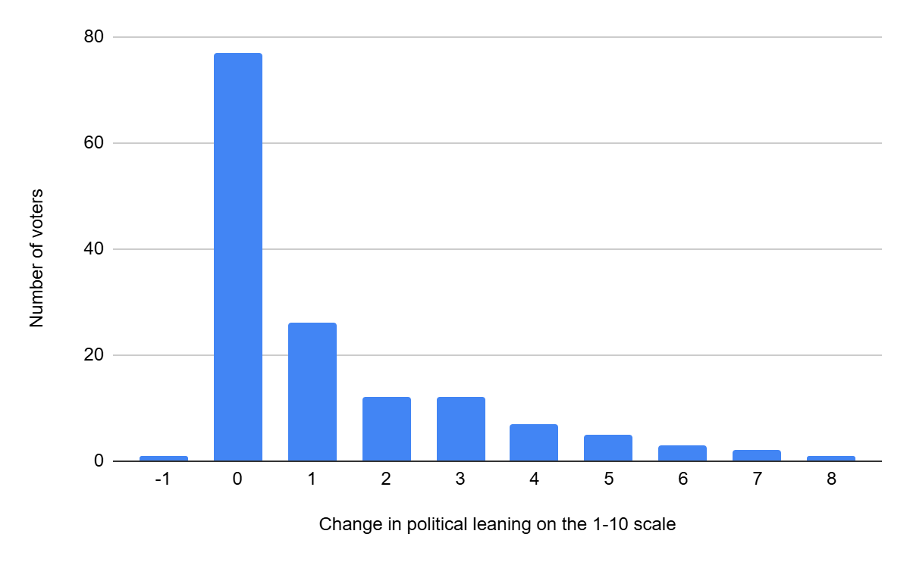

The issues AOC voters felt influenced their vote varied based on their gender. Female AOC voters indicated an average factor importance greater than the AOC voter average for all factors except posters. Conversely, male AOC voters indicated a lower average factor importance than the AOC voter average for all factors except posters, where they were higher than the average. For both male and female AOC voters, the most important factors in their decision to vote for AOC were candidate persona and issues/policies. For non-binary AOC voters, the most important factors were debate performance and issues/policy; however, the small sample size means that this may not be reliable/significant.

For AOC voters who were Asian, Native Hawaiian, or other Pacific Islander, on average, the most important factors in choosing to vote for AOC was issues/policies and candidate persona, with average importances of 8.66 and 8.58 respectively. For AOC voters who were Black or African American, on average, the most important factors in choosing to vote for AOC was issues/policies and candidate persona, with average importances of 9.00 and 8.95 respectively. For AOC voters who were Hispanic or Latino, on average, the most important factors in choosing to vote for AOC was candidate persona and kickoff, with average importances of 9.43 and 9.07 respectively. For AOC voters who were white, on average, the most important factors in choosing to vote for AOC was issues/policies and candidate persona, with average importances of 9.07 and 8.39. For AOC voters of two or more races, on average, the most important factors in choosing to vote for AOC was candidate persona and issues/policies, with average importances of 8.38 and 8.14 respectively.

Something of note regarding the responses to these questions is that many voters did not respond to the back of the ballot at all, so the data is only representative of part of the voter base. The overall political leaning of AOC voters shifted to be more liberal between before the start of the mock election and the time of voting. For AOC voters, the average political affiliation on the 1-10 scale from very conservative to very liberal was 7.03. The average political affiliation on the 1-10 scale at the time of voting 8.25. Prior to the mock election, 25.3% of AOC voters who responded to the question viewed themselves as more conservative than liberal. However, at the time of voting, only 7.5% of AOC voters who responded to the question viewed themselves as more conservative-leaning then liberal leaning. This means the number of initially conservative AOC voters who remained conservative after the election was very small. This could indicate that the AOC campaign was effective in informing voters about liberal policy ideas, or possibly that voters may have been confused by the conservative to liberal 1-10 scale.

Surprisingly, the overall mock election had a large impact on swaying the people's political leaning. As we can see from the graph, nearly 50% of the respondents had some change in political leaning due to the mock election, much greater than that of a typical election. The existence of voters with changes in political leaning greater than 5, especially those with changes of 7 or 8, is interesting. These indicate that there were voters who were initially somewhat or strongly conservative who, following the mock election, felt they were somewhat or strongly liberal. These large changes in political leaning could also be indicative of confusion about the meaning of the scale on which the questions were asked.