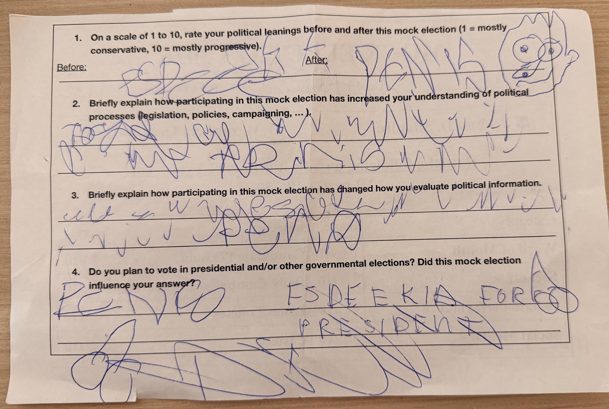
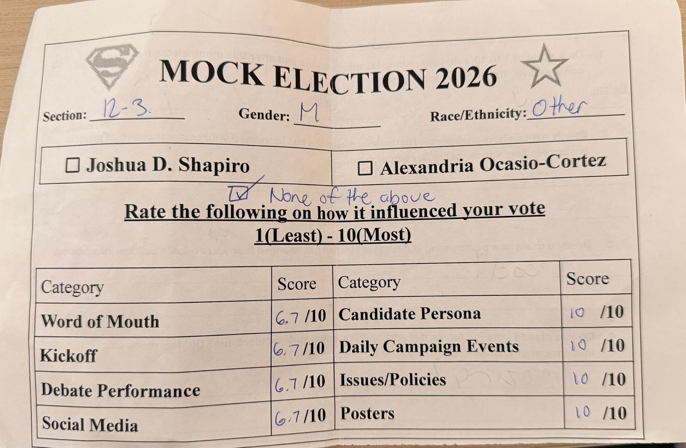
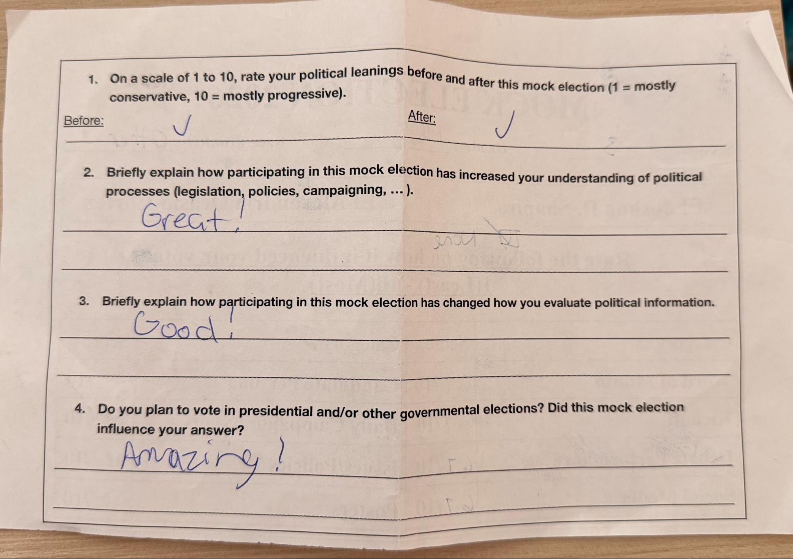

#### Image 1

#### Image 2

There are a couple of factors with the ballot that may have skewed the data results. One of the first factors that could be modified is the race/ethnicity factor; while many voters stuck to the major classifications such as White, Black/African American, Asian, Native Hawaiian, or other Pacific Islander, and Hispanic or Latino, others included very specific ones such as Arab, Indian, Chinese, Middle Eastern, etc. Instead, what might be more helpful is to make it multiple choice, where they can also indicate if they are of two races or more, or specify in Other if they need to.

There were also inconsistencies with both the factor rating questions in the front and the political leaning rating question on the back. Some people chose to put in numbers that were outside of the 1-10 score range, making data skewed. On the back, inconsistencies were sometimes shown as some people who voted for AOC would say that they were a 10 on the scale (leaning extreme liberal) before the election and was a 1 on the scale (leaning extreme conservative) after the election. Similarly, some Shapiro voters claimed that they were a 1 on the scale before the election and a 10 on the scale after the election, which wasn’t exactly consistent with their vote.

A common trend that was spotted during ballot analysis was that many people did not fill out the back questions at all, and even when they did, more than half the time their answers either did not truly address what the question was asking and made no sense or their answers consisted of just a single word. For instance, image 1b displays a ballot in which the respondent voted for “None of the above” and put 6.7 for all the factor ratings while putting a checkmark on the question where they were supposed to indicate their political leaning before and after the election. Similarly, the second ballot in images 2a and 2b may seem normal at first, yet the respondent thought it was amusing to put their gender as “Black” after scribbling out a previously written “Male” while also putting their race/ethnicity down as white. On the back of the ballot, they then proceeded to ignore all the questions and instead wrote and drew the word “penis” all around the back.

One way this can be improved is making most, if not, all of the questions on the ballot in future years be completely multiple choice to increase the likelihood of people actually answering the questions and providing more data to work with. While open-ended questions may allow those who are extremely politically engaged to provide feedback, it may make others feel as though it is a hassle to go through just to submit a vote for a mock election candidate. In fact, the addition of a “jot down anything that the mock election has helped you learn more about” type question with the multiple choice questions may account for those people who truly took something away from the mock election.

In conclusion, this year’s mock election ballot was successful for the most part in gathering information on what factors voters took into consideration when casting their vote, which could be useful for future mock elections for strategizing. However, it is not without many flaws that caused data gaps and errors, making the data collected not completely accurate or reliable. Improvements can be made in order to make the ballot easier to answer and get done while also leaving space for those who will to further explain their thoughts on the back to gain detailed information on what worked and didn’t work. Overall, the data collected by the ballot is still helpful to look at and analyze, accomplishing its job. 
