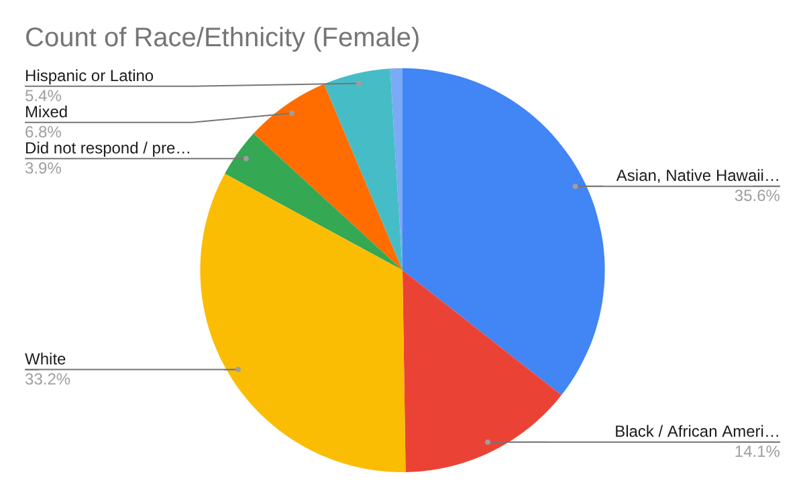

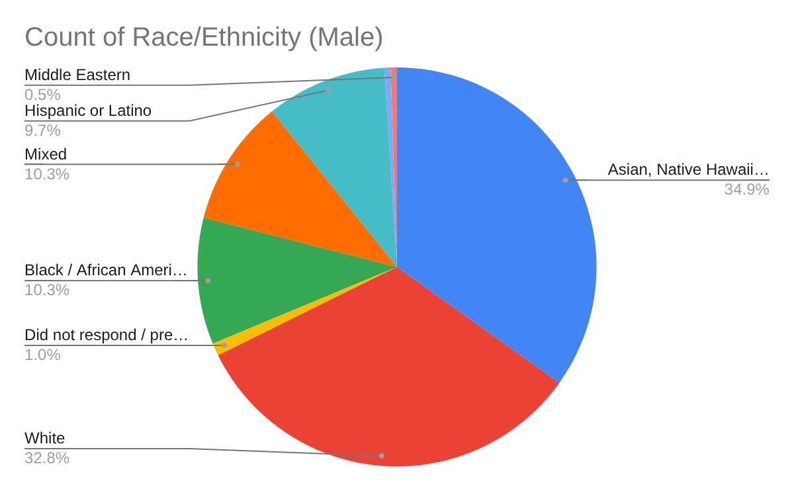

Out of 205 female voters, 73 (35.6%) were Asian, Native Hawaiian, or Pacific Islander, 68 (33.2%) were White, 29 (14.1%) were Black or African American, 14 (6.8%) were of two or more races, and 11 (5.4%) were Hispanic or Latino.

Out of 195 male voters, 68 (34.9%) were Asian, Native Hawaiian, or Pacific Islander, 64 (32.8%) were White, 20 (10.3%) were Black or African American, 20 (10.3%) were of two or more races, and 19 (9.7%) were Hispanic or Latino.

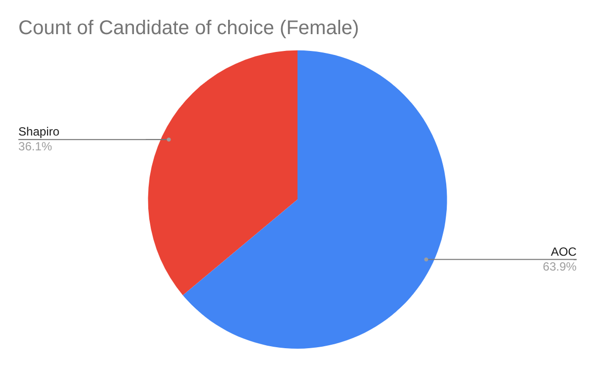

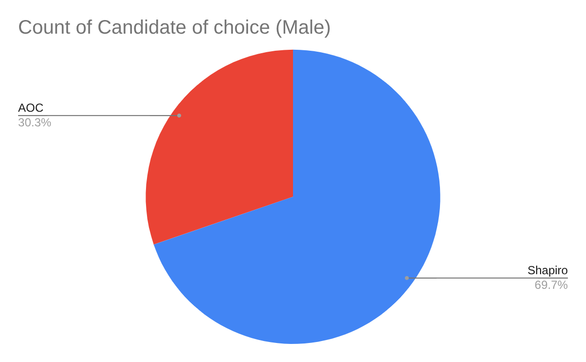

The female votes for candidates are 74 (36.1%) for Joshua Shapiro and 131 (63.9%) for Alexandria Ocasio-Cortez.

The male votes for candidates are 136 (69.7%) for Joshua Shapiro and 59 (30.3%) for Alexandria Ocasio-Cortez.

This shows that female voters were much more likely than male voters to vote for AOC, and the same applies vice versa when it comes to male voters voting for Shapiro

**Importance of Factors (Female)**
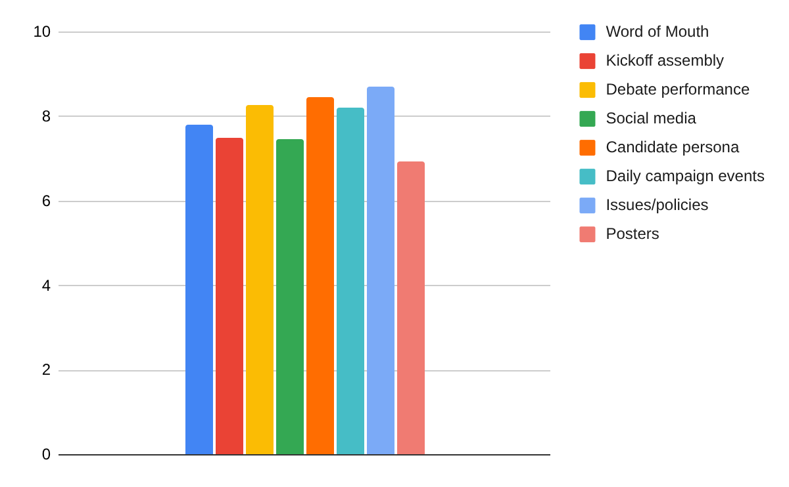

For female voters, the average importance of each of the eight factors listed in the ballot, with 1 being least important and 10 being most important, follow as: 7.82 for word of mouth, 7.50 for kickoff, 8.27 for debate performance, 7.46 for social media, 8.48 for candidate persona, 8.21 for daily campaign events, 8.71 for issues/policies, 6.95 for posters. This indicates that on average, issues/policy seems to have been the most important factor for female voters in deciding which candidate to vote for with a rating of 8.71, and, on average, posters were of the least importance with a rating of 6.95.

**Importance of Factors (Male)**
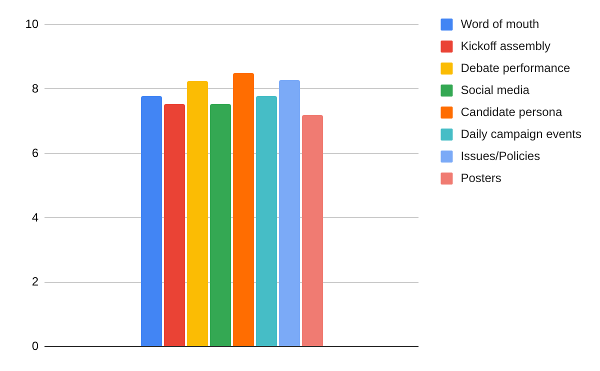

For male voters, the average importance of each of the eight factors listed in the ballot, with 1 being least important and 10 being most important, follow as: 7.79 for word of mouth, 7.54 for kickoff, 8.26 for debate performance, 7.53 for social media, 8.49 for candidate persona, 7.77 for daily campaign events, 8.27 for issues/policies, 7.2 for posters. This indicates that on average, candidate persona seems to have been the most important factor for male voters in deciding which candidate to vote for with a rating of 8.49, and, on average, posters were of the least importance with a rating of 7.2.

In both cases, the factor that played the least important role appeared to be posters, while the factor that played the most important role was different based on gender. Female voters tended to focus more on the actual promises and legislation that candidates are able to bring to the table, preferring substantial evidence that a candidate is able to help them and actually solve issues. On the other hand, male voters favored candidate personas slightly more, being attracted by how a candidate carries themselves through pressing situations such as during the debate assembly.

**Political Leanings (higher is more liberal) (Female)**
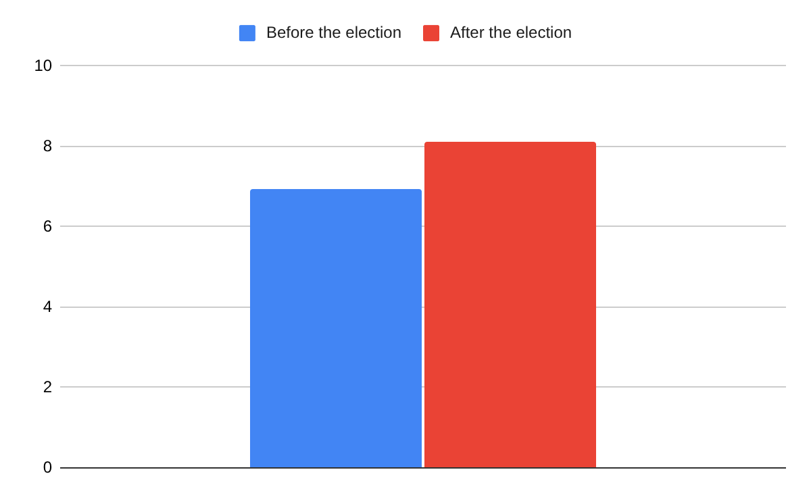

As seen in the chart above, female voters had an average leaning of around 6.94 on the scale before the election and an average leaning of around 8.1 after the election. This hints that throughout the course of the week, their political leanings have actually gone from moderate liberal towards being more solidly liberal.

**Political Leanings (higher is more liberal) (Male)**
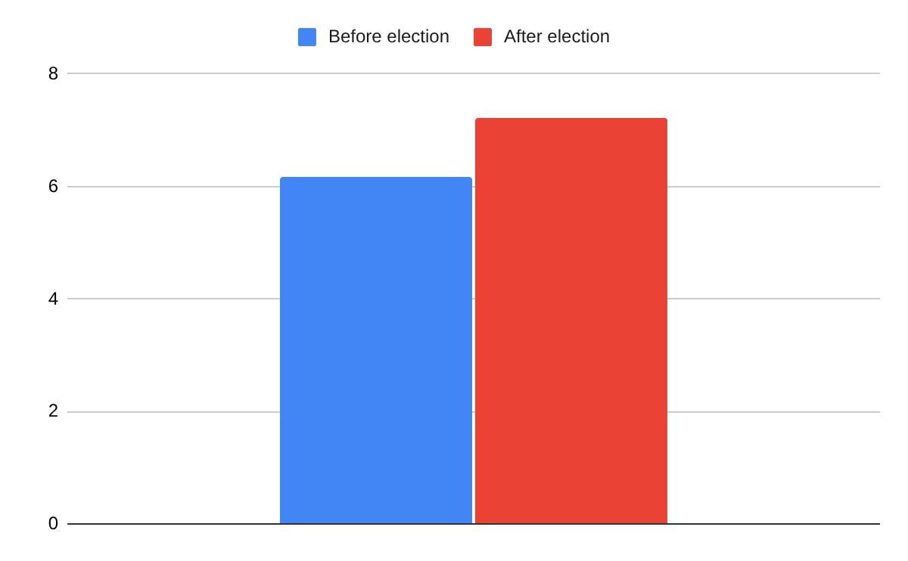

In this chart, male voters had an average leaning of around 6.18 on the scale before the election and an average leaning of around 7.21 after the election. This hints that throughout the course of the week, their political leanings have actually gone from moderate liberal towards being slightly more solidly liberal. 

These two charts indicate that female voters were more likely to be further left both before and after the election than male voters.

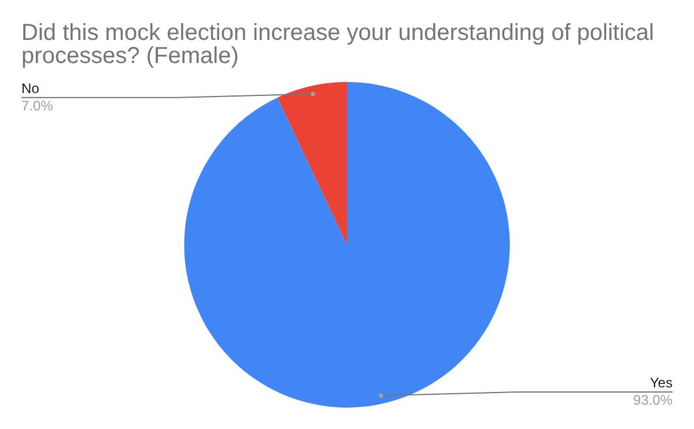

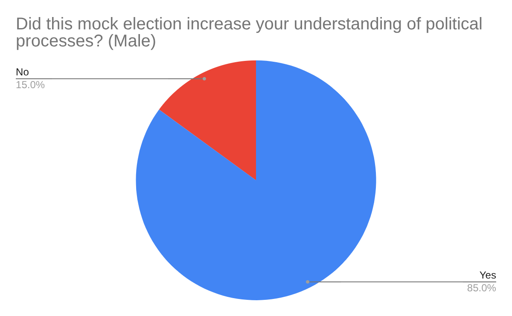

Out of the 142 female voters who answered this question, 132 (93.0%) people stated that the mock election increased their understanding of political processes while 10 (7.0%) people stated that the mock election didn’t increase their understanding of political processes. This indicates that the mock election was pretty successful in informing female voters on political processes.

Out of the 107 male voters who answered this question, 91 (85.0%) people stated that the mock election increased their understanding of political processes, while 16 (15.0%) people stated that the mock election didn’t increase their understanding of political processes. This indicates that the mock election was at least somewhat successful in informing male voters on political processes.

According to the data, the mock election seems to have made more of an impact on female voters by increasing their understanding of various political processes.

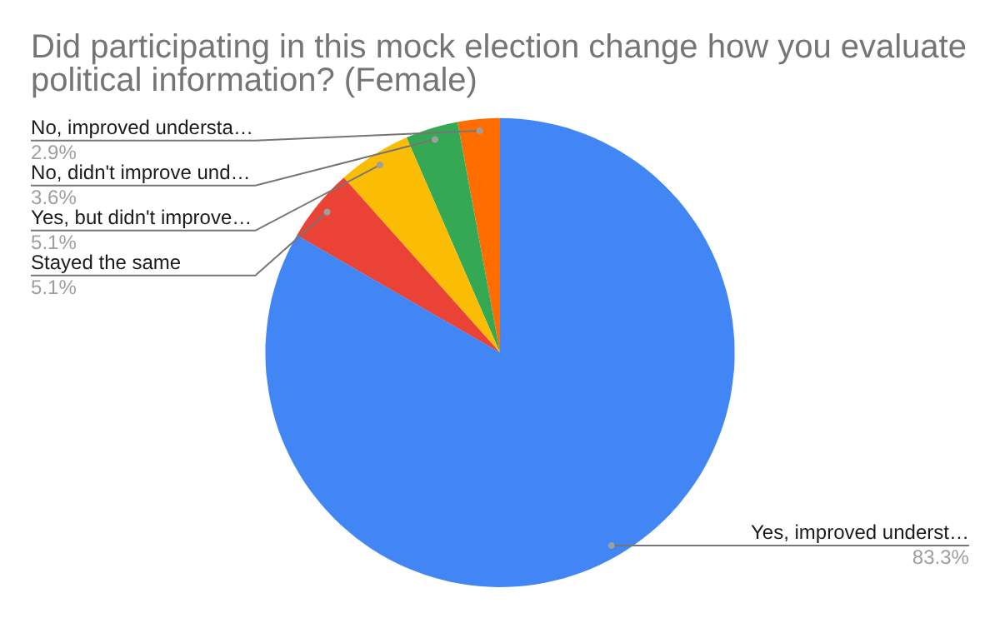

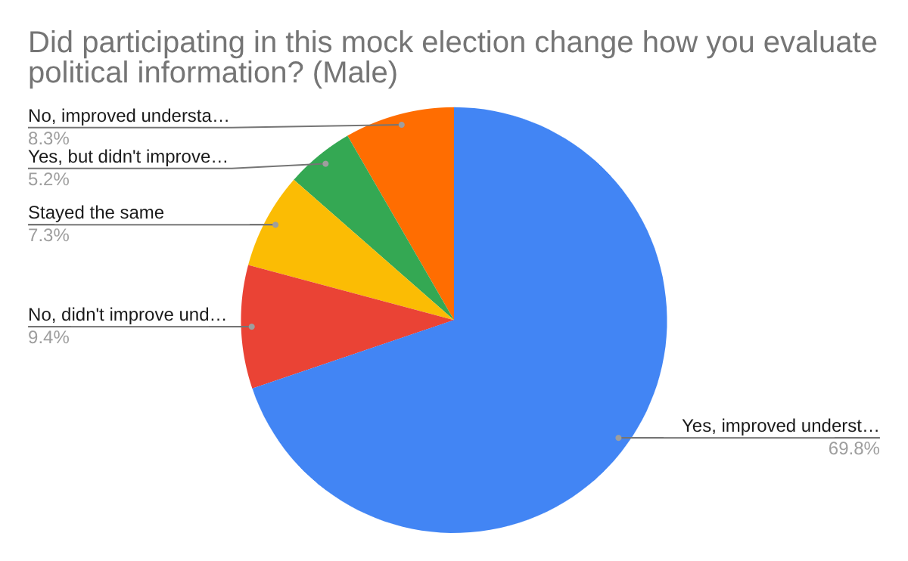

For this question, a total of 138 female voters answered out of the 205 total female ballots, with the breakdown being as follows: 115 (83.3%) stated that it changed the way they evaluate political information and improved their understanding, 7 (5.1%) stated that it changed the way they evaluate political information but didn’t exactly improve their understanding, 4 (2.9%) stated that it didn’t change the way they evaluate political information but improved their understanding of political information, 5 (3.6%) stated that it neither changed the way they evaluate political information nor improve their understanding of said information, and 7 (5.1%) stated that both the way they evaluate information and their understanding of political information remained the same.

A total of 96 male voters answered out of the 195 total male ballots, with the breakdown being as follows: 67 (69.8%) stated that it changed the way they evaluate political information and improved their understanding, 5 (5.2%) stated that it changed the way they evaluate political information but didn’t exactly improve their understanding, 8 (8.3%) stated that it didn’t change the way they evaluate political information but improved their understanding of political information, 9 (9.4%) stated that it neither changed the way they evaluate political information nor improve their understanding of said information, and 7 (7.3%) stated that both the way they evaluate information and their understanding of political information remained the same.

Similar to the last question, the data indicates that this mock election has changed the way female voters evaluate political information significantly more than male voters. In fact, there is a >10% difference when it comes to changing how female voters evaluate political information and improving their understanding as compared to male voters.

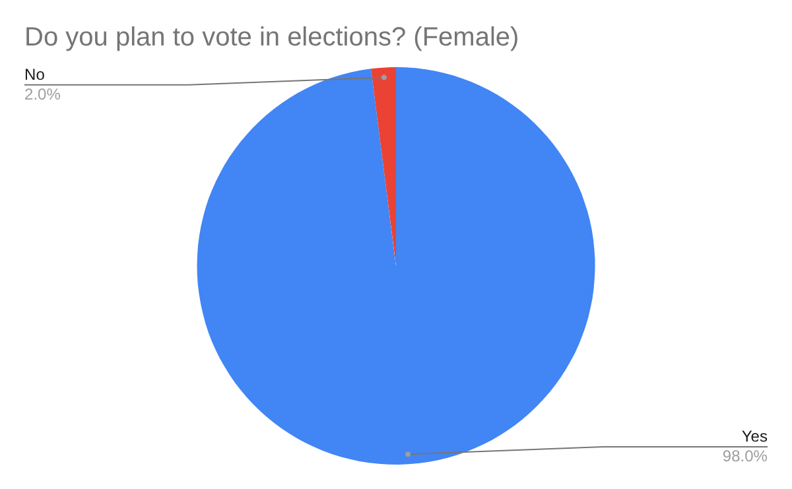

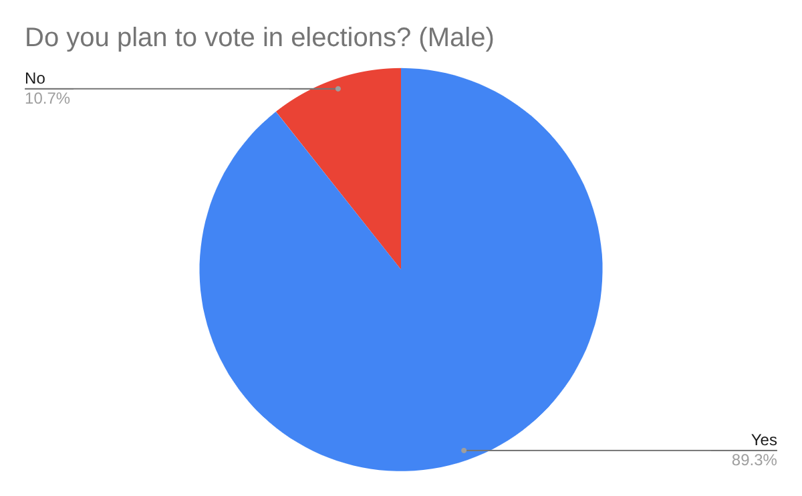

For this final question, 146 (98.0%) out of the 149 female voters that answered stated that they do plan on voting in future presidential and governmental elections while 3 (2.0%) people said they do not plan on voting in future elections.

109 (89.3%) out of the 122 male voters that answered stated that they do plan on voting in future presidential and governmental elections while 13 (10.7%) people said they do not plan on voting in future elections.

Like the two questions above, the data indicates that female voters are much more likely than male voters to plan on voting in governmental elections in the future.