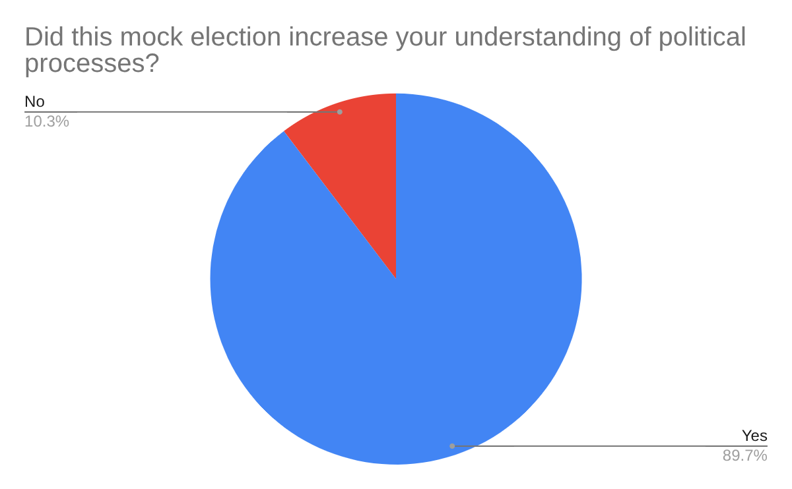
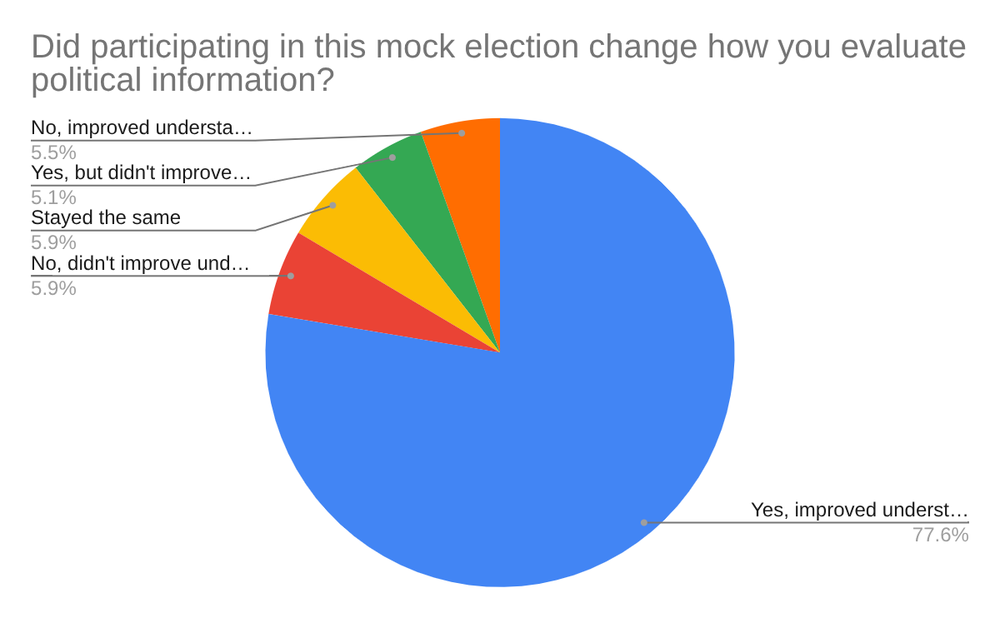
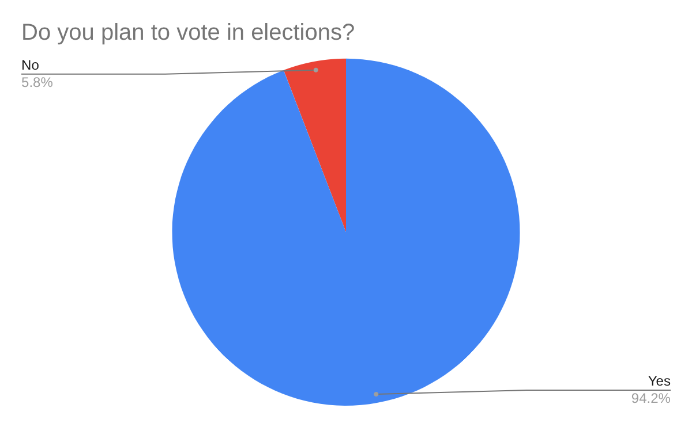

Out of the 252 voters who answered this question, 226 (89.7%) people stated that the mock election increased their understanding of political processes white 26 (10.3%) people stated that the mock election didn’t increase their understanding of political processes. This indicates that the mock election was at least decently successful in informing the high school audience on political processes, whether that be passing legislation, the ins and outs of campaigning, or different policies.

For this question, a total of 237 voters answered out of the 406 total ballots, with the breakdown being as follows: 184 (77.6%) stated that it changed the way they evaluate political information and improved their understanding, 12 (5.1%) stated that it changed the way they evaluate political information but didn’t exactly improve their understanding, 13 (5.5%) stated that it didn’t change the way they evaluate political information but improved their understanding of political information, 14 (5.9%) stated that it neither changed the way they evaluate political information nor improve their understanding of said information, and 14 (5.9%) stated that both the way they evaluate information and their understanding of political information remained the same.

For this final question, 258 (94.2%) out of the 274 people who answered stated that they do plan on voting in future presidential and governmental elections while 16 (5.8%) people said they do not plan on voting in future elections.

For the open-ended questions (questions 2-4), the pollsters decided that it was best to simplify them into yes or no questions, due to the subjectivity of the responses that were received. This decision can be partially attributed to the fact that the questions weren’t taken seriously. 

*Please see below for some of the responses to the open-ended questions from the respondents who took them seriously.*

**Question 2:** “Briefly explain how participating in this mock election has increased your understanding of political processes (legislation, policies, campaigning, … ). “
* “It increased my understanding by learning about the policies, paying attention and understanding each campaign and really listening and being engaged.”
* “[I] think that the clarification of what a primary election is really important.”
* “I understand better the difference between moderate and progressive governing, also between governors and representatives.”

**Question 3:** “Briefly explain how participating in this mock election has changed how you evaluate political information.” 
* “I have learned to choose based off of who has better options for not just me, but those I surround myself with.”
* “This has taught me how political information can be evaluated depending on the tactics they use to persuade people.”
* “I see the value in educating myself on the previous works of the candidates as well as staying up to date on political issues in our country.”
* A response that stood out in a different way: “I didn't know politics could make such good videos #vote4josh.”

**Question 4:** Do you plan to vote in presidential and/or other governmental elections? Did this mock election influence your answer? 
* “Yes! My answer previously was yes, but it's been emphasized by this mock election.”
* “Yes, I plan to vote in the future. The mock has a bitesized way that prepared me for analyzing candidates.”
* “Yes, because every vote counts, this mock election didn't influence my answer though.”
