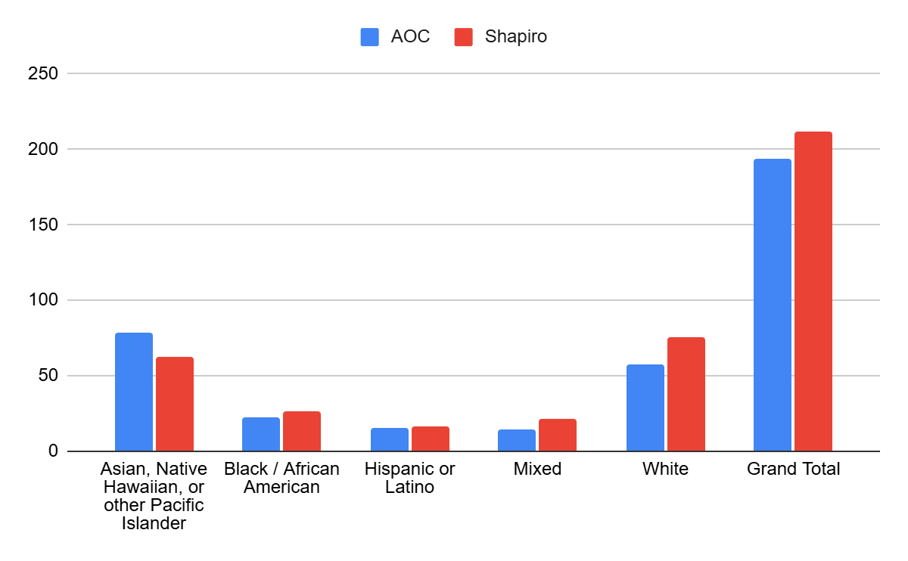

The table above shows the breakdown of how each race voted in the mock election. For Asian, Native Hawaiian, or other Pacific Islanders, 79 (55.63%) voted for Alexandria Ocasio-Cortez, and 63 (44.37%) voted for Joshua Shapiro. For those who were Black or African American, 22 (44.90%) voted for Alexandria Ocasio-Cortez and 27 (55.10%) voted for Joshua Shapiro. For those who were Hispanic or Latino, 15 (48.39%) voted for Alexandria Ocasio-Cortez, and 16 (51.61%) voted for Joshua Shapiro. For those who were white, 57 (42.86%) voted for Alexandria Ocasio-Cortez, and 76 (57.14%) voted for Joshua Shapiro. For those who were of two or more races, 14 (40.00%) voted for Alexandria Ocasio-Cortez, and 21 (60.00%) voted for Joshua Shapiro.