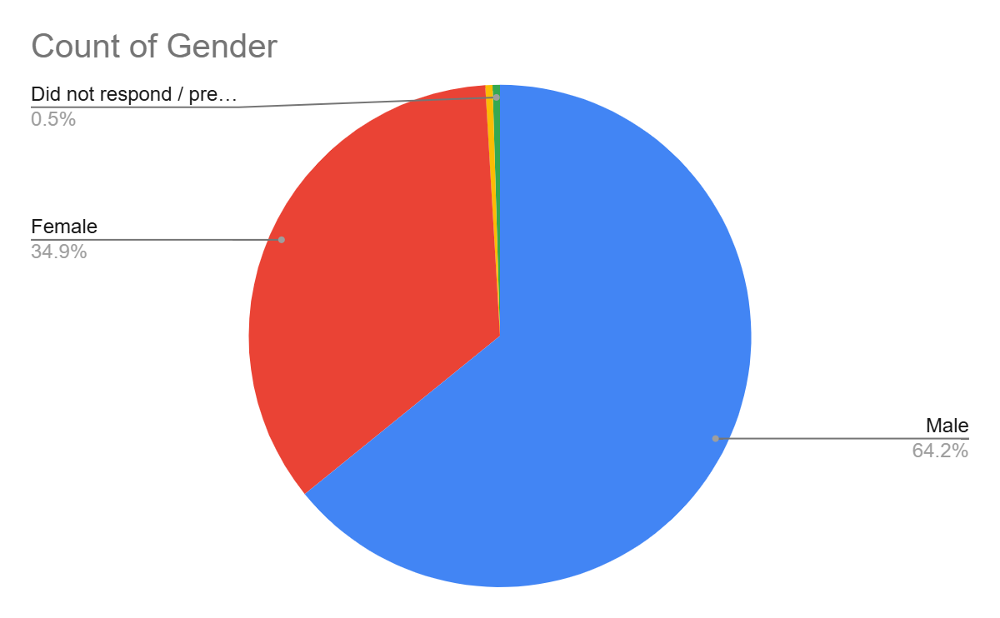
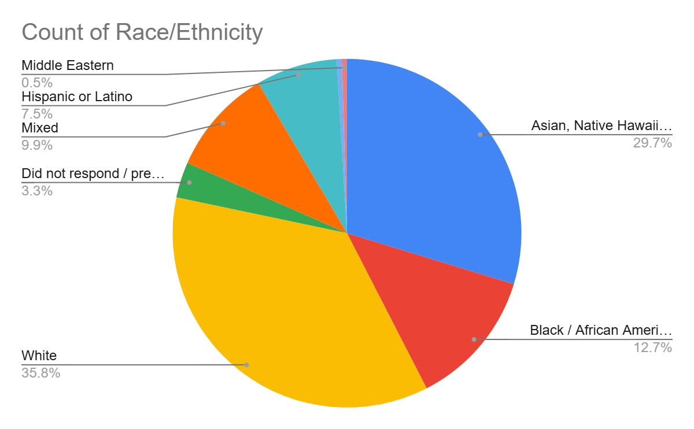
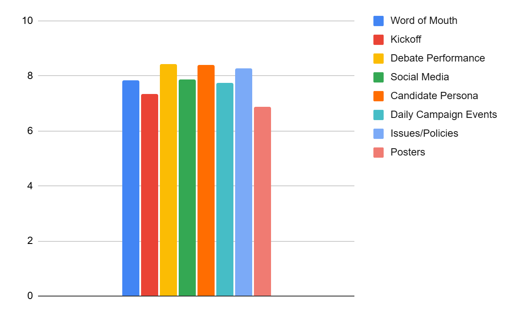
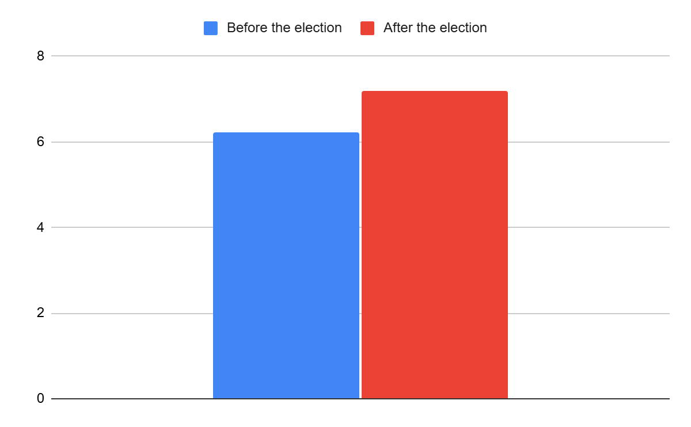

Out of 212 Shapiro voters, 136 (64.2%) were male, 74 (34.9%) were female, and one (0.5%) was nonbinary, with one (0.5%) additional who abstained from answering. Looking at the data, it can be seen that there is a huge difference (nearly 30%) between the two primary genders that voted for Shapiro, which was what the campaign had expected. This disparity may be due to the fact that students who identified as females voted for the female candidate, whereas most of the students who identified as males voted for the male candidate, indicating that there may have been a gender bias in addition to bias in favor of the progressive sector among the electorate.

The breakdown of the Shapiro followers by race/ethnicity follow as: 76 (35.8%) were White, 63 (29.7%) were Asian, Native Hawaiian, or other Pacific Islander, 27 (12.7%) were Black/African-American, 21 (9.9%) were of two or more races, 16 (7.5%) were Hispanic or Latino, and one (0.5%) was Middle Eastern. There were also seven (3.3%) of voters that did not respond to the question, possibly impacting the race/ethnicity breakdown of the voters. Out of the major racial/ethnic groups, the group that comprised the highest of Shapiro voters were those that were White, with 35.8%. The group that comprised the least of Shapiro voters were Hispanic or Latino, with 7.5%.

For Shapiro voters, the average importance of each of the eight factors listed in the ballot, with 1 being least important and 10 being most important, follow as: 7.84 for word of mouth, 7.36 for kickoff, 8.43 for debate performance, 7.87 for social media, 8.40 for candidate persona, 7.76 for daily campaign events, 8.27 for issues/policies, 6.89 for posters. This indicates that on average, the debate performance seems to have been the most important factor for Shapiro voters in deciding which candidate to vote for with a rating of 8.43, likely due to the campaign video that was showed at the end, and, on average, posters were of the least importance with the only rating below seven at a 6.89.

As seen in the chart above, Shapiro voters had an average leaning of around 6.23 on the scale before the election and an average of leaning of around 7.19 after the election. This hints that throughout the course of the week, their political leanings have actually gone from moderate leaning liberal towards being slightly more solidly liberal. This may have been due to factors such as Masterman being a primarily liberal environment, where the location of the school as well as the political leaning of family members and friends/peers possibly playing a factor in the political leanings before the election. After the election, the shift towards the left may indicate that voters also gained information from the Alexandria Ocasio-Cortez campaign, thus why they headed slightly more progressive.