### Overview

In order to get an idea of what the high school constituency knew about the two candidates, the Shapiro campaign drafted a pre-kickoff poll that was published to the Google Classroom pages of all four grades during the snow day. This would provide the entire campaign on what salient issues should be covered during daily campaign breakfast and lunch events, the kickoff assembly, and the mock election debate, as well as whether or not the student body was informed about the candidates and the legislative action they were involved in.

As the day of the kickoff assembly drew near, a partisan kickoff poll was designed in order to figure out the general gist of their political leanings. With this poll, there was more flexibility in how questions could be framed and ordered since the pre-kickoff poll was bound by non-partisan restrictions. This poll was conducted by having Shapiro informants stationed around the auditorium with a scannable QR code that led to the poll for easier accessibility. Finally, around the middle of mock election week, a benchmark poll was conducted by utilizing pollster volunteers to head to different high school advisories in order to get an idea of what is and isn’t working with our daily campaign events and social media posts, as well as what the voters are most interested to have addressed during the upcoming debate.

### Pre-Kickoff Poll

Unlike the other two polls that the Shapiro campaign conducted throughout the course of mock election week, the pre-kickoff poll was the only one that had to follow certain rules. Specifically, Mr. Gilligan had informed both classes that prior to the kickoff assembly, only “non-partisan polling and project advertisements (Mock Election is Coming!) may be released.” In addition, though it was not exactly a formal rule, all polls were shown to Mr. Gilligan prior to being published in order to get suggestions on how questions could be altered in order to be less confusing for respondents.

The pre-kickoff poll, as stated above, was meant to be non-partisan polling that would be used by the Shapiro campaign to get a general idea of the high school body. Specifically, we hoped to get an idea of what the students deemed as “key issues” that we would try and prioritize during daily campaign events and a rough overview of what had made previous mock elections successful in informing voters that we could also utilize.

#### *Chart 1A*
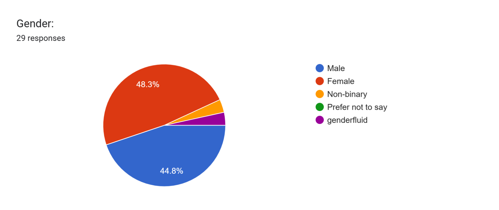

The poll started off with a standard gender question. Out of the twenty-nine responses we received, approximately thirteen of those (44.8%) were male respondents, fourteen (48.3%) were female respondents, one respondent (3.4%) was non-binary, and one respondent (3.4%) was genderfluid. It can be seen by looking at the data that female high schoolers were slightly more likely to respond than male high schoolers, though just by a hair. This data aligned with what our campaign had previously expected, so there wasn’t much surprise here.

#### *Chart 2A*
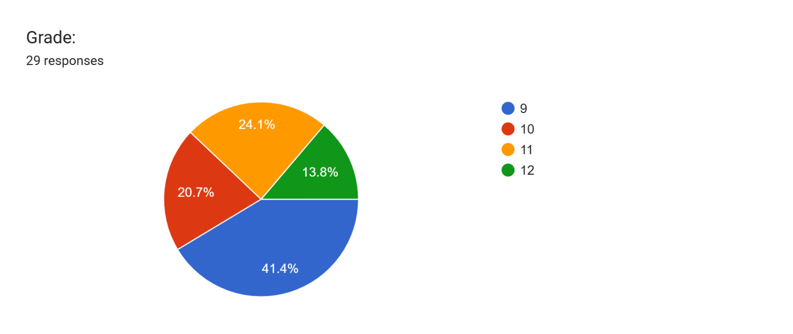

Our next question was which grade the respondent was in. Out of the twenty-nine respondents, twelve (41.4%) were freshmen, six (20.7%) were sophomores, seven (24.1%) were juniors, and four (13.8%) were seniors. Out of all four grades, freshmen comprised a larger percentage of all respondents than the other grades, while seniors comprised the smallest percentage of all respondents. This data came as a bit of a surprise, as we had previously thought that the sophomores or juniors would have comprised the largest percentage of all respondents. This may have occurred due to the fact that there are five sections of high schoolers in ninth grade, and implies that the campaign may need to pay special attention to what the freshmen have to say.

#### *Chart 3A*
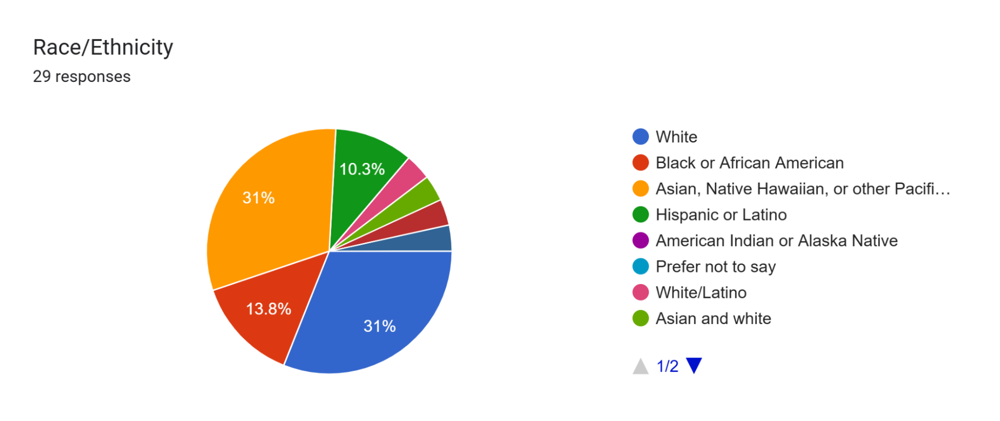

The next question was a standard race/ethnicity question. Out of twenty-nine responses, nine (31%) were White, four (13.8%) were Black or African American, nine (31%) were Asian, Native Hawaiian, or other Pacific Islander, three (10.3%) were Hispanic or Latino, and the other four (13.6%) were of two or more races. This roughly fits the demographics of the school found on the 2024-2025 school profile, where the ethnic/racial composition of the high school is 38% AAPI, 33% White/Caucasian, 14% Black/African-American, 8% two or more races, and 7% Hispanic/Latino.

#### *Chart 4A*
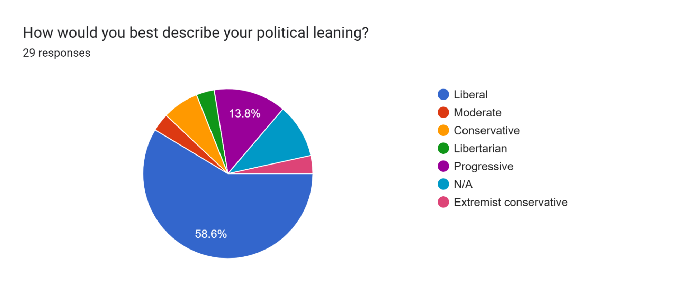

Our first non-partisan question relating to the mock election asked the political leaning of respondents, notable statistics out of the twenty-nine responses include seventeen (58.6%) liberal, four (13.8%) progressive, two (6.9%) conservative, and one (3.4%) moderate. Both campaigns highly anticipated that the majority of Masterman high schoolers would, in fact, tend to lean towards the left of the political spectrum considering how the school is located in Philadelphia, a primarily blue city, and based off of past voting trends in previous mock elections. Based on these responses, it can be heavily inferred that there is higher support for the candidate which leans further left than the other, which has historically proven true in Masterman mock election history with the exception of one election.

#### *Chart 5A*
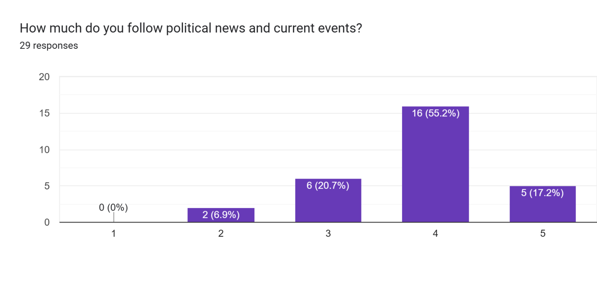

The next question was intended to figure out how politically aware the student body was. Based on the data shown in the bar chart, it seems as though all respondents had at least some basic knowledge about political news and current events, with the majority clustering around a score of 4 on the 1-5 score range.

#### *Chart 6A*
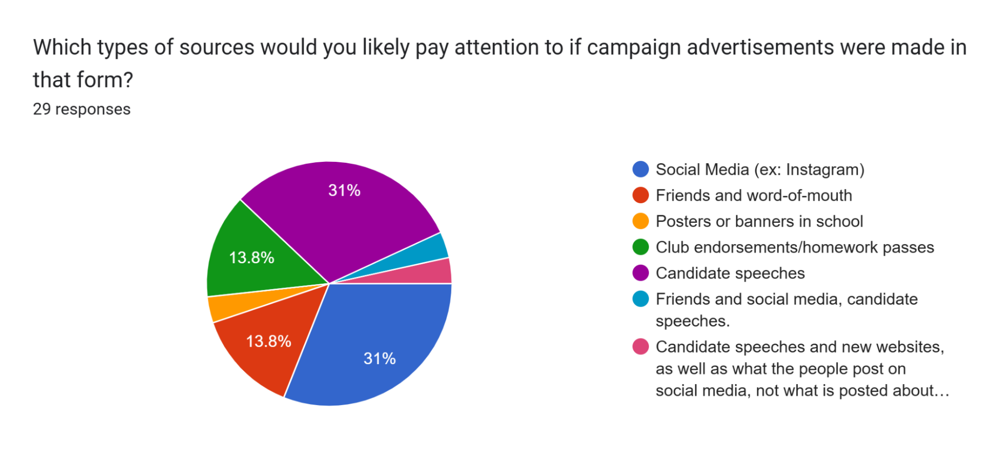

Surprisingly, this data depicts that social media and candidate speeches carry the same weight in terms of attracting the electorate’s attention. Given that the electorate consisted entirely of teenagers, the “Social Media” sector was expected to be larger. This statistic shows that the voters may be open to diverse forms of advertising.

#### *Chart 7A*
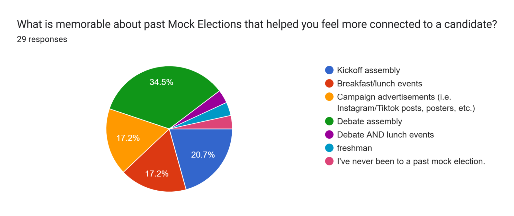

The first question was intended to allow the Shapiro campaign to figure out what we may need to put special attention to in order to gain support among the voters. Out of twenty-nine responses, notable statistics to be aware of include nine (31%) each stating candidate speeches and social media, respectively. In addition, four (13.8%) each stated club endorsements/homework passes and friends/word-of-mouth as important sources of information that they would pay attention to. This data was a bit surprising since we had previously expected there to be a heavy bias towards social media as most of the high schoolers heavily rely on social media as a way to gain information nowadays, but it appears that candidate speeches at both the kickoff and debate assemblies may need more attention.

Likewise, the next question showed similarities in responses to the one above, where ten (34.5%) and six (20.7%) stated the debate assembly and kickoff assembly as memorable events about previous mock elections that made them feel more connected to the candidate, respectively, and five (17.2%) each stated campaign advertisements and breakfast/lunch events.

In the next section of the poll, we had various key issues that respondents would need to pick a score from 1 to 5 to indicate what they deemed important to them. Some key issues that had percentages above 80% of selecting either a 4 or a 5 include the economy, with twenty-five (85.9%) responses, immigration policies and enforcement, with twenty-six (89.7%) responses, healthcare, with twenty-seven (93.1%) responses, climate change, with twenty-five (85.9%) responses, and gun control laws and gun violence, with twenty-eight (96.6%) responses. Surprisingly, some issues we thought would’ve been of high importance, such as foreign affairs, only had sixteen (55.2%) out of twenty-nine responses that ranked it a 4 or a 5.

The data collected from the pre-kickoff poll served as a useful precursor as to what our class could tailor the campaign towards in order to both better inform voters on issues that they were interested in and hopefully, increase their chances of participating politically and percentages of civic engagement.

### Kickoff Poll

Similar to the pre-kickoff poll, we started the kickoff poll with a grade and race/ethnicity, except now we were able to incorporate partisan polling questions as well as rearrange/frame the questions. As stated above, informants stationed around the auditorium were meant to get a random representative sample from each grade. However, we were only able to collect fourteen responses, likely due to the fact that most students were in a hurry to leave the school and the fact that the AOC campaign attached candy to their cards as they were passed out. The gender and grade percentages were roughly the same as the Pre-Kickoff Poll. As a result, we have decided to not include the specific breakdowns of these sections. It’s worth noting that the following data may not be reliable due to the small sample size of 14 respondents.

#### *Chart 1B: Popular Policies*
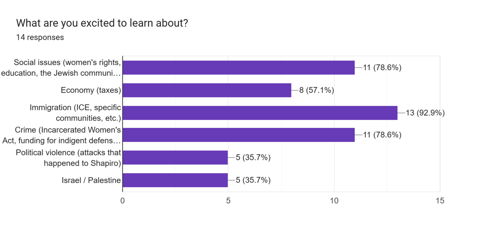

The Kickoff Poll began with a list of topics that the campaign plans to cover in the presentations. These topics were derived from the research document, and seek to provide information to the researchers about what ideals they should prioritize. Since this question was designed to allow multiple selections, the results accumulate to greater than a hundred percent. Notably, these statistics showed that policies and legislation surrounding immigration, social issues, and crime were what the voters were most excited to learn about, as 13/14, 11/14, and 11/14 chose these topics, respectively. Based on these, the emphasis in terms of presentations were placed accordingly.

#### *Chart 2B: Josh Shapiro Ratings*
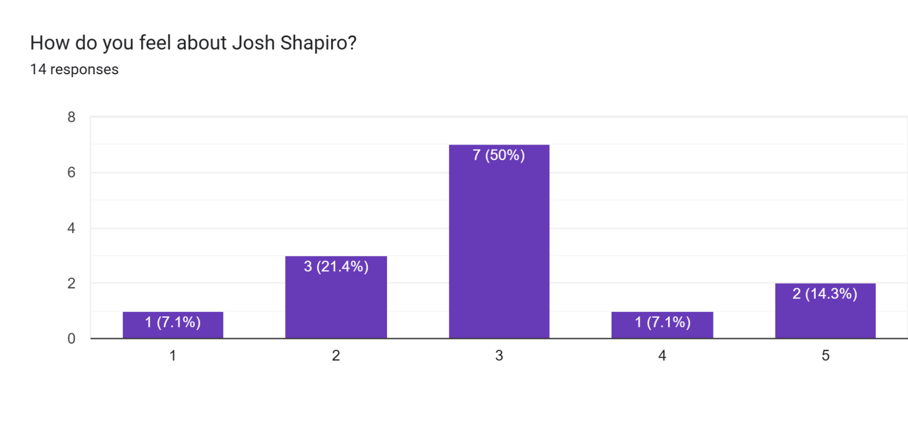

#### *Chart 3B: AOC Ratings*
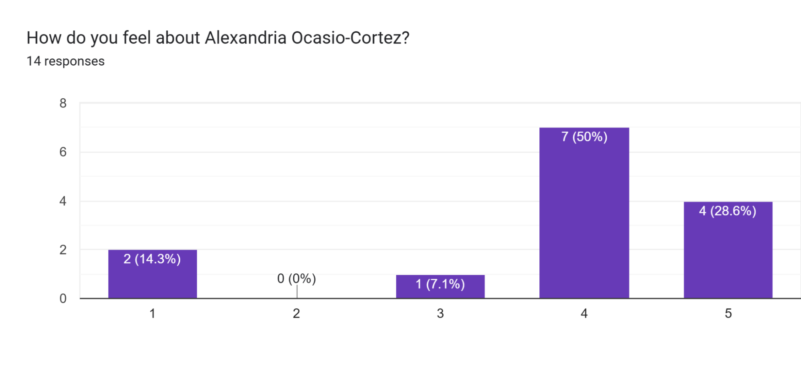

The questions for Charts 2B and 3B were designed to gauge initial biases the electorate has, whether that was developed through social media, specific legislation, or other factors. On a scale of one to five, with one being “Least favorable” and five being “Very favorable,” the voters were asked to rank each candidate. The average rating for Shapiro was three, whereas the average for AOC was 3.79. These results were expected, as the electorate is predominantly progressive, as indicated by the following chart, Chart 4B.

#### *Chart 4B: Direction of the Democratic Party*
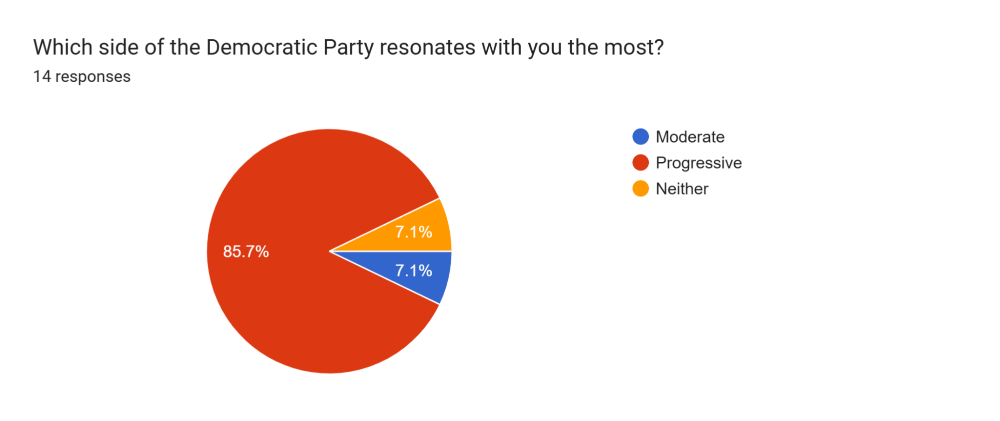

When asked to pick the side of the Democratic Party that resonated with them the most, the electorate predominantly chose progressive. Compared to the other two choices of “Moderate” and “Neither,” “Progressive” received 85.7% of the votes, whereas the others received 7.1% each. This means that there are likely preconceived notions that put Shapiro's campaign at a disadvantage.

#### *Chart 5B: Direction of the Democratic Party*
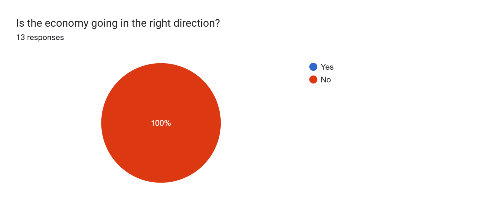

Even though the electorate only consisted of high school students, the economy is one of the major concerns in politics in the real world, especially for adults who actively contribute to the economy. Yet, all of the respondents believed the economy isn’t going in the right direction, which alludes to the fact that the campaigns and candidates may be able to win some votes with positive economic policies or track records in that regard.

#### *Chart 6B: Electability*
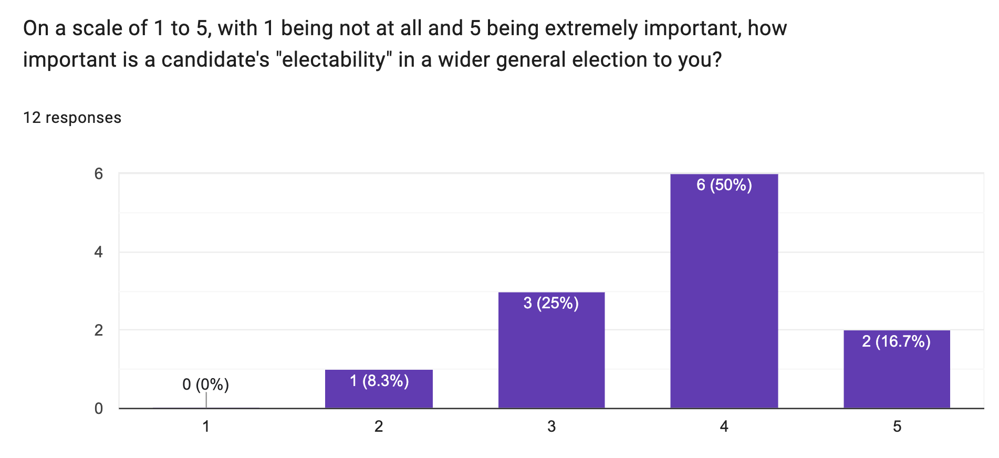

Though there were only 12 responses, it’s probable to deduce that around half of the voters believed a candidate’s ability to win elections is rather important when deciding who to vote for, as the average ranking, with one being “Not important” and five being “Extremely important,” is 4. This data hints that the candidate with policies that benefit the most people, preferably people from diverse political parties, are more likely to be elected. In addition, it suggests that certain members may be subjected to the bandwagon effect or elect to not vote at all on Election Day.

#### *Chart 7B: Deciding Factor*
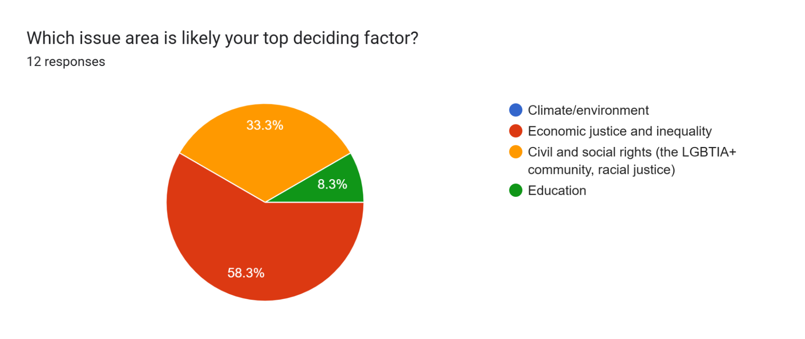

This question asked the electorate the category of issues that served as their top deciding factor. In other words, the question gauges what the voters care the most about. Out of the 12 responses, none contended that climate or environmental issues were the most important, 7 (58.3%) contended that economic justice and inequality was the most important, 4 (33.3%) contended that civil and social rights were the most important, and one response (8.3%) contended that education was the most important. Though the results were relatively spread out, it can be inferred that economic justice and inequality will play a big part in their decisions on Election Day. However, it’s worth noting that economic justice and inequality are  related to civil and social rights, as financial disparity limits various social components, hindering a person’s ability to exercise their rights.

#### *Chart 8B: Deal-Breaker Issue*
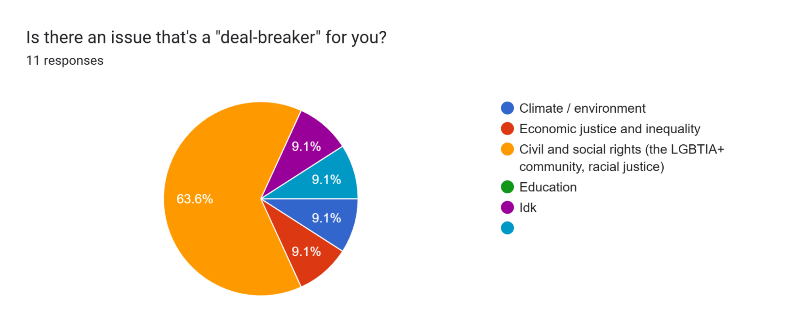

When asked to select a category of issues that were “deal-breakers,” most of the electorate (63.6%) chose civil and social rights. This makes sense. There are a lot of reports and protests regarding human rights infringement, such as the unnecessarily intense crackdown on immigration, during the campaigning phase. The remaining categories received one vote (9.1%) each, though a respondent selected the “Other” option but never provided a written response explaining their decision. These statistics indicate that cuts to programs like social and welfare will be frowned upon and would most likely be used against the candidates.

#### *Chart 9B: Private School Vouchers*
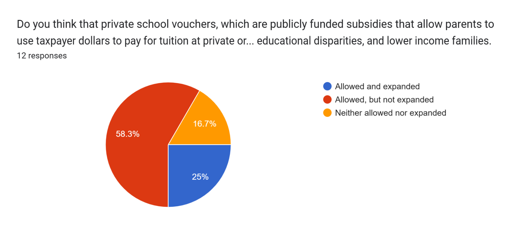

Even though the Mock Election took place at Masterman, a public school, a supermajority of the electorate believed private school vouchers should be generally allowed, as those who chose “Allowed and expanded” and “Allow, but not expanded” accumulate to 83.3% of the responses. Though ironic—private school vouchers are known to direct high-achieving students and funding away from public schools—the data shows that Shapiro’s support for private school vouchers wouldn’t necessarily hurt him on Election Day.

#### *Chart 10B: Polarization and Compromise*
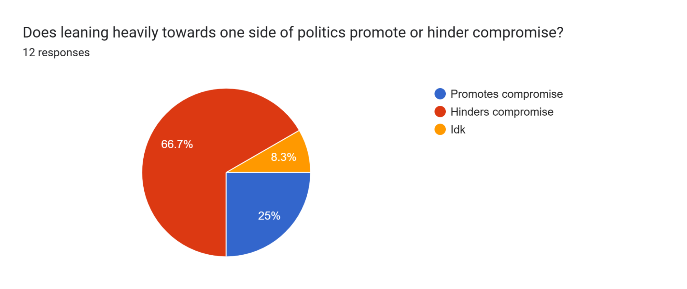

Most of the electorate contended that polarization hinders political compromise, which is consistent with the trends of the United States government because the federal government or certain sectors of the federal government have shut down due to the lack of compromise, which can be attributed to polarization. As for the three respondents that chose “Idk” (I don’t know), it can be inferred that they’re underclassmen and were unfamiliar with these terms. Using this data to Shapiro’s advantage, the campaign was able to place a stronger emphasis on the fact that he is a moderate candidate who’s more likely to bring forth compromise and reduce legislative gridlock. Even though most of the electorate identified as progressive, the campaign was able to strategically frame that gridlock and lack of compromise are generally negative, which most likely worked in Shapiro’s favor. 

#### *Other Subjective Questions*

In other sections of the poll, Shapiro’s pollsters asked the respondents questions regarding the words/phrases that come to their mind when they think of moderate policy and their stance on politicians supporting Israel. For the former question, respondents indicated that moderate policy reminded them of “compromise” and that there is an additional aspect that involves “understanding … the other party.” In terms of the latter question, eight out of the nine people who responded contended that American politicians shouldn’t support Israel, with the remaining person believing that the issue is “a bit controversial.” One of the respondents also remarked that they see Israel as an “inherently flawed state.” Knowing this sentiment allowed the campaign to dive deeper into opposition research because even though AOC wasn’t as outspoken as Shapiro about her support for Israel, she has supported the allocation of defensive funding for the country.

### Benchmark Poll

#### *Overview*
The last public poll that was conducted before Election Day was the Benchmark Poll, which was carried out on Wednesday during advisory, after the morning events. For this poll, it was determined that it would be better if a majority of the responses stemmed from voters who have attended at least one of Shapiro’s events. As a result, if the respondent chose “No” when asked whether they attended any of Shapiro’s events, they weren’t presented with further questions and were directed to submit the form. Though well-intentioned, this resulted in a biased group of respondents, as it overly emphasized Shapiro's supporters or voters who were more open-minded to the policies of both sides, which wasn’t generally representative of the electorate at large.

#### *Chart 1C: Grade*
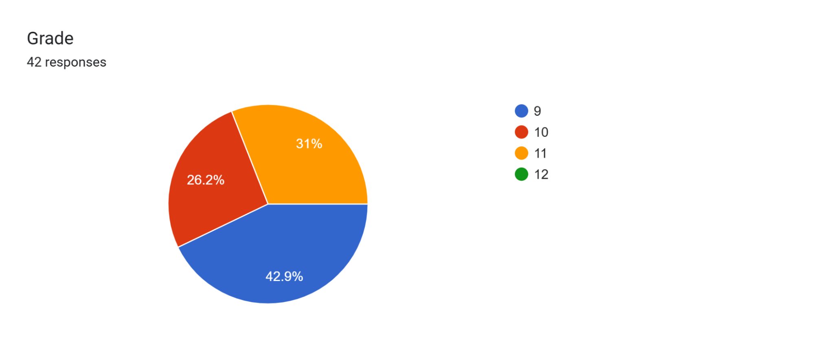

Pollsters were assigned to go to different high school advisories to get a random sample of around five people per advisory. Due to the truncated nature of morning advisories as well as the fact that many people were occupied with the morning event and wouldn’t have had enough time to go to the classrooms, the decision was made to leave out the seniors for this poll. Given that around half of the seniors were campaign members, this decision made sense. Though only seniors who weren’t in the AP Gov. classes were allowed to be polled, they were more likely to have loyalty towards their friend’s campaign—even if the ideologies don’t align with theirs—thus skewing the results. Ninth and tenth graders were expected to have more responses compared to eleventh since they had five sections instead of four, but the tenth graders ultimately produced fewer responses than expected.

#### *Chart 2C: Grade*
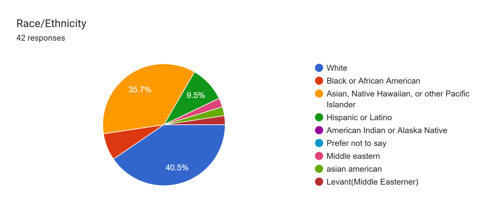

Relatively consistent with Masterman’s 2025-26 School Profile, 16 respondents (38%) identified as Asian, Native Hawaiian, or other Pacific Islander; 19 respondents (45.24%) identified as White or Middle Eastern; and 4 respondents (9.5%) identified as Hispanic or Latino. However, those who identified as Black or African American were underrepresented in this poll.

#### *Chart 3C: Attendance*
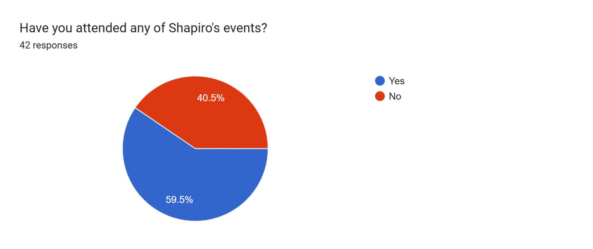

Chart 3C attempts to depict the percentage of the electorate that attended or didn’t attend Shapiro’s events. According to the data, it’s probable that 40.50% of the electorate didn’t plan to attend any of Shapiro’s events and/or weren’t open to learning about any of his policies. This trend, however, could also be attributed to the fact that some voters may have planned to attend Shapiro’s events later in the week.

#### *Chart 4C: Number of Shapiro's Events Attended*
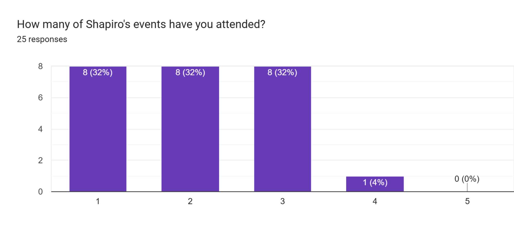

#### *Chart 5C: Number of AOC's Events Attended*
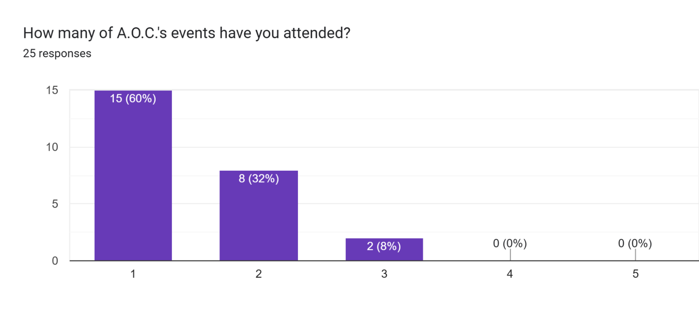

Charts 4 and 5 C shows that all of the respondents who attended at least one of Shapiro’s events also attended at least one of AOC’s events. This suggests that the respondents of this poll may not have been as biased as they were expected to be, but they seem to lean in the favor of Shapiro’s campaign. The average number of events attended for Shapiro is 2.08, whereas the average number of events attended for AOC is 1.48. Though this data may not be completely representative of the predominantly progressive electorate, it showed the campaign that Shapiro and his policies were exerting at least some positive influence on the public opinion.

#### *Chart 6C: Shapiro's Topics*
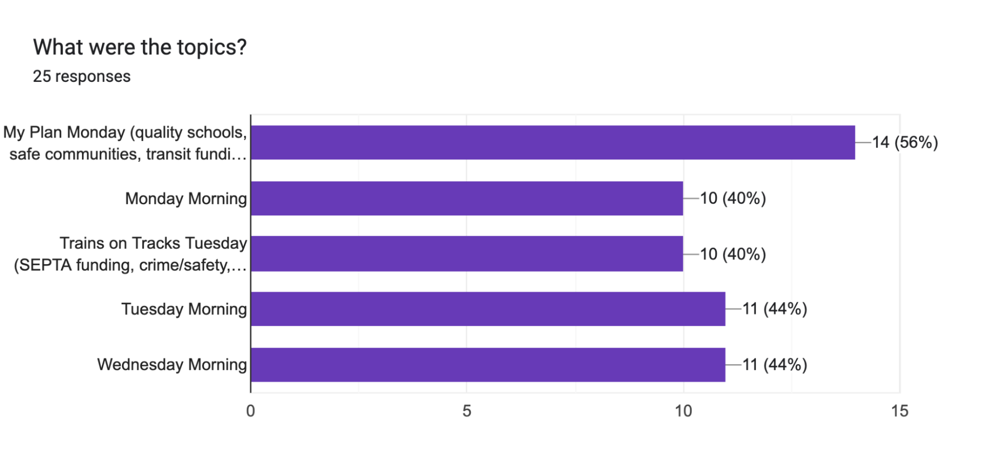

This question was designed to allow multiple selections to gauge which event(s) voters predominantly attended. The responses are rather evenly distributed, though most of the respondents (56%) attended Monday’s lunch event.

#### *Chart 7C: Most Successful Session(s)*
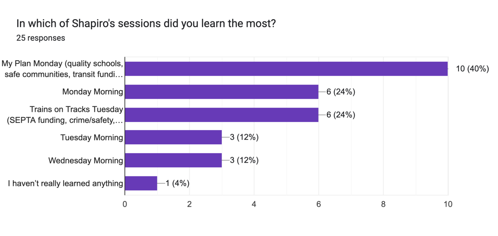

According to the respondents, Monday’s lunch event was the most effective in terms of knowledge disbursement, though this data may be skewed given that a majority of the respondents also attended the event. In addition, the data shows that the events on Tuesday and Wednesday mornings are the least effective, with one respondent contending that they didn’t believe they learned anything.

#### *Chart 8C: Alignment with the Progressives Before*
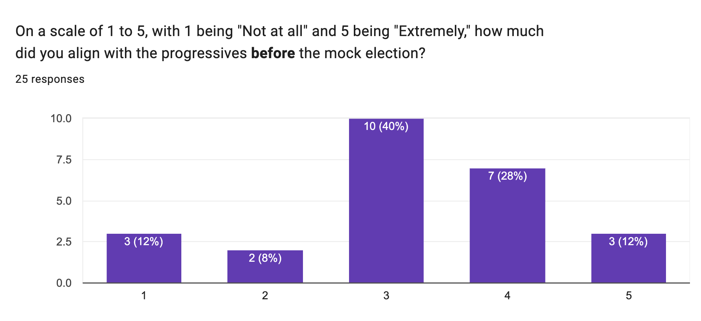

#### *Chart 9C: Alignment with the Progressives at the Halfway Point*
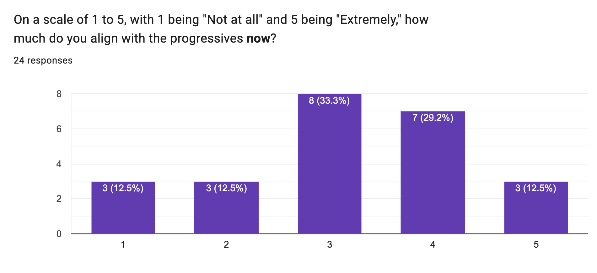

Charts 8 and 9 C depict the respondents’ alignment with progressive policy, with 1 being “Not at all” and 5 being “Extremely.” Before the Mock Election, the average alignment with the progressive sector of the Democratic Party was 3.33, whereas the average alignment with the progressives halfway through the campaign was 3.04. This data doesn’t necessarily point to a statistically significant decrease, since the median number remained consistent.

#### *Chart 10C: Alignment with the Moderates Before*
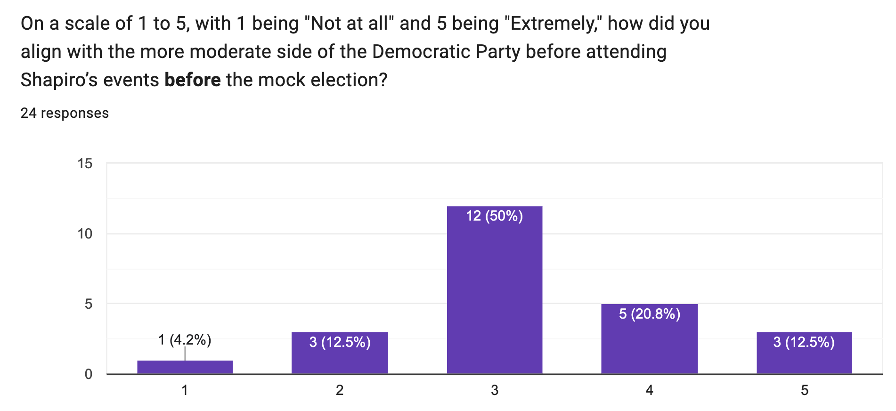

#### *Chart 11C: Alignment with the Moderates at the Halfway Point*
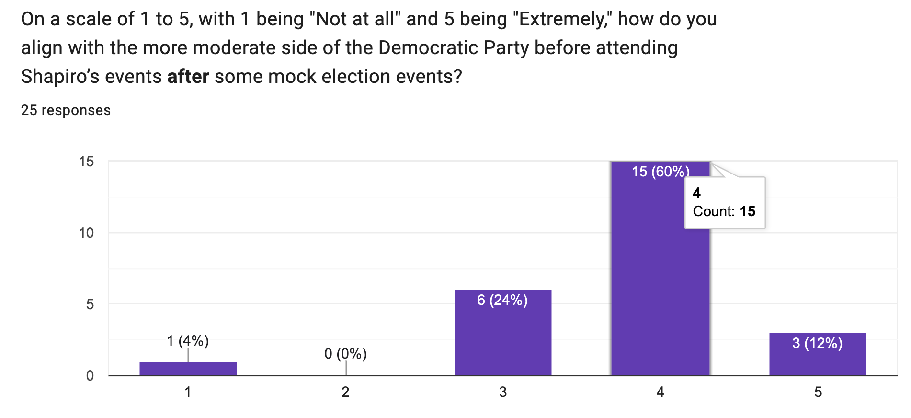

Charts 10 and 11 C details the respondents’ alignment with the moderate sector of the Democratic Party, with 1 being “Not at all” and 5 being “Extremely.” Before the campaigning began, the average alignment was 3.25. Halfway through the campaigning phase, the average alignment was 3.76. Though the data may have been biased, there is evidence that the various campaigning strategies helped sway voter sentiment in favor of the moderates.

#### *Chart 12C: Choice of Candidate*
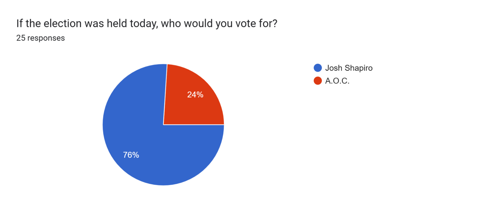

Though 19 respondents (76%) stated that they would vote for Shapiro if the election was held at that moment, this is likely biased due to the constraint stated in the overview for this poll. It’s also worth noting that with 19 supporters for Shapiro and 6 for AOC, even if the 17 respondents who submitted the form early because they didn’t attend Shapiro’s events all voted for AOC, Shapiro would still secure around 45% of the votes. This finding was higher than expected, as the electorate was expected to take a more progressive stance. Therefore, it was probable that the public sentiment in Shapiro’s favor ranged anywhere from 45 to 76 percent, but it was more reasonable to assume that the results would lean more towards the halfway mark—this assumption was supported by the ballot results, whose data comes directly after this section. 