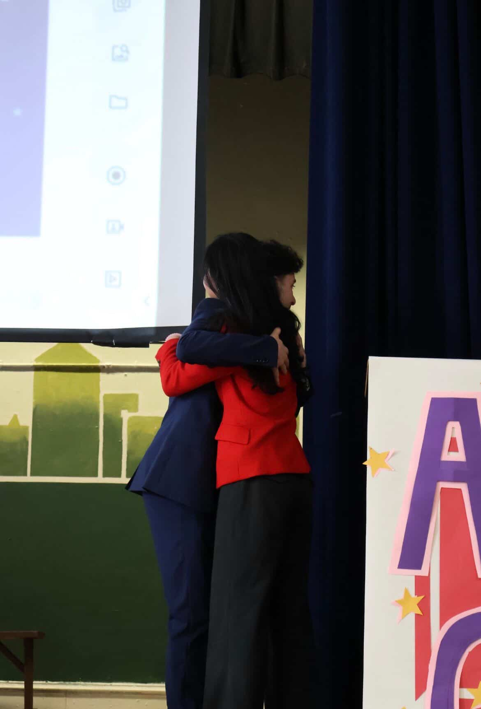

As briefly mentioned before, both campaigns came to notice that social media became one of the most important aspects of the election this year due to the tension and competitiveness between the two campaigns that became increasingly evident throughout the week. One example of this is that when the AOC campaign had more followers and engagement, the Shapiro campaign went on to follow students and others from outside of Masterman in order to increase the numbers on their page, which then prompted the AOC team to do the same as well. With each campaign averaging around 400 or slightly more followers, this year’s campaigns had more than double the amount of followers this year as opposed to last year. 

The two campaigns were more competitive when it came to communicating more information and attacking the other candidate as well. In comparison to last year’s social media pages, where the Vance campaign had eleven posts and the Walz campaign had fourteen, the AOC campaign ended up posting 24 posts in total while the Shapiro campaign would end up posting 28, again doubling the number from last year.

Due to the competitiveness for engagement, there often arose complications about what is “allowed” and what isn’t when it came to criticizing the other candidate. Most of these complications were resolved between the campaign managers and Mr. Gilligan, and did not cause so large of an issue that any campaign needed to be penalized.

