### Financial Report

#### *Chart 1: Financial Breakdown (Hard v. Soft Money)*

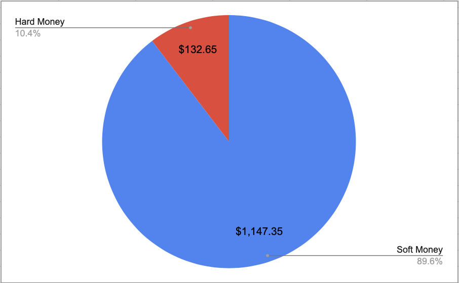

The AOC campaign incurred a staggering $1,280.00 in total expenditures. The majority of these expenditures were from soft money costs, which accounted for 89.6% of the total, or $1,147.35. In contrast, hard money costs accounted for only 10.4% of the total, or $132.65.

Soft money represented a significant share of overall spending, as morning and lunch events served as the campaign’s main points of engagement. This proved effective, as attendance at these events was nearly double that of other campaigns. Allocating soft money toward these events allowed the campaign to conserve its limited hard money for essential items, such as balloons for the kickoff, utensils for lunch events, and a $25 Dunkin’ Donuts gift card used as a prize for the Kahoot conducted on Thursday. The campaign also purposely minimized expenditures whenever possible. For example, flyers were produced using the free black-and-white copies provided by Mr. Gilligan. Color printing was deemed unnecessary as it would have significantly cut into the hard-money budget.

Among student members of the campaign, the average total expenditure was $41.29. Of this amount, the average hard money spending was approximately $4.38, while the average soft money spending was $37.01.

In the following sections, expenditures will be analyzed in greater detail, including hard money, soft money, free, kickoff, and daily spending from Monday through Friday, as well as a breakdown of both hard and soft money. A separate section for the debate is not included, as the campaign did not incur any hard or soft money expenses for this event; only leftover balloons from the kickoff were utilized.

#### *Table 1: Hard Money*

<table>
    <thead>
        <tr>
            <th>Item:</th>
            <th>Amount</th>
            <th>Total Cost:</th>
            <th>Link:</th>
            <th>Receipt:</th>
            <th>Calculations:</th>
            <th>Notes:</th>
        </tr>
    </thead>
    <tbody>
        <tr>
            <td>White Long Balloons</td>
            <td>100 Pcs</td>
            <td>$4.99</td>
            <td><a href="https://www.amazon.com" target="_blank">https://www.amazon</a></td>
            <td>Joanna</td>
            <td>N/A</td>
            <td>Joanna Amazon Prime purchase</td>
        </tr>
        <tr>
            <td>Regular Balloons</td>
            <td>120 Pcs</td>
            <td>$6.00</td>
            <td><a href="https://www.instacart.com" target="_blank">https://www.instacar</a></td>
            <td>Saoirse</td>
            <td>N/A</td>
            <td>Saoirse Walmart Instacart purchase</td>
        </tr>
        <tr>
            <td>Blow Pops</td>
            <td>75 Pcs</td>
            <td>$9.54</td>
            <td><a href="https://giantfoodstores.com" target="_blank">https://giantfoodstor</a></td>
            <td>Saoirse</td>
            <td>N/A</td>
            <td>Saoirse Walmart Instacart purchase</td>
        </tr>
        <tr>
            <td>Dum Dums</td>
            <td>360 Pcs</td>
            <td>$14.99</td>
            <td><a href="https://www.bjs.com" target="_blank">https://www.bjs.com</a></td>
            <td>Vicky</td>
            <td>N/A</td>
            <td>Vicky Bj's store purchase</td>
        </tr>
        <tr>
            <td>Instacart Fees &amp; Tip</td>
            <td>N/A</td>
            <td>$1.73</td>
            <td>N/A</td>
            <td>Saoirse</td>
            <td>(($21.91 - ($9.54 + $6.00 + 3.78))/3)*2</td>
            <td>Saoirse Walmart Instacart purchase</td>
        </tr>
        <tr style="background-color: #FFF9C4;">
            <td>Monday Forks</td>
            <td>108 Pcs</td>
            <td>$2.16</td>
            <td>N/A</td>
            <td>N/A</td>
            <td>108*$0.02 = $2.16</td>
            <td>3J's (Sean's family restaurant, using lowest market prices for both classes)</td>
        </tr>
        <tr style="background-color: #FFF9C4;">
            <td>Monday Napkins</td>
            <td>50 Pcs</td>
            <td>$0.19</td>
            <td>N/A</td>
            <td>N/A</td>
            <td>50*$0.00375 = $0.19</td>
            <td>3J's (Sean's family restaurant, using lowest market prices for both classes)</td>
        </tr>
        <tr style="background-color: #FFF9C4;">
            <td>Monday Cups</td>
            <td>123 Pcs</td>
            <td>$4.80</td>
            <td>N/A</td>
            <td>N/A</td>
            <td>123*$0.039 = $4.80</td>
            <td>3J's (Sean's family restaurant, using lowest market prices for both classes)</td>
        </tr>
        <tr style="background-color: #FFF9C4;">
            <td>Tuesday Cups</td>
            <td>149 Pcs</td>
            <td>$5.81</td>
            <td>N/A</td>
            <td>N/A</td>
            <td>149*$0.039 = $5.81</td>
            <td>3J's (Sean's family restaurant, using lowest market prices for both classes)</td>
        </tr>
        <tr style="background-color: #FFF9C4;">
            <td>Tuesday Forks</td>
            <td>150 Pcs</td>
            <td>$3.00</td>
            <td>N/A</td>
            <td>N/A</td>
            <td>150*$0.02 = $3.00</td>
            <td>3J's (Sean's family restaurant, using lowest market prices for both classes)</td>
        </tr>
        <tr style="background-color: #FFF9C4;">
            <td>Tuesday Bowls</td>
            <td>45 Pcs</td>
            <td>$2.34</td>
            <td>N/A</td>
            <td>N/A</td>
            <td>45*$0.052 = $2.34</td>
            <td>3J's (Sean's family restaurant, using lowest market prices for both classes)</td>
        </tr>
        <tr style="background-color: #FFF9C4;">
            <td>Wednesday Bowls</td>
            <td>15 Pcs</td>
            <td><b>$0.78</b></td>
            <td>N/A</td>
            <td>N/A</td>
            <td>15*$0.052 = $0.78</td>
            <td>3J's (Sean's family restaurant, using lowest market prices for both classes)</td>
        </tr>
        <tr style="background-color: #FFF9C4;">
            <td>Wednesday Plates</td>
            <td>100 Pcs</td>
            <td>$3.00</td>
            <td>N/A</td>
            <td>N/A</td>
            <td>100*$0.03 = $3.00</td>
            <td>3J's (Sean's family restaurant, using lowest market prices for both classes)</td>
        </tr>
        <tr style="background-color: #FFF9C4;">
            <td>Wednesday Cups</td>
            <td>250 Pcs</td>
            <td><b>$9.75</b></td>
            <td>N/A</td>
            <td>N/A</td>
            <td>250*$0.039 = $9.75</td>
            <td>3J's (Sean's family restaurant, using lowest market prices for both classes)</td>
        </tr>
        <tr style="background-color: #FFF9C4;">
            <td>Wednesday Forks</td>
            <td>150 Pcs</td>
            <td><b>$3.00</b></td>
            <td>N/A</td>
            <td>N/A</td>
            <td>150*$0.02 = $3.00</td>
            <td>3J's (Sean's family restaurant, using lowest market prices for both classes)</td>
        </tr>
        <tr style="background-color: #FFF9C4;">
            <td>Thursday Cups</td>
            <td>150 Pcs</td>
            <td><b>$5.85</b></td>
            <td>N/A</td>
            <td>N/A</td>
            <td>150*$0.039 = $5.85</td>
            <td>3J's (Sean's family restaurant, using lowest market prices for both classes)</td>
        </tr>
        <tr style="background-color: #FFF9C4;">
            <td>Thursday Bowls</td>
            <td>150 Pcs</td>
            <td><b>$7.80</b></td>
            <td>N/A</td>
            <td>N/A</td>
            <td>150*$0.052 = $7.80</td>
            <td>3J's (Sean's family restaurant, using lowest market prices for both classes)</td>
        </tr>
        <tr style="background-color: #FFF9C4;">
            <td>Thursday Napkins</td>
            <td>100 Pcs</td>
            <td><b>$0.38</b></td>
            <td>N/A</td>
            <td>N/A</td>
            <td>100*$0.0375 = $0.38</td>
            <td>3J's (Sean's family restaurant, using lowest market prices for both classes)</td>
        </tr>
        <tr>
            <td>Orange Juice</td>
            <td>1 Jug</td>
            <td>$7.82</td>
            <td>N/A</td>
            <td>N/A</td>
            <td>N/A</td>
            <td>Sean didn't grab receipt, for Thursday morning</td>
        </tr>
        <tr>
            <td>Dunkin Gift Card</td>
            <td>1 Card</td>
            <td>$25.00</td>
            <td>N/A</td>
            <td>Izzy</td>
            <td>N/A</td>
            <td>Izzy bought alongside personal items for Thursday lunch</td>
        </tr>
        <tr style="background-color: #FFF9C4;">
            <td><b>Friday Cups</b></td>
            <td>150 Pcs</td>
            <td><b>$5.85</b></td>
            <td>N/A</td>
            <td>N/A</td>
            <td>150*$0.039 = $5.85</td>
            <td>3J's (Sean's family restaurant, using lowest market prices for both classes)</td>
        </tr>
        <tr style="background-color: #FFF9C4;">
            <td><b>Friday Forks</b></td>
            <td>150 Pcs</td>
            <td><b>$3.00</b></td>
            <td>N/A</td>
            <td>N/A</td>
            <td>150*$0.02 = $3.00</td>
            <td>3J's (Sean's family restaurant, using lowest market prices for both classes)</td>
        </tr>
        <tr style="background-color: #FFF9C4;">
            <td><b>Friday Plates</b></td>
            <td>150 Pcs</td>
            <td><b>$4.50</b></td>
            <td>N/A</td>
            <td>N/A</td>
            <td>150*$0.03 = $4.50</td>
            <td>3J's (Sean's family restaurant, using lowest market prices for both classes)</td>
        </tr>
        <tr style="background-color: #FFF9C4;">
            <td><b>Friday Napkins</b></td>
            <td>100 Pcs</td>
            <td><b>$0.38</b></td>
            <td>N/A</td>
            <td>N/A</td>
            <td>100*$0.0375 = $0.38</td>
            <td>3J's (Sean's family restaurant, using lowest market prices for both classes)</td>
        </tr>
        <tr style="background-color: #E8F5E9;">
            <td colspan="2"></td>
            <td><b>$132.65</b></td>
            <td colspan="4"></td>
        </tr>
    </tbody>
</table>
*Items highlighted in pale yellow used market price estimates*

#### *Chart 2: Hard Money Breakdown (Day by Day)*
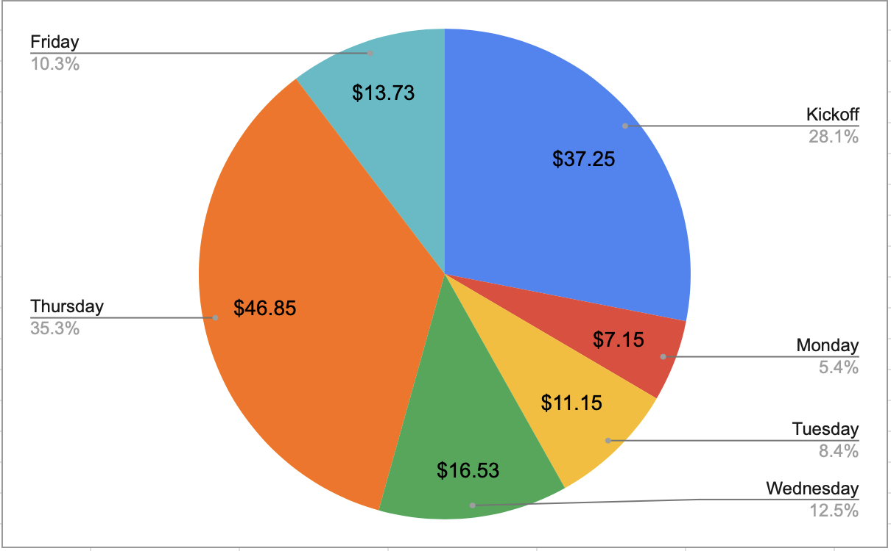

#### *Chart 3: Hard Money Breakdown (Item)*
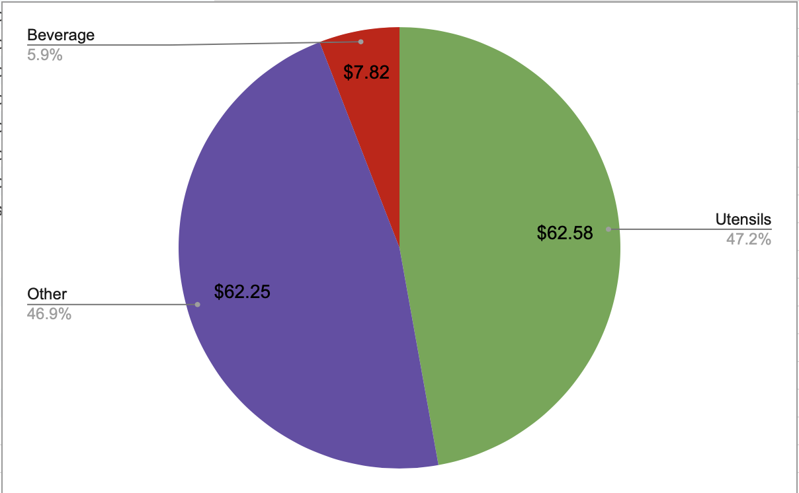

In terms of hard money, the campaign collected $135 from the class and spent $132.65. As shown in the graph, the two largest expenditures were utensils and the “other” category. The “other” category includes items such as balloons, candy, and the Dunkin’ Donuts gift card, and was the second-largest expenditure by $0.033. This was not surprising, as the category consisted of several miscellaneous items. The percentage of hard money allocated to utensils was also expected, as previous campaigns had identified this as their largest expense. We prepared for this in advance by reducing utensil costs through purchasing items from 3J’s Cafe, which allowed the campaign to pay the lowest market price and avoid tax. This decision was discussed with Mr. Gilligan and approved.

The highest spending days were the kickoff and Thursday. Thursday was the second-highest spending day, as the morning event specified orange juice, which could not be made using soft money. At that point in the week, the campaign had sufficient budget to cover the cost. The kickoff was the highest spending day, largely due to the purchase of candy and balloons. Candy was the most expensive item, accounting for over 70% of Thursday’s hard money spending. Because none of the desired kickoff items could be obtained through soft money, the campaign chose to allocate more funds to this event. This decision proved effective, as the long balloons and candy helped generate early momentum for the campaign.

In terms of hard money collected, the campaign raised $132.65. These funds were used to reimburse individuals who purchased hard money items throughout the week. The additional $2.35 collected was reimbursed to Sean R., as he contributed the largest overall amount.

A student-by-student breakdown of hard money contributions could not be conducted, as individual collections were not tracked.

### Soft Money

#### *Table 2: Hard Money Breakdown (Item)*

<table>
    <thead>
        <tr>
            <th>Item:</th>
            <th>Amount:</th>
            <th>Total Cost:</th>
            <th>Link:</th>
            <th>Receipt:</th>
            <th>Calculations:</th>
            <th>Notes:</th>
        </tr>
    </thead>
    <tbody>
        <tr style="background-color: #FFF9C4;">
            <td>Chocolate Chip Cookies</td>
            <td>60 Pcs</td>
            <td>$30.00</td>
            <td>N/A</td>
            <td>N/A</td>
            <td>$0.5*60 = $30.00</td>
            <td>Lorina brought for Monday morning homemade and no receipt, using estimated market price</td>
        </tr>
        <tr>
            <td>Shin Ramen</td>
            <td>5 Packs</td>
            <td>$5.75</td>
            <td><a href="https://www.walmart.com" target="_blank">https://w</a></td>
            <td>N/A</td>
            <td>$1.15*5 = $5.75</td>
            <td>Joanna brought for Monday lunch</td>
        </tr>
        <tr>
            <td>Chicken Top Ramen</td>
            <td>24 Packs</td>
            <td>$6.96</td>
            <td><a href="https://www.walmart.com" target="_blank">https://w</a></td>
            <td>Yes</td>
            <td>N/A</td>
            <td>Sabrina brought for Monday lunch</td>
        </tr>
        <tr style="background-color: #FFF9C4;">
            <td>Pancakes (with Whipped Cream &amp; Syrup)</td>
            <td>60 Pcs</td>
            <td>$240</td>
            <td>N/A</td>
            <td>N/A</td>
            <td>($12.00/3)*60 = $240</td>
            <td>Sean R. brought for Tuesday morning homemade and no receipt, using estimated price based off of 3J's Menu</td>
        </tr>
        <tr>
            <td>Barilla Penne Pasta</td>
            <td>4 Boxes (16 ounces each)</td>
            <td>$8.76</td>
            <td><a href="https://giantfoodstores.com" target="_blank">https://gi</a></td>
            <td>N/A</td>
            <td>$2.19*4 = $8.76</td>
            <td>Saoirse brought for Tuesday lunch</td>
        </tr>
        <tr>
            <td>Prego Marinara Sauce</td>
            <td>3 Jars (23 ounces each)</td>
            <td>$8.37</td>
            <td><a href="https://giantfoodstores.com" target="_blank">https://gi</a></td>
            <td>N/A</td>
            <td>$2.79*3 = $8.37</td>
            <td>Saoirse brought for Tuesday lunch</td>
        </tr>
        <tr>
            <td>Giant's Brand Shredded Parmesan Cheese</td>
            <td>3 Bags (6 ounces each)</td>
            <td>$5.97</td>
            <td><a href="https://giantfoodstores.com" target="_blank">https://gi</a></td>
            <td>N/A</td>
            <td>$1.99*3 = $5.97</td>
            <td>Saoirse brought for Tuesday lunch</td>
        </tr>
        <tr style="background-color: #FFF9C4;">
            <td>French Toast (with Whipped Cream &amp; Syrup)</td>
            <td>60 Pcs</td>
            <td>$300</td>
            <td>N/A</td>
            <td>N/A</td>
            <td>($15.00/3)*60 = $300</td>
            <td>Sean R. brought for Wednesday morning homemade and no receipt, using estimated price based off of 3J's Menu</td>
        </tr>
        <tr>
            <td>Mission Burrito Flour Tortillas</td>
            <td>4 Bags</td>
            <td>$18.52</td>
            <td><a href="https://www.walmart.com" target="_blank">https://w</a></td>
            <td>N/A</td>
            <td>$4.63*4 = $18.52</td>
            <td>Saoirse brought for Wednesday lunch</td>
        </tr>
        <tr>
            <td>Lucerne Mexican Cheese</td>
            <td>6 Bags (8 ounces each)</td>
            <td>$14.94</td>
            <td><a href="https://www.walmart.com" target="_blank">https://w</a></td>
            <td>N/A</td>
            <td>$2.49*6 = $14.94</td>
            <td>Saoirse brought for Wednesday lunch</td>
        </tr>
        <tr>
            <td>2% Milk</td>
            <td>2 Gallons</td>
            <td>$9.28</td>
            <td><a href="https://giantfoodstores.com" target="_blank">https://gi</a></td>
            <td>Yes</td>
            <td>$4.64*2 = $9.28</td>
            <td>Zoe brought for Wednesday lunch</td>
        </tr>
        <tr>
            <td>WuFuYan Tapioca Pearls</td>
            <td>4 Bags (250 grams each)</td>
            <td>$13.96</td>
            <td><a href="https://www.walmart.com" target="_blank">https://w</a></td>
            <td>N/A</td>
            <td>$3.49*4 = $13.96</td>
            <td>Zoe brought for Wednesday lunch</td>
        </tr>
        <tr>
            <td>Trader Joes Black Tea Concentrate</td>
            <td>2 Bottles (16 ounces each)</td>
            <td>$9.98</td>
            <td><a href="https://www.walmart.com" target="_blank">https://w</a></td>
            <td>Yes</td>
            <td>$4.99*2 = $9.98</td>
            <td>Zoe brought for Wednesday lunch</td>
        </tr>
        <tr style="background-color: #FFF9C4;">
            <td>Pierogis</td>
            <td>100 Pcs</td>
            <td>$22.90</td>
            <td>N/A</td>
            <td>N/A</td>
            <td>($10.99/48)*100 = $22.90</td>
            <td>Vicky brought for Wednesday lunch, homemade and no receipt, using estimated market price</td>
        </tr>
        <tr style="background-color: #FFF9C4;">
            <td>Mac and Cheese</td>
            <td>1 Pan (240 ounces)</td>
            <td>$45.00</td>
            <td>N/A</td>
            <td>N/A</td>
            <td>N/A</td>
            <td>Olivia brought for Wednesday lunch, homemade and no receipt, using estimated market price</td>
        </tr>
        <tr style="background-color: #FFF9C4;">
            <td>Chocolate Chip Muffins</td>
            <td>60 Pcs</td>
            <td>$60</td>
            <td>N/A</td>
            <td>N/A</td>
            <td>$1.00*60 = $60.00</td>
            <td>Saoirse brought for Thursday morning, homemade and no receipt, using estimated market price</td>
        </tr>
        <tr>
            <td>Iced Tea Mix</td>
            <td>1 Can (82.6 ounces)</td>
            <td>$9.99</td>
            <td><a href="https://giantfoodstores.com" target="_blank">https://gi</a></td>
            <td>N/A</td>
            <td>N/A</td>
            <td>Sam brought for Thursday lunch</td>
        </tr>
        <tr style="background-color: #FFF9C4;">
            <td>Chicken Nuggets</td>
            <td>4 Bags</td>
            <td>$19.88</td>
            <td><a href="https://www.walmart.com" target="_blank">https://w</a></td>
            <td>N/A</td>
            <td>$4.97*4 = $19.88</td>
            <td>Sabrina brought for Thursday lunch, no receipt, using Tyson White Meat Chicken Nuggets (29 oz) as substitute</td>
        </tr>
        <tr style="background-color: #FFF9C4;">
            <td>Onion Rings</td>
            <td>1 Bag</td>
            <td>$3.42</td>
            <td><a href="https://www.walmart.com" target="_blank">https://w</a></td>
            <td>N/A</td>
            <td>N/A</td>
            <td>Unknown, no receipt, using Great Value Whole Onion Rings (16 oz) as substitute</td>
        </tr>
        <tr style="background-color: #FFF9C4;">
            <td>Waffle Fries</td>
            <td>1 Bag</td>
            <td>$3.32</td>
            <td><a href="https://www.walmart.com" target="_blank">https://w</a></td>
            <td>N/A</td>
            <td>N/A</td>
            <td>Unknown, no receipt, using Great Value Waffle Cut French Fried Potatoes (24 oz) as substitute</td>
        </tr>
        <tr>
            <td>Crinkle Cut Potatoes</td>
            <td>2 Bags</td>
            <td>$6.38</td>
            <td><a href="https://www.walmart.com" target="_blank">https://w</a></td>
            <td>N/A</td>
            <td>$3.19*2 = $6.38</td>
            <td>Kenrick brought for Thursday lunch</td>
        </tr>
        <tr style="background-color: #FFF9C4;">
            <td>Regular Seasoned Fries</td>
            <td>1 Bag</td>
            <td>$5.94</td>
            <td><a href="https://www.walmart.com" target="_blank">https://w</a></td>
            <td>N/A</td>
            <td>N/A</td>
            <td>Unknown, no receipt, using Great Value Seasoned French Fried Potatoes (64 oz) as substitute</td>
        </tr>
        <tr style="background-color: #FFF9C4;">
            <td>Barbeque Sauce</td>
            <td>1 Bottle</td>
            <td>$2.97</td>
            <td><a href="https://www.walmart.com" target="_blank">https://w</a></td>
            <td>N/A</td>
            <td>N/A</td>
            <td>Deybrian brought for Thursday lunch, no receipt, using Walmart Sweet Baby Ray's Original Barbecue Sauce (28 oz) as substitute</td>
        </tr>
        <tr style="background-color: #FFF9C4;">
            <td>Chick-Fil-A Sauce</td>
            <td>1 Bottle</td>
            <td>$3.97</td>
            <td><a href="https://www.walmart.com" target="_blank">https://w</a></td>
            <td>N/A</td>
            <td>N/A</td>
            <td>Sabrina brought for Thursday lunch, no receipt, using Walmart price</td>
        </tr>
        <tr style="background-color: #FFF9C4;">
            <td>Tea</td>
            <td>1 Catering Jug (96 ounces)</td>
            <td>$20</td>
            <td>N/A</td>
            <td>N/A</td>
            <td>N/A</td>
            <td>Sean R. brought for Friday morning homemade and no receipt, using estimated market price</td>
        </tr>
        <tr style="background-color: #FFF9C4;">
            <td>Coffee</td>
            <td>1 Catering Jug (96 ounces)</td>
            <td>$30</td>
            <td>N/A</td>
            <td>N/A</td>
            <td>N/A</td>
            <td>Sean R. brought for Friday morning homemade and no receipt, using estimated market price</td>
        </tr>
        <tr style="background-color: #FFF9C4;">
            <td>Brownies</td>
            <td>60 Pcs</td>
            <td>$30.00</td>
            <td>N/A</td>
            <td>N/A</td>
            <td>$0.50*60 = $30.00</td>
            <td>Lorina brought for Friday morning, homemade and no receipt, using estimated market price</td>
        </tr>
        <tr style="background-color: #FFF9C4;">
            <td>Strawberry Vanilla Mini Cakes</td>
            <td>50 Pcs</td>
            <td>$25.33</td>
            <td>N/A</td>
            <td>Yes</td>
            <td>(2.19*2) + 1.09 + (4.99)</td>
            <td>Joanna brought for Friday lunch, homemade with receipt for most items</td>
        </tr>
        <tr style="background-color: #FFF9C4;">
            <td>Chocolate Raspberry Mini Cakes</td>
            <td>50 Pcs</td>
            <td>$22.68</td>
            <td>N/A</td>
            <td>Yes</td>
            <td>(2.19*2) + 1.09 + 7.49</td>
            <td>Joanna brought for Friday lunch, homemade with receipt for most items</td>
        </tr>
        <tr>
            <td>Trader Joes Chicken Gyozas</td>
            <td>5 Bags</td>
            <td>$19.95</td>
            <td><a href="https://www.walmart.com" target="_blank">https://w</a></td>
            <td>N/A</td>
            <td>$3.99*5 = $19.95</td>
            <td>Joanna brought for Friday lunch</td>
        </tr>
        <tr>
            <td>Royal Asia Vegetable Spring Rolls</td>
            <td>6 Boxes</td>
            <td>$71.94</td>
            <td><a href="https://sameday.costco.com" target="_blank">https://sa</a></td>
            <td>N/A</td>
            <td>6 x 11.99 = 71.94</td>
            <td>Sabrina brought for Friday lunch</td>
        </tr>
        <tr>
            <td>Brown Basmati Rice</td>
            <td>2 Bags</td>
            <td>$8.58</td>
            <td>N/A</td>
            <td>N/A</td>
            <td>$4.29*2 = $8.58</td>
            <td>Kenrick brought for Friday lunch</td>
        </tr>
        <tr>
            <td>Frozen Mixed Vegetables</td>
            <td>2 Bags</td>
            <td>$2.18</td>
            <td>N/A</td>
            <td>N/A</td>
            <td>$1.09*2 = $2.18</td>
            <td>Kenrick brought for Friday lunch</td>
        </tr>
        <tr>
            <td>Eggs</td>
            <td>1 Carton (1 Dozen)</td>
            <td>$2.19</td>
            <td>N/A</td>
            <td>N/A</td>
            <td>N/A</td>
            <td>Kenrick brought for Friday lunch</td>
        </tr>
        <tr>
            <td>2% Milk</td>
            <td>2 Gallons</td>
            <td>$9.28</td>
            <td><a href="https://giantfoodstores.com" target="_blank">https://gi</a></td>
            <td>Yes</td>
            <td>$4.64*2 = $9.28</td>
            <td>Zoe brought for Friday lunch</td>
        </tr>
        <tr>
            <td>Trader Joes Black Tea Concentrate</td>
            <td>2 Bottles</td>
            <td>$9.98</td>
            <td><a href="https://www.walmart.com" target="_blank">https://w</a></td>
            <td>Yes</td>
            <td>$4.99*2 = $9.98</td>
            <td>Zoe brought for Friday lunch</td>
        </tr>
        <tr>
            <td>Trader Joes Oat Brown Sugar Creamer</td>
            <td>2 Bottles</td>
            <td>$3.98</td>
            <td><a href="https://www.walmart.com" target="_blank">https://w</a></td>
            <td>Yes</td>
            <td>$1.99*2 = $3.98</td>
            <td>Zoe brought for Friday lunch</td>
        </tr>
        <tr style="background-color: #E8F5E9;">
            <td colspan="2"></td>
            <td><b>$1,147.35</b></td>
            <td colspan="4"></td>
        </tr>
    </tbody>
</table>
*Items highlighted in pale yellow used market price estimates*

Three receipts were submitted for soft money expenditures. The first was a Giant receipt from Joanna listing the items needed to make the mini cakes for the Friday lunch event, totaling $39.18. The second was another Giant receipt, this time from Zoe, totaling $9.28 for the items used to make the boba for the Friday lunch event. The final receipt, also submitted by Zoe, was from Trader Joe's and totaled $43.92, with the actual amount attributed to the campaign being $413.96. The items on this receipt were also used to prepare the boba for the Friday lunch event.

All items listed in the soft money expenditure table were tax-exempt, as they were food items. A link to the receipts will be provided at the end of the report.

#### *Chart 4: Soft Money Breakdown (Day by Day)*
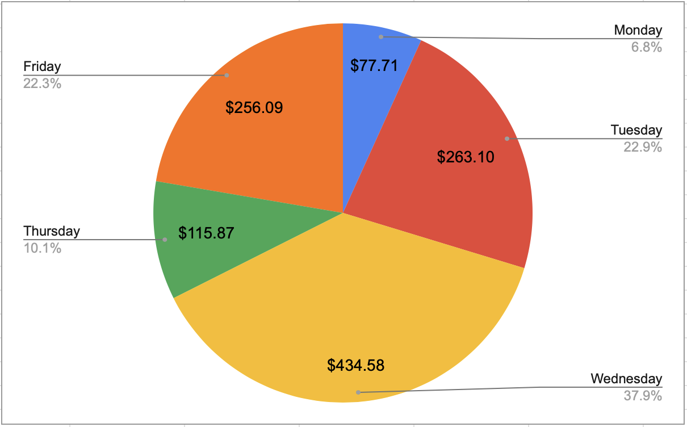

#### *Chart 5: Soft Money Breakdown (Item)*
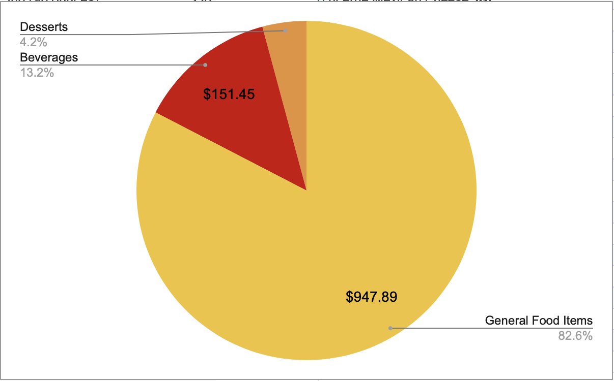

#### *Chart 6: Soft Money Breakdown (Student by Student)*
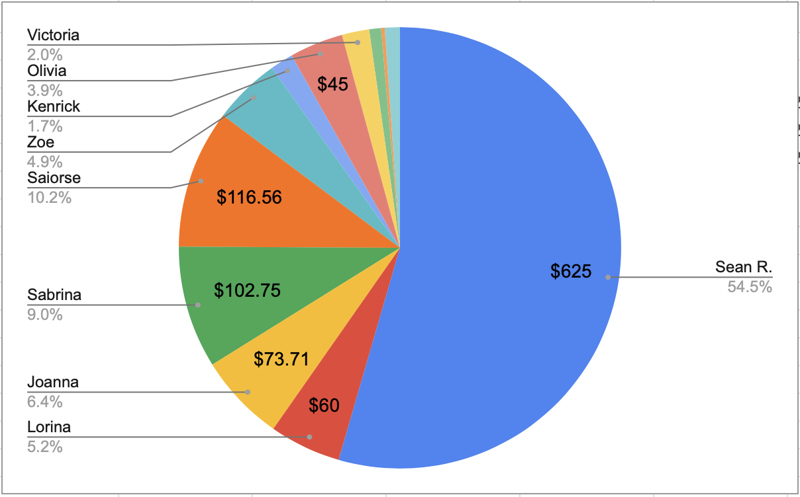

Most of the soft money spending, 82.6% or $947.89, was allocated to general food items for the morning and lunch events planned for the campaign. These items typically served as the main courses at each event. For example, muffins and cookies provided at morning events were categorized as general food items rather than desserts because they functioned as full meals. The second-largest category was beverages, which is consistent with the campaign including them at 3 out of 5 lunch events and 3 out of 5 morning events. The smallest category was desserts, as they were offered only at the Friday lunch event. This was a strategic effort to attract students, since the Shapiro campaign had the auditorium and rumors suggested they were planning a major event. This approach proved effective, as the AOC campaign successfully drew more students, even while competing with the Shapiro campaign’s appealing food offerings.

In terms of daily spending, the highest expenditure occurred on Wednesday, when Sean Rolando prepared 60 pieces of French toast with toppings for the morning event. The total cost for this was $300. It is important to note that prices from 3J’s may appear higher, as production costs can differ from standard market rates. The second-highest spending day was Friday, when the AOC campaign allocated additional funds to counter the Shapiro campaign’s Friday lunch event.

The largest contributor to the campaign’s soft money expenditures was Sean Rolando. His family’s café, 3J’s, provided access to a commercial kitchen, allowing him and several other students to prepare many of the morning event food items. This saved the campaign a significant amount of hard money while providing more attractive food options. Sean alone contributed $625 in soft money expenditures. The second-largest contributor was Saoirse, who spent $116.56. Following Saoirse were Sabrina, Joanna, Lorina, Zoe, and Olivia, who spent $102.75, $73.71, $60.00, $56.46, and $45, respectively. Other notable contributors include Victoria, Kenrick, Samuel, Deybrian, and a category of unknown individuals, who spent $22.90, $19.33, $9.99, $2.97, and $12.68, respectively.

### Free

#### *Table 3: Free Items*
<table>
    <thead>
        <tr>
            <th>Item:</th>
            <th>Amount:</th>
            <th>Cost:</th>
            <th>Link:</th>
            <th>Receipt:</th>
            <th>Notes:</th>
        </tr>
    </thead>
    <tbody>
        <tr>
            <td>Black Construction Paper (Handles)</td>
            <td>25 Sheets</td>
            <td>N/A</td>
            <td>N/A</td>
            <td>N/A</td>
            <td>GOV 2 Personal Use</td>
        </tr>
        <tr>
            <td>Red Construction Paper (Pom Poms)</td>
            <td>12 Sheets</td>
            <td>N/A</td>
            <td>N/A</td>
            <td>N/A</td>
            <td>GOV 2 Personal Use</td>
        </tr>
        <tr>
            <td>Scotch Tape (Paper Promo)</td>
            <td>1/10 Roll</td>
            <td>N/A</td>
            <td>N/A</td>
            <td>N/A</td>
            <td>GOV 2 Personal Use</td>
        </tr>
        <tr>
            <td>Black and White Copy Paper (Izzy Head Cutout)</td>
            <td>90 Sheets</td>
            <td>N/A</td>
            <td>N/A</td>
            <td>N/A</td>
            <td>GOV 2 Personal Use</td>
        </tr>
        <tr>
            <td>Banner Paper (Kickoff)</td>
            <td>4 ft</td>
            <td>N/A</td>
            <td>N/A</td>
            <td>N/A</td>
            <td>GOV 2 Personal Use</td>
        </tr>
        <tr>
            <td>Banner Paper (Cafeteria)</td>
            <td>8 ft</td>
            <td>N/A</td>
            <td>N/A</td>
            <td>N/A</td>
            <td>GOV 2 Personal Use</td>
        </tr>
        <tr>
            <td>Black and White Copy Paper (Kickoff Pamphlets)</td>
            <td>Roughly 100 Sheets</td>
            <td>N/A</td>
            <td>N/A</td>
            <td>N/A</td>
            <td>GOV 2 Personal Use</td>
        </tr>
        <tr style="background-color: #D9EAD3;">
            <td>Dark Blue Construction Paper</td>
            <td>4 Sheets</td>
            <td>N/A</td>
            <td>N/A</td>
            <td>N/A</td>
            <td>Interclass Use, Chain Link for MC Debate Table</td>
        </tr>
        <tr style="background-color: #D9EAD3;">
            <td>Light Blue Construction Paper</td>
            <td>4 Sheets</td>
            <td>N/A</td>
            <td>N/A</td>
            <td>N/A</td>
            <td>Interclass Use, Chain Link for MC Debate Table</td>
        </tr>
        <tr style="background-color: #D9EAD3;">
            <td>Staples</td>
            <td>100 Staples</td>
            <td>N/A</td>
            <td>N/A</td>
            <td>N/A</td>
            <td>Interclass Use, Chain Link for MC Debate Table</td>
        </tr>
        <tr>
            <td>Black and White Copy Paper (Homework/Extra Credit Passes)</td>
            <td>Roughly 50 Sheets</td>
            <td>N/A</td>
            <td>N/A</td>
            <td>N/A</td>
            <td>GOV 2 Personal Use</td>
        </tr>
        <tr>
            <td>Black and White Copy Paper (Flyers)</td>
            <td>Roughly 100 Sheets</td>
            <td>N/A</td>
            <td>N/A</td>
            <td>N/A</td>
            <td>GOV 2 Personal Use</td>
        </tr>
        <tr>
            <td>Assorted Colors Construction Paper (Podium)</td>
            <td>Roughly 5 Sheets</td>
            <td>N/A</td>
            <td>N/A</td>
            <td>N/A</td>
            <td>GOV 2 Personal Use</td>
        </tr>
    </tbody>
</table>
*Light green highlight represents items shared by both classes*

As part of the mock election, Mr. Gilligan provided both campaigns with several free items to use. Of those free items, the one the campaign team utilized most was paper. Paper was used for banners in the kickoff and lunchroom, paper cutouts of AOC on the balloons, decorating the podium, kickoff pamphlets, and flyers throughout the school.

### Kickoff

#### *Table 4: Kickoff Expenses (Hard Money)*
<table>
    <thead>
        <tr>
            <th>Item:</th>
            <th>Amount:</th>
            <th>Total Cost:</th>
            <th>Link:</th>
            <th>Receipt:</th>
            <th>Calculations:</th>
            <th>Notes:</th>
        </tr>
    </thead>
    <tbody>
        <tr>
            <td>White Long Balloons <b>[O]</b></td>
            <td>100 Pcs</td>
            <td>$4.99</td>
            <td><a href="https://www.amazon.com" target="_blank">https://www.amazon.com</a></td>
            <td>Joanna</td>
            <td>N/A</td>
            <td>Joanna Amazon Prime purchase</td>
        </tr>
        <tr>
            <td>Regular Balloons <b>[O]</b></td>
            <td>120 Pcs</td>
            <td>$6.00</td>
            <td><a href="https://www.instacart.com" target="_blank">https://www.instacart.com</a></td>
            <td>Saoirse</td>
            <td>N/A</td>
            <td>Saoirse Walmart Instacart purchase</td>
        </tr>
        <tr>
            <td>Blow Pops <b>[O]</b></td>
            <td>75 Pcs</td>
            <td>$9.54</td>
            <td><a href="https://giantfoodstores.com" target="_blank">https://giantfoodstores.com</a></td>
            <td>Saoirse</td>
            <td>N/A</td>
            <td>Saoirse Walmart Instacart purchase</td>
        </tr>
        <tr>
            <td>Dum Dums <b>[O]</b></td>
            <td>360 Pcs</td>
            <td>$14.99</td>
            <td><a href="https://www.bjs.com" target="_blank">https://www.bjs.com</a></td>
            <td>Vicky</td>
            <td>N/A</td>
            <td>Vicky Bj's store purchase</td>
        </tr>
        <tr>
            <td>Instacart Fees &amp; Tip <b>[O]</b></td>
            <td>N/A</td>
            <td>$1.73</td>
            <td>N/A</td>
            <td>Izzy</td>
            <td>(($21.91 - ($9.54 + $6.00 + 3.78))/3)*2 = $1.73</td>
            <td>Saoirse Walmart Instacart purchase</td>
        </tr>
        <tr style="background-color: #D1D5DB;">
            <td colspan="2"></td>
            <td><b>$37.25</b></td>
            <td colspan="4"></td>
        </tr>
    </tbody>
</table>

#### *Table 5: Kickoff Expenses (Free)*
<table>
    <thead>
        <tr>
            <th>Item:</th>
            <th>Amount:</th>
            <th>Cost:</th>
            <th>Link:</th>
            <th>Receipt:</th>
            <th>Notes:</th>
        </tr>
    </thead>
    <tbody>
        <tr>
            <td>Black Construction Paper (Handles)</td>
            <td>25 Sheets</td>
            <td>N/A</td>
            <td>N/A</td>
            <td>N/A</td>
            <td>GOV 2 Personal Use</td>
        </tr>
        <tr>
            <td>Red Construction Paper (Pom Poms)</td>
            <td>12 Sheets</td>
            <td>N/A</td>
            <td>N/A</td>
            <td>N/A</td>
            <td>GOV 2 Personal Use</td>
        </tr>
        <tr>
            <td>Scotch Tape (Paper Promo)</td>
            <td>1/10 Roll</td>
            <td>N/A</td>
            <td>N/A</td>
            <td>N/A</td>
            <td>GOV 2 Personal Use</td>
        </tr>
        <tr>
            <td>Black and White Copy Paper (Izzy Head Cutout)</td>
            <td>90 Sheets</td>
            <td>N/A</td>
            <td>N/A</td>
            <td>N/A</td>
            <td>GOV 2 Personal Use</td>
        </tr>
        <tr>
            <td>Banner Paper (Kickoff)</td>
            <td>4 ft</td>
            <td>N/A</td>
            <td>N/A</td>
            <td>N/A</td>
            <td>GOV 2 Personal Use</td>
        </tr>
        <tr>
            <td>Banner Paper (Cafeteria)</td>
            <td>8 ft</td>
            <td>N/A</td>
            <td>N/A</td>
            <td>N/A</td>
            <td>GOV 2 Personal Use</td>
        </tr>
        <tr>
            <td>Black and White Copy Paper (Kickoff Pamphlets)</td>
            <td>Roughly 100 Sheets</td>
            <td>N/A</td>
            <td>N/A</td>
            <td>N/A</td>
            <td>GOV 2 Personal Use</td>
        </tr>
    </tbody>
</table>

For the kickoff, the AOC campaign spent a total of $37.25. Of this amount, $10.99 was allocated to balloons, while $24.53 was spent on candy. The Dum Dums were attached to campaign pamphlets, which incentivized students to take and read them. The Blow Pops were offered as a reward for students who took pictures with AOC, the AOC balloons, and/or the AOC pamphlets and posted them on their Instagram pages. This helped increase the visibility of AOC’s face, name, and policies.

An additional $1.73 was attributed to a DoorDash tip and service fee, as the campaign was unable to purchase the necessary items for the kickoff in person or in time. It is important to note that this DoorDash order also included a bag of Smarties for personal use; therefore, the $1.73 represents two-thirds of the total service fee and tip, since the order included three items.

### Monday

#### *Table 6: Monday Expenses (Hard Money)*
<table>
    <thead>
        <tr>
            <th>Item:</th>
            <th>Amount:</th>
            <th>Total Cost:</th>
            <th>Link:</th>
            <th>Receipt:</th>
            <th>Calculations:</th>
            <th>Notes:</th>
        </tr>
    </thead>
    <tbody>
        <tr>
            <td>Monday Plastic Forks <b>[U]</b></td>
            <td>108 Pcs</td>
            <td>$2.16</td>
            <td>N/A</td>
            <td>N/A</td>
            <td>108*$0.02 = $2.16</td>
            <td>3J's (Sean's family restaurant, using lowest market prices for both classes)</td>
        </tr>
        <tr>
            <td>Monday Napkins <b>[U]</b></td>
            <td>50 Pcs</td>
            <td>$0.19</td>
            <td>N/A</td>
            <td>N/A</td>
            <td>50*$0.00375 = $0.19</td>
            <td>3J's (Sean's family restaurant, using lowest market prices for both classes)</td>
        </tr>
        <tr>
            <td>Monday Paper Cups <b>[U]</b></td>
            <td>123 Pcs</td>
            <td>$4.80</td>
            <td>N/A</td>
            <td>N/A</td>
            <td>123*$0.039 = $4.80</td>
            <td>3J's (Sean's family restaurant, using lowest market prices for both classes)</td>
        </tr>
        <tr style="background-color: #D1D5DB;">
            <td colspan="2"></td>
            <td><b>$7.15</b></td>
            <td colspan="4"></td>
        </tr>
    </tbody>
</table>
*U stands for utensils*

#### *Table 7: Monday Expenses (Soft Money)*
<table>
    <thead>
        <tr>
            <th>Item:</th>
            <th>Amount:</th>
            <th>Total Cost:</th>
            <th>Link:</th>
            <th>Receipt:</th>
            <th>Calculations:</th>
            <th>Notes:</th>
        </tr>
    </thead>
    <tbody>
        <tr style="background-color: #DDEBF7;">
            <td>Hot Chocolate <b>[B]</b></td>
            <td>1 Catering Jug (96 ounces)</td>
            <td>$35.00</td>
            <td>N/A</td>
            <td>N/A</td>
            <td>N/A</td>
            <td>Sean R. brought for Monday morning homemade and no receipt, using estimated market price</td>
        </tr>
        <tr style="background-color: #DDEBF7;">
            <td>Chocolate Chip Cookies <b>[G]</b></td>
            <td>60 Pcs</td>
            <td>$30.00</td>
            <td>N/A</td>
            <td>N/A</td>
            <td>$0.5*60 = $30.00</td>
            <td>Lorina brought for Monday morning homemade and no receipt, using estimated market price</td>
        </tr>
        <tr style="background-color: #D9D2E9;">
            <td>Shin Ramen <b>[G]</b></td>
            <td>5 Packs</td>
            <td>$5.75</td>
            <td><a href="https://www.costco.com" target="_blank">costco.com</a></td>
            <td>N/A</td>
            <td>$1.15*5 = $5.75</td>
            <td>Joanna brought for Monday lunch</td>
        </tr>
        <tr style="background-color: #D9D2E9;">
            <td>Chicken Top Ramen <b>[G]</b></td>
            <td>24 Packs</td>
            <td>$6.96</td>
            <td><a href="https://www.amazon.com" target="_blank">amazon.com</a></td>
            <td>Yes</td>
            <td>N/A</td>
            <td>Sabrina brought for Monday lunch</td>
        </tr>
        <tr style="background-color: #D1D5DB;">
            <td colspan="2"></td>
            <td><b>$77.71</b></td>
            <td colspan="4"></td>
        </tr>
    </tbody>
</table>
*B stands for beverage, D stands for dessert, G stands for general food items; blue highlight symbolizes morning event, purple highlight symbolizes lunch event*

#### *Chart 7: Monday Overall Breakdown (Hard v. Soft Money)*
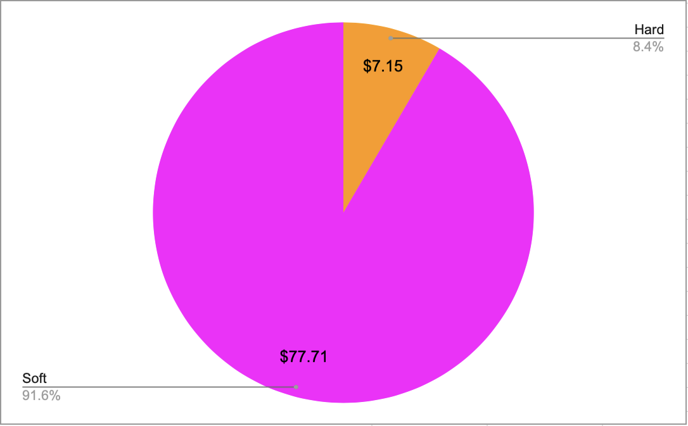

#### *Chart 8: Monday Soft Money Breakdown (Morning v. Lunch)*
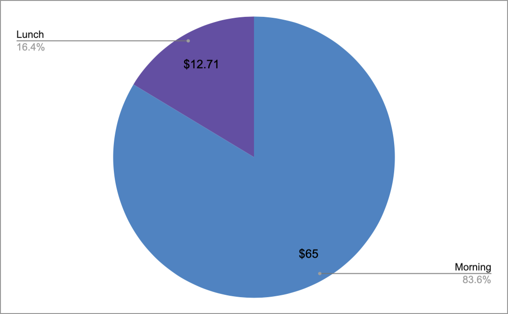

#### *Chart 9: Monday Overall Breakdown (Items)*
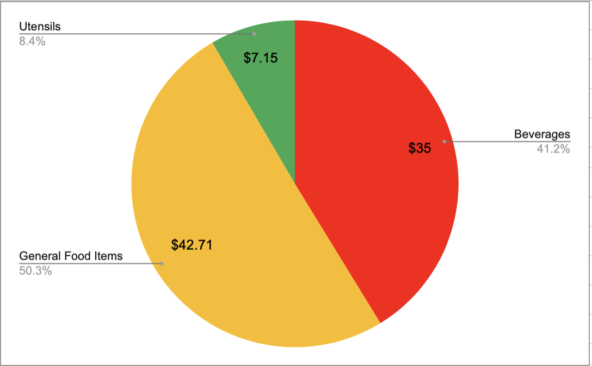

#### *Chart 10: Monday Soft Money Breakdown (Student by Student)*
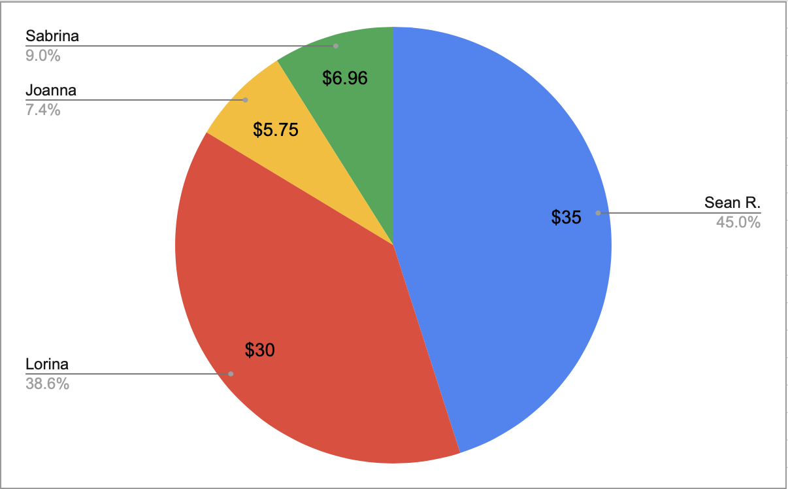

On Monday, the majority of expenses came from soft money, as hard money was only used for utensils. A significant portion of the soft money spending was allocated to the morning event, since the lunch event consisted of ramen and was relatively inexpensive. The largest contributors were Sean R. and Lorina. Both the chocolate chip cookies and hot chocolate were homemade, so costs were estimated based on market value.

Regarding the chart titled "Monday Soft Money Cost Breakdown (Morning v. Lunch)," the campaign did not track how many of each utensil were used at each time of day. Instead, the predetermined number of utensils, set the week before, were brought in and used for morning, with leftovers used for lunch; thus, the chart was conducted based on soft money only. Regarding the chart titled "Monday Soft Money Cost Breakdown (Student by Student)," the campaign prepared the chart only for soft money, as hard money expenditures were reimbursed, meaning students did not technically contribute anything.

### Tuesday

#### *Table 8: Tuesday Expenses (Hard Money)*
<table>
  <thead>
    <tr>
      <th>Item:</th>
      <th>Amount:</th>
      <th>Total Cost:</th>
      <th>Link:</th>
      <th>Receipt:</th>
      <th>Calculations:</th>
      <th>Notes:</th>
    </tr>
  </thead>
  <tbody>
    <tr>
      <td>Tuesday Paper Cups [U]</td>
      <td>149 Pcs</td>
      <td>$5.81</td>
      <td>N/A</td>
      <td>N/A</td>
      <td>149 * $0.039 = $5.81</td>
      <td>3J's (Sean's family restaurant, using lowest market prices for both classes)</td>
    </tr>
    <tr>
      <td>Tuesday Plastic Forks [U]</td>
      <td>150 Pcs</td>
      <td>$3.00</td>
      <td>N/A</td>
      <td>N/A</td>
      <td>150 * $0.02 = $3.00</td>
      <td>3J's (Sean's family restaurant, using lowest market prices for both classes)</td>
    </tr>
    <tr>
      <td>Tuesday Paper Bowls [U]</td>
      <td>45 Pcs</td>
      <td>$2.34</td>
      <td>N/A</td>
      <td>N/A</td>
      <td>45 * $0.052 = $2.34</td>
      <td>3J's (Sean's family restaurant, using lowest market prices for both classes)</td>
    </tr>
  </tbody>
  <tfoot>
    <tr style="background-color: #dcedc8;">
      <td colspan="2"></td>
      <td style="font-weight: bold;">$11.15</td>
      <td colspan="4"></td>
    </tr>
  </tfoot>
</table>
*U stands for utensils*

#### *Table 9: Tuesday Expenses (Soft Money)*
<table>
  <thead>
    <tr>
      <th>Item:</th>
      <th>Amount:</th>
      <th>Total Cost:</th>
      <th>Link:</th>
      <th>Receipt:</th>
      <th>Calculations:</th>
      <th>Notes:</th>
    </tr>
  </thead>
  <tbody>
    <tr style="background-color: #e3f2fd;">
      <td>Pancakes (with Whipped Cream &amp; Syrup) [G]</td>
      <td>60 Pcs</td>
      <td>$240</td>
      <td>N/A</td>
      <td>N/A</td>
      <td>($12.00/3) * 60 = $240</td>
      <td>Sean R. brought for Tuesday morning homemade and no receipt, using estimated price based off of 3J's Menu</td>
    </tr>
    <tr style="background-color: #ede7f6;">
      <td>Barilla Penne Pasta [G]</td>
      <td>4 Boxes (16 ounces each)</td>
      <td>$8.76</td>
      <td><a href="https://giantfood.com">https://giantfood.com</a></td>
      <td>N/A</td>
      <td>$2.19 * 4 = $8.76</td>
      <td>Saoirse brought for Tuesday lunch</td>
    </tr>
    <tr style="background-color: #ede7f6;">
      <td>Prego Marinara Sauce [G]</td>
      <td>3 Jars (23 ounces each)</td>
      <td>$8.37</td>
      <td><a href="https://giantfood.com">https://giantfood.com</a></td>
      <td>N/A</td>
      <td>$2.79 * 3 = $8.37</td>
      <td>Saoirse brought for Tuesday lunch</td>
    </tr>
    <tr style="background-color: #ede7f6;">
      <td>Giant's Brand Shredded Parmesan Cheese [G]</td>
      <td>3 Bags (6 ounces each)</td>
      <td>$5.97</td>
      <td><a href="https://giantfood.com">https://giantfood.com</a></td>
      <td>N/A</td>
      <td>$1.99 * 3 = $5.97</td>
      <td>Saoirse brought for Tuesday lunch</td>
    </tr>
  </tbody>
  <tfoot>
    <tr style="background-color: #dcedc8;">
      <td colspan="2"></td>
      <td style="font-weight: bold;">$263.10</td>
      <td colspan="4"></td>
    </tr>
  </tfoot>
</table>
*B stands for beverage, D stands for dessert, G stands for general food items; blue highlight symbolizes morning event, purple highlight symbolizes lunch event*

#### *Chart 11: Tuesday Overall Breakdown (Hard v. Soft Money)*

#### *Chart 12: Tuesday Soft Money Breakdown (Morning v. Lunch)*
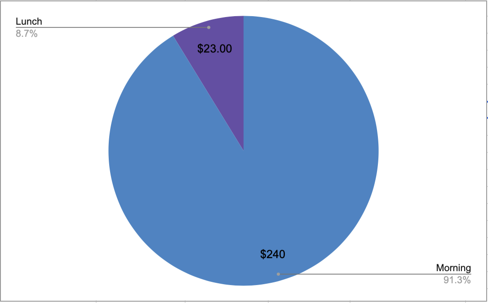

#### *Chart 13: Tuesday Overall Breakdown (Items)*
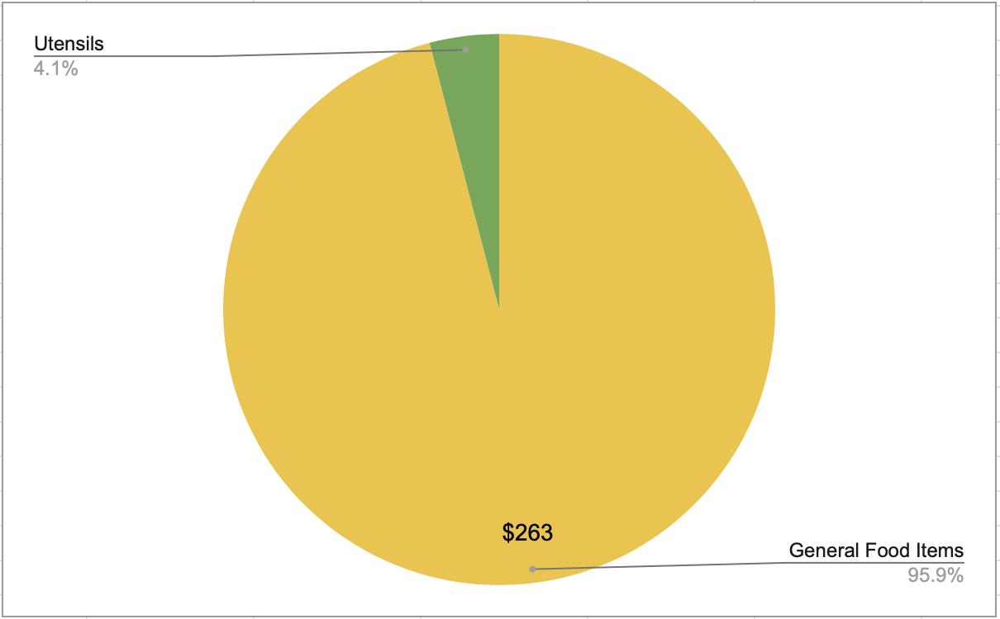

#### *Chart 14: Tuesday Soft Money Breakdown (Student by Student)*
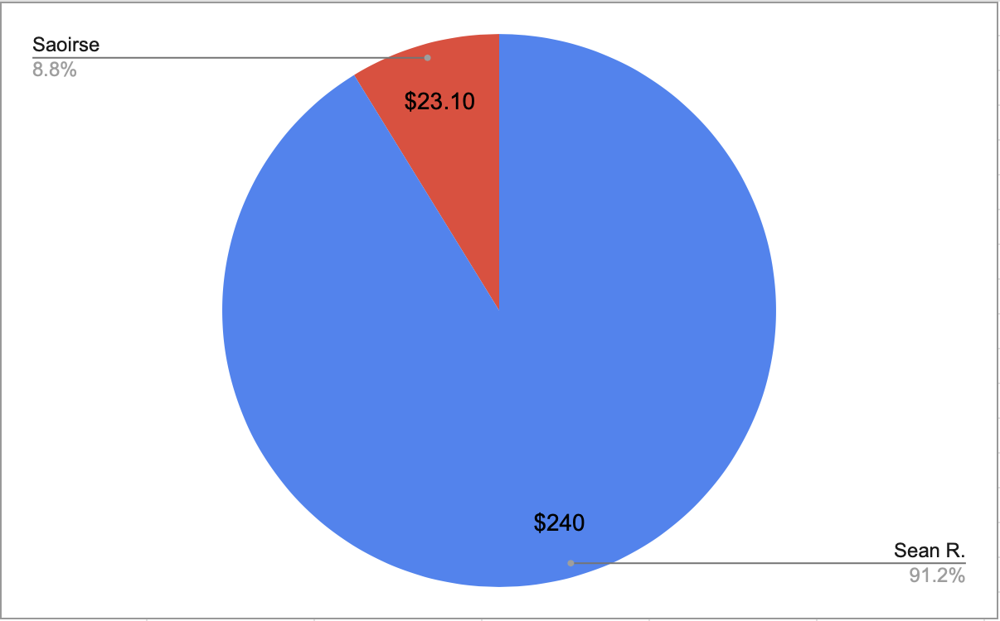

On Tuesday, the majority of expenses came from soft money, as hard money was again used only for utensils. A significant portion of the soft money spending went toward the morning event, which featured pancakes with toppings prepared by Sean R. from 3J’s. The cost of the pancakes was calculated using 3J’s menu, which lists three pancakes at $12, resulting in a per-pancake cost of $4. The largest contributors were Sean R. and Saoirse, respectively.

Regarding the chart titled "Tuesday Soft Money Cost Breakdown (Morning v. Lunch)," the campaign did not track how many of each utensil were used at each time of day. Instead, the predetermined number of utensils, set the week before, were brought in and used for morning, with leftovers used for lunch; thus, the chart was conducted based on soft money only. Regarding the chart titled "Tuesday Soft Money Cost Breakdown (Student by Student)," the campaign prepared the chart only for soft money, as hard money expenditures were reimbursed, meaning students did not technically contribute anything.

### Wednesday

#### *Table 10: Wednesday Expenses (Hard Money)*
<table>
  <thead>
    <tr>
      <th>Item:</th>
      <th>Amount:</th>
      <th>Total Cost:</th>
      <th>Link:</th>
      <th>Receipt:</th>
      <th>Calculations:</th>
      <th>Notes:</th>
    </tr>
  </thead>
  <tbody>
    <tr>
      <td>Wednesday Bowls [U]</td>
      <td>15 Pcs</td>
      <td>$0.78</td>
      <td>N/A</td>
      <td>N/A</td>
      <td>15 * $0.052 = $0.78</td>
      <td>3J's (Sean's family restaurant, using lowest market prices for both classes)</td>
    </tr>
    <tr>
      <td>Wednesday Plates [U]</td>
      <td>100 Pcs</td>
      <td>$3.00</td>
      <td>N/A</td>
      <td>N/A</td>
      <td>100 * $0.03 = $3.00</td>
      <td>3J's (Sean's family restaurant, using lowest market prices for both classes)</td>
    </tr>
    <tr>
      <td>Wednesday Cups [U]</td>
      <td>250 Pcs</td>
      <td>$9.75</td>
      <td>N/A</td>
      <td>N/A</td>
      <td>250 * $0.039 = $9.75</td>
      <td>3J's (Sean's family restaurant, using lowest market prices for both classes)</td>
    </tr>
    <tr>
      <td>Wednesday Forks [U]</td>
      <td>150 Pcs</td>
      <td>$3.00</td>
      <td>N/A</td>
      <td>N/A</td>
      <td>150 * $0.02 = $3.00</td>
      <td>3J's (Sean's family restaurant, using lowest market prices for both classes)</td>
    </tr>
  </tbody>
  <tfoot>
    <tr style="background-color: #d3dcd3;">
      <td colspan="2"></td>
      <td style="font-weight: bold; text-align: center;">$16.53</td>
      <td colspan="4"></td>
    </tr>
  </tfoot>
</table>
*U stands for utensils*

#### *Table 11: Wednesday Expenses (Soft Money)*
<table>
  <thead>
    <tr>
      <th>Item:</th>
      <th>Amount:</th>
      <th>Total Cost:</th>
      <th>Receipt:</th>
      <th>Calculations:</th>
      <th>Notes:</th>
    </tr>
  </thead>
  <tbody>
    <tr style="background-color: #e1f5fe;">
      <td>French Toast (with Whipped Cream &amp; Syrup) [G]</td>
      <td>60 Pcs</td>
      <td>$300</td>
      <td>N/A</td>
      <td>($15.00/3) * 60 = $300</td>
      <td>Sean R. brought for Wednesday morning homemade and no receipt, using estimated price based off of 3J's Menu</td>
    </tr>
    <tr style="background-color: #ede7f6;">
      <td>Mission Burrito Flour Tortillas [G]</td>
      <td>4 Bags</td>
      <td>$18.52</td>
      <td>N/A</td>
      <td>$4.63 * 4 = $18.52</td>
      <td>Saoirse brought for Wednesday lunch</td>
    </tr>
    <tr style="background-color: #ede7f6;">
      <td>Lucerne Mexican Cheese [G]</td>
      <td>6 Bags (8 ounces each)</td>
      <td>$14.94</td>
      <td>N/A</td>
      <td>$2.49 * 6 = $14.94</td>
      <td>Saoirse brought for Wednesday lunch</td>
    </tr>
    <tr style="background-color: #ede7f6;">
      <td>Pierogis [G]</td>
      <td>100 Pcs</td>
      <td>$22.90</td>
      <td>N/A</td>
      <td>($10.99/48) * 100 = $22.896</td>
      <td>Vicky brought for Wednesday lunch, homemade and no receipt, using estimated market price</td>
    </tr>
    <tr style="background-color: #ede7f6;">
      <td>Mac and Cheese [G]</td>
      <td>1 Pan (240 ounces)</td>
      <td>$45.00</td>
      <td>N/A</td>
      <td>N/A</td>
      <td>Olivia brought for Wednesday lunch, homemade and no receipt, using estimated market price</td>
    </tr>
    <tr style="background-color: #ede7f6;">
      <td>2% Milk [B]</td>
      <td>2 Gallons</td>
      <td>$9.28</td>
      <td>Yes</td>
      <td>$4.64 * 2 = $9.28</td>
      <td>Zoe brought for Wednesday lunch</td>
    </tr>
    <tr style="background-color: #ede7f6;">
      <td>WuFuYan Tapioca Pearls [B]</td>
      <td>4 Bags (250 grams each)</td>
      <td>$13.96</td>
      <td>N/A</td>
      <td>$3.49 * 4 = $13.96</td>
      <td>Zoe brought for Wednesday lunch</td>
    </tr>
    <tr style="background-color: #ede7f6;">
      <td>Trader Joes Black Tea Concentrate [B]</td>
      <td>2 Bottles (16 ounces each)</td>
      <td>$9.98</td>
      <td>Yes</td>
      <td>$4.99 * 2 = $9.98</td>
      <td>Zoe brought for Wednesday lunch</td>
    </tr>
  </tbody>
  <tfoot>
    <tr style="background-color: #dcedc8;">
      <td colspan="2"></td>
      <td style="font-weight: bold; text-align: center;">$434.58</td>
      <td colspan="3"></td>
    </tr>
  </tfoot>
</table>
*B stands for beverage, D stands for dessert, G stands for general food items; blue highlight symbolizes morning event, purple highlight symbolizes lunch event*

#### *Chart 15: Wednesday Overall Breakdown (Hard v. Soft Money)*
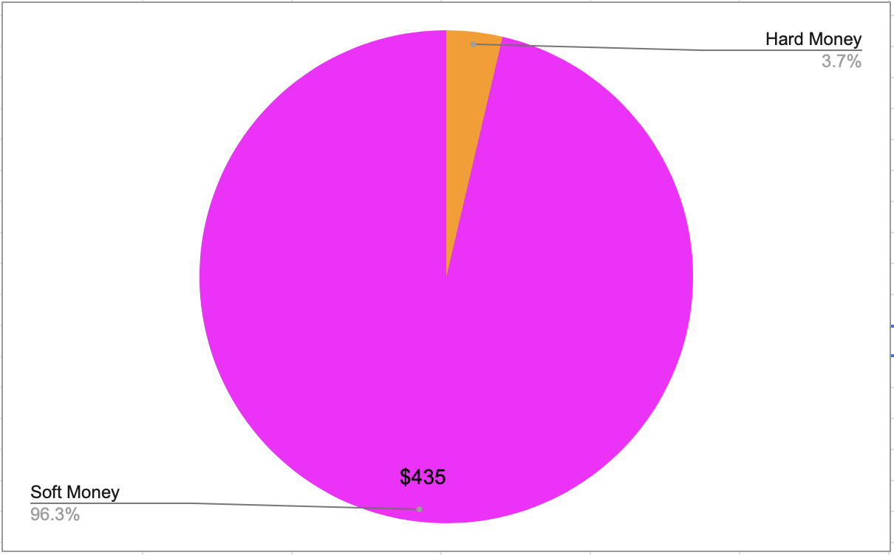

#### *Chart 16: Wednesday Soft Money Breakdown (Morning v. Lunch)*
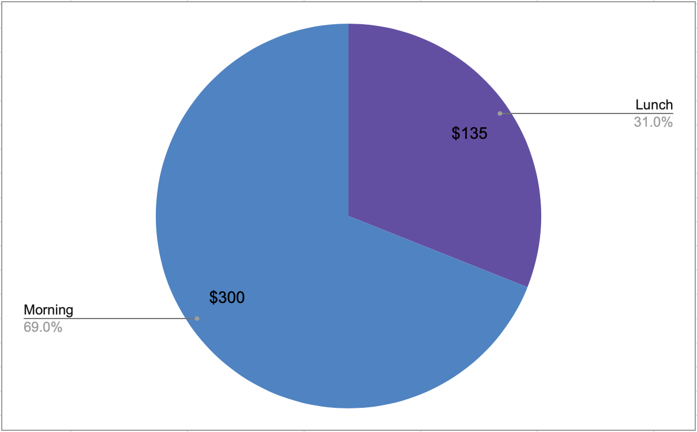

#### *Chart 17: Wednesday Overall Breakdown (Items)*
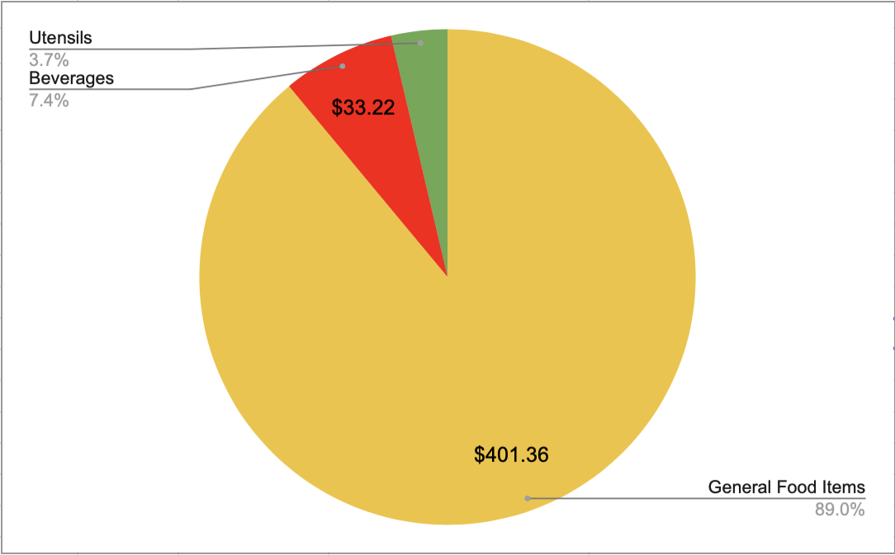

#### *Chart 18: Wednesday Soft Money Breakdown (Student by Student)*
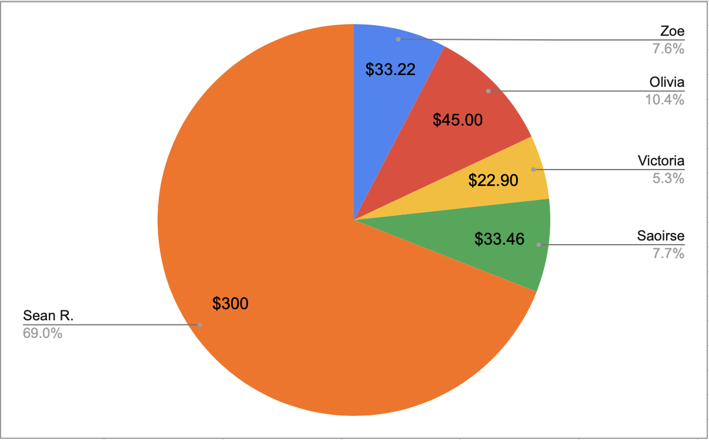

On Wednesday, the majority of expenses again came from soft money, as hard money was used only for utensils. A significant portion of the soft money spending was allocated to the morning event, which featured french toast with toppings prepared by Sean R. from 3J’s. The cost of the French toast was calculated using 3J’s menu, which lists three pieces at $15, or approximately $5 per piece. The largest contributors were Sean R. and Olivia, respectively. The cost of Olivia’s homemade mac and cheese was estimated using standard market catering values.

Regarding the chart titled "Wednesday Soft Money Cost Breakdown (Morning v. Lunch)," the campaign did not track how many of each utensil were used at each time of day. Instead, the predetermined number of utensils, set the week before, were brought in and used for morning, with leftovers used for lunch; thus, the chart was conducted based on soft money only. Regarding the chart titled "Wednesday Soft Money Cost Breakdown (Student by Student)," the campaign prepared the chart only for soft money, as hard money expenditures were reimbursed, meaning students did not technically contribute anything.

### Thursday

#### *Table 12: Thursday Expenses (Hard Money)*
<table>
  <thead>
    <tr>
      <th>Item:</th>
      <th>Amount:</th>
      <th>Total Cost:</th>
      <th>Receipt:</th>
      <th>Calculations:</th>
      <th>Notes:</th>
    </tr>
  </thead>
  <tbody>
    <tr>
      <td>Thursday Cups [U]</td>
      <td>150 Pcs</td>
      <td>$5.85</td>
      <td>N/A</td>
      <td>150 * $0.039 = $5.85</td>
      <td>3J's (Sean's family restaurant, using lowest market prices for both classes)</td>
    </tr>
    <tr>
      <td>Thursday Bowls [U]</td>
      <td>150 Pcs</td>
      <td>$7.80</td>
      <td>N/A</td>
      <td>150 * $0.052 = $7.80</td>
      <td>3J's (Sean's family restaurant, using lowest market prices for both classes)</td>
    </tr>
    <tr>
      <td>Thursday Napkins [U]</td>
      <td>100 Pcs</td>
      <td>$0.38</td>
      <td>N/A</td>
      <td>100 * $0.0375 = $0.38</td>
      <td>3J's (Sean's family restaurant, using lowest market prices for both classes)</td>
    </tr>
    <tr>
      <td>Orange Juice [B]</td>
      <td>1 Jug</td>
      <td>$7.82</td>
      <td>N/A</td>
      <td>N/A</td>
      <td>Sean didn't grab receipt, for Thursday morning</td>
    </tr>
    <tr>
      <td>Dunkin Gift Card [O]</td>
      <td>1 Card</td>
      <td>$25.00</td>
      <td>Izzy</td>
      <td>N/A</td>
      <td>Izzy bought alongside personal items for Thursday lunch</td>
    </tr>
  </tbody>
  <tfoot>
    <tr style="background-color: #d3dcd3;">
      <td colspan="2"></td>
      <td style="font-weight: bold; text-align: center;">$46.85</td>
      <td colspan="3"></td>
    </tr>
  </tfoot>
</table>
*U stands for utensils, B stands for beverage, O stands for other*

#### *Table 13: Thursday Expenses (Soft Money)*
<table>
  <thead>
    <tr>
      <th>Item:</th>
      <th>Amount:</th>
      <th>Total Cost:</th>
      <th>Receipt:</th>
      <th>Calculations:</th>
      <th>Notes:</th>
    </tr>
  </thead>
  <tbody>
    <tr style="background-color: #e1f5fe;">
      <td>Chocolate Chip Muffins [G]</td>
      <td>60 Pcs</td>
      <td>$60</td>
      <td>N/A</td>
      <td>$1.00 * 60 = $60.00</td>
      <td>Saoirse brought for Thursday morning, homemade and no receipt, using estimated market price</td>
    </tr>
    <tr style="background-color: #ede7f6;">
      <td>Chicken Nuggets [G]</td>
      <td>4 Bags</td>
      <td>$19.88</td>
      <td>N/A</td>
      <td>$4.97 * 4 = $19.88</td>
      <td>Sabrina brought for Thursday lunch, no receipt, using Tyson White Meat Chicken Nuggets (29 oz) as substitute</td>
    </tr>
    <tr style="background-color: #ede7f6;">
      <td>Onion Rings [G]</td>
      <td>1 Bag</td>
      <td>$3.42</td>
      <td>N/A</td>
      <td>N/A</td>
      <td>Unknown, no receipt, using Great Value Whole Onion Rings (16 oz) as substitute</td>
    </tr>
    <tr style="background-color: #ede7f6;">
      <td>Waffle Fries [G]</td>
      <td>1 Bag</td>
      <td>$3.32</td>
      <td>N/A</td>
      <td>N/A</td>
      <td>Unknown, no receipt, using Great Value Waffle Cut French Fried Potatoes (24 oz) as substitute</td>
    </tr>
    <tr style="background-color: #ede7f6;">
      <td>Crinkle Cut Potatoes [G]</td>
      <td>2 Bags</td>
      <td>$6.38</td>
      <td>N/A</td>
      <td>$3.19 * 2 = $6.38</td>
      <td>Kenrick brought for Thursday lunch</td>
    </tr>
    <tr style="background-color: #ede7f6;">
      <td>Regular Seasoned Fries [G]</td>
      <td>1 Bag</td>
      <td>$5.94</td>
      <td>N/A</td>
      <td>N/A</td>
      <td>Unknown, no receipt, using Great Value Seasoned French Fried Potatoes (64 oz) as substitute</td>
    </tr>
    <tr style="background-color: #ede7f6;">
      <td>Barbeque Sauce [G]</td>
      <td>1 Bottle</td>
      <td>$2.97</td>
      <td>N/A</td>
      <td>N/A</td>
      <td>Deybrian brought or Thursday lunch, no receipt, using Walmart Sweet Baby Ray's Original Barbecue Sauce (28 oz) as substitute</td>
    </tr>
    <tr style="background-color: #ede7f6;">
      <td>Chick-Fil-A Sauce [G]</td>
      <td>1 Bottle</td>
      <td>$3.97</td>
      <td>N/A</td>
      <td>N/A</td>
      <td>Sabrina brought or Thursday lunch, no receipt, using Walmart price</td>
    </tr>
    <tr style="background-color: #ede7f6;">
      <td>Iced Tea Mix [B]</td>
      <td>1 Can (82.6 ounces)</td>
      <td>$9.99</td>
      <td>N/A</td>
      <td>N/A</td>
      <td>Sam brought for Thursday lunch</td>
    </tr>
  </tbody>
  <tfoot>
    <tr style="background-color: #dcedc8;">
      <td colspan="2"></td>
      <td style="font-weight: bold; text-align: center;">$115.87</td>
      <td colspan="3"></td>
    </tr>
  </tfoot>
</table>
*B stands for beverage, D stands for dessert, G stands for general food items; blue highlight symbolizes morning event, purple highlight symbolizes lunch event*

#### *Chart 19: Thursday Overall Breakdown (Hard v. Soft Money)*
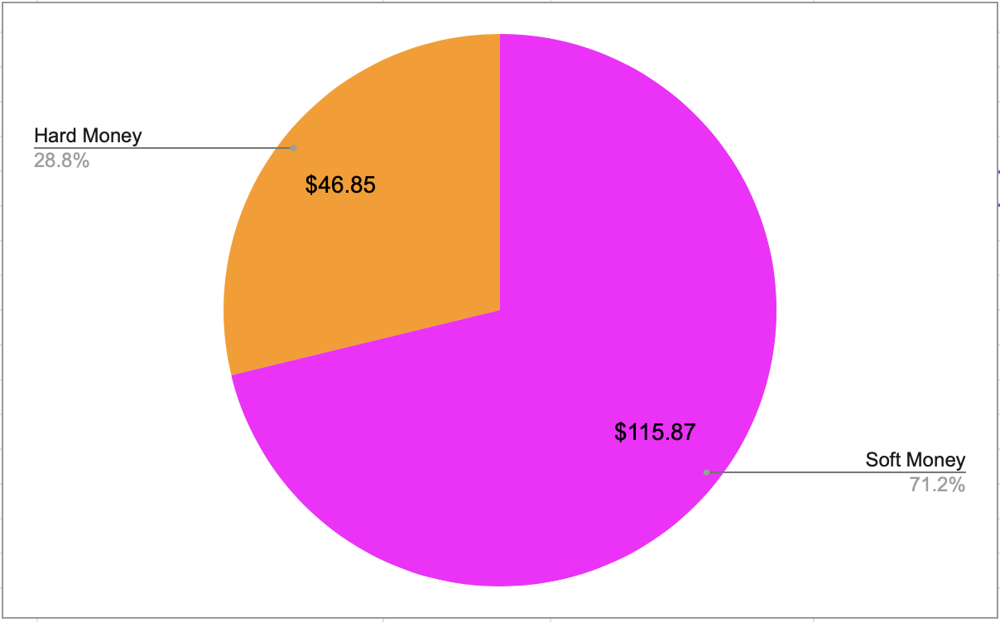

#### *Chart 20: Thursday Soft Money Breakdown (Breakfast v. Lunch)*
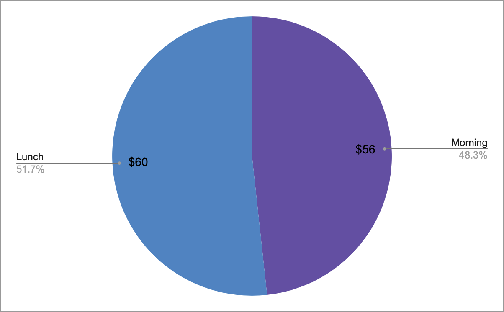
\*This chart ignores the hard money cost of orange juice\*

#### *Chart 21: Thursday Overall Breakdown (Items)*
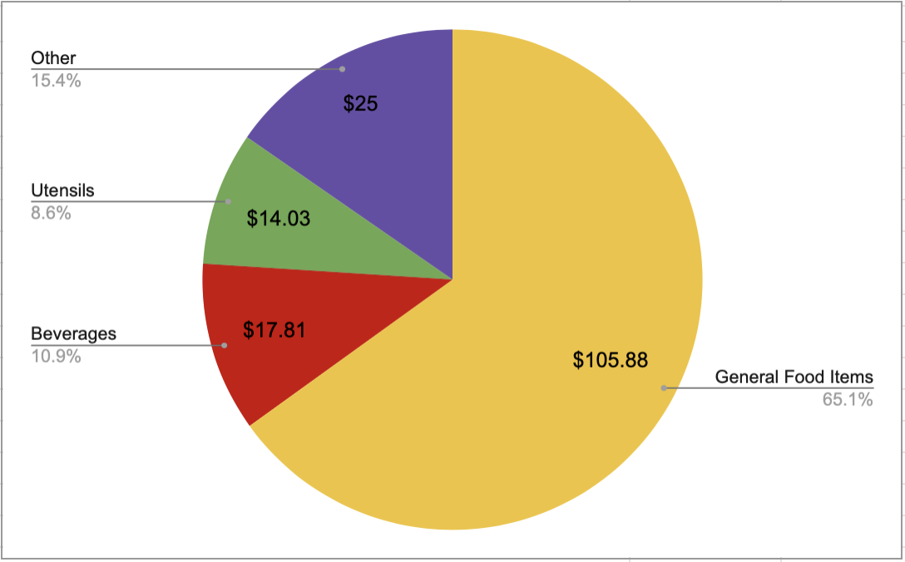

#### *Chart 22: Thursday Soft Breakdown (Student by Student)*
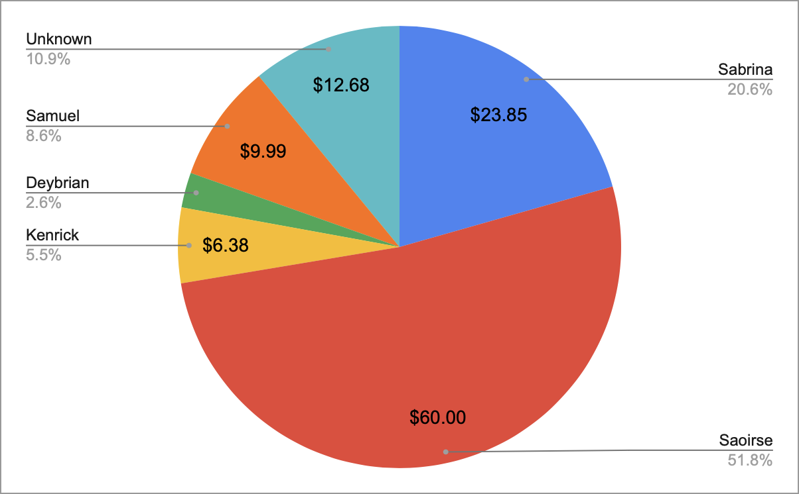

On Thursday, the majority of expenses again came from soft money, although some hard money was used, accounting for roughly 30% of the hard money budget, or $14.03. Hard money was also spent on orange juice that day, as no other beverages were available. The largest portion of the hard money expenditure was a Dunkin’ Donuts gift card, purchased because the campaign had funds to spare.

Soft money was distributed almost equally between the morning and lunch events, with slightly more allocated to the lunch event compared to previous days. The largest contributors were Saoirse and Sabrina, respectively. There is also a category labeled “Unknown,” as three students contributed items but did not list their names on the planning sheet and did not respond to inquiries asking them to claim credit.

Regarding the chart titled "Thursday Soft Money Cost Breakdown (Morning v. Lunch)," the campaign did not track how many of each utensil were used at each time of day. Instead, the predetermined number of utensils, set the week before, were brought in and used for morning, with leftovers used for lunch; thus, the chart was conducted based on soft money only. Regarding the chart titled "Thursday Soft Money Cost Breakdown (Student by Student)," the campaign prepared the chart only for soft money, as hard money expenditures were reimbursed, meaning students did not technically contribute anything.

### Friday

#### *Table 14: Friday Expenses (Hard Money)*
<table>
  <thead>
    <tr>
      <th>Item:</th>
      <th>Amount:</th>
      <th>Total Cost:</th>
      <th>Receipt:</th>
      <th>Calculations:</th>
      <th>Notes:</th>
    </tr>
  </thead>
  <tbody>
    <tr>
      <td>Friday Cups [U]</td>
      <td>150 Pcs</td>
      <td>$5.85</td>
      <td>N/A</td>
      <td>150 * $0.039 = $5.85</td>
      <td>3J's (Sean's family restaurant, using lowest market prices for both classes)</td>
    </tr>
    <tr>
      <td>Friday Forks [U]</td>
      <td>150 Pcs</td>
      <td>$3.00</td>
      <td>N/A</td>
      <td>150 * $0.02 = $3.00</td>
      <td>3J's (Sean's family restaurant, using lowest market prices for both classes)</td>
    </tr>
    <tr>
      <td>Friday Plates [U]</td>
      <td>150 Pcs</td>
      <td>$4.50</td>
      <td>N/A</td>
      <td>150 * $0.03 = $4.50</td>
      <td>3J's (Sean's family restaurant, using lowest market prices for both classes)</td>
    </tr>
    <tr>
      <td>Friday Napkins [U]</td>
      <td>100 Pcs</td>
      <td>$0.38</td>
      <td>N/A</td>
      <td>100 * $0.0375 = $0.38</td>
      <td>3J's (Sean's family restaurant, using lowest market prices for both classes)</td>
    </tr>
  </tbody>
  <tfoot>
    <tr style="background-color: #d3dcd3;">
      <td colspan="2"></td>
      <td style="font-weight: bold; text-align: center;">$13.73</td>
      <td colspan="3"></td>
    </tr>
  </tfoot>
</table>
*U stands for utensils*

#### *Table 15: Friday Expenses (Soft Money)*
<table>
  <thead>
    <tr>
      <th>Item:</th>
      <th>Amount:</th>
      <th>Total Cost:</th>
      <th>Receipt:</th>
      <th>Calculations:</th>
      <th>Notes:</th>
    </tr>
  </thead>
  <tbody>
    <tr style="background-color: #e1f5fe;">
      <td>Tea [B]</td>
      <td>1 Catering Jug (96 ounces)</td>
      <td>$20</td>
      <td>N/A</td>
      <td>N/A</td>
      <td>Sean R. brought for Friday morning homemade and no receipt, using estimated market price</td>
    </tr>
    <tr style="background-color: #e1f5fe;">
      <td>Coffee [B]</td>
      <td>1 Catering Jug (96 ounces)</td>
      <td>$30</td>
      <td>N/A</td>
      <td>N/A</td>
      <td>Sean R. brought for Friday morning homemade and no receipt, using estimated market price</td>
    </tr>
    <tr style="background-color: #e1f5fe;">
      <td>Brownies [G]</td>
      <td>60 Pcs</td>
      <td>$30.00</td>
      <td>N/A</td>
      <td>$0.50 * 60 = $30.00</td>
      <td>Lorina brought for Friday morning, homemade and no receipt, using estimated market price</td>
    </tr>
    <tr style="background-color: #ede7f6;">
      <td>Trader Joes Chicken Gyozas [G]</td>
      <td>5 Bags</td>
      <td>$19.95</td>
      <td>N/A</td>
      <td>$3.99 * 5 = $19.95</td>
      <td>Joanna brought for Friday lunch</td>
    </tr>
    <tr style="background-color: #ede7f6;">
      <td>Royal Asia Vegetable Spring Rolls [G]</td>
      <td>6 Boxes</td>
      <td>$71.94</td>
      <td>N/A</td>
      <td>6 x 11.99 = 71.94</td>
      <td>Sabrina brought for Friday lunch</td>
    </tr>
    <tr style="background-color: #ede7f6;">
      <td>Brown Basmati Rice [G]</td>
      <td>2 Bags</td>
      <td>$8.58</td>
      <td>N/A</td>
      <td>$4.29 * 2 = $8.58</td>
      <td>Kenrick brought for Friday lunch</td>
    </tr>
    <tr style="background-color: #ede7f6;">
      <td>Frozen Mixed Vegetables [G]</td>
      <td>2 Bags</td>
      <td>$2.18</td>
      <td>N/A</td>
      <td>$1.09 * 2 = $2.18</td>
      <td>Kenrick brought for Friday lunch</td>
    </tr>
    <tr style="background-color: #ede7f6;">
      <td>Eggs [G]</td>
      <td>1 Carton (1 Dozen)</td>
      <td>$2.19</td>
      <td>N/A</td>
      <td>N/A</td>
      <td>Kenrick brought for Friday lunch</td>
    </tr>
    <tr style="background-color: #ede7f6;">
      <td>Strawberry Vanilla Mini Cakes [D]</td>
      <td>50 Pcs</td>
      <td>$25.33</td>
      <td>Yes</td>
      <td>(2.19 * 2) + 1.09 + (4.99 * 2) + 3.69 + (3.39 / 2) + (5.97 / 2) + 0.25 + 0.60 + 0.50 + 0.16 = $25.33</td>
      <td>Joanna brought for Friday lunch, homemade with receipt for most items</td>
    </tr>
    <tr style="background-color: #ede7f6;">
      <td>Chocolate Raspberry Mini Cakes [D]</td>
      <td>50 Pcs</td>
      <td>$22.68</td>
      <td>Yes</td>
      <td>(2.19 * 2) + 1.09 + 7.49 + 3.69 + (3.39 / 2) + (5.97 / 2) + 0.25 + 0.60 + 0.50 = $22.68</td>
      <td>Joanna brought for Friday lunch, homemade with receipt for most items</td>
    </tr>
    <tr style="background-color: #ede7f6;">
      <td>2% Milk [B]</td>
      <td>2 Gallons</td>
      <td>$9.28</td>
      <td>Yes</td>
      <td>$4.64 * 2 = $9.28</td>
      <td>Zoe brought for Friday lunch</td>
    </tr>
    <tr style="background-color: #ede7f6;">
      <td>Trader Joes Black Tea Concentrate [B]</td>
      <td>2 Bottles</td>
      <td>$9.98</td>
      <td>Yes</td>
      <td>$4.99 * 2 = $9.98</td>
      <td>Zoe brought for Friday lunch</td>
    </tr>
    <tr style="background-color: #ede7f6;">
      <td>Trader Joes Oat Brown Sugar Creamer [B]</td>
      <td>2 Bottles</td>
      <td>$3.98</td>
      <td>Yes</td>
      <td>$1.99 * 2 = $3.98</td>
      <td>Zoe brought for Friday lunch</td>
    </tr>
  </tbody>
  <tfoot>
    <tr style="background-color: #dcedc8;">
      <td colspan="2"></td>
      <td style="font-weight: bold; text-align: center;">$256.09</td>
      <td colspan="3"></td>
    </tr>
  </tfoot>
</table>
*B stands for beverage, D stands for dessert, G stands for general food items; blue highlight symbolizes morning event, purple highlight symbolizes lunch event*

#### *Chart 23: Friday Overall Breakdown (Hard v. Soft Money)*
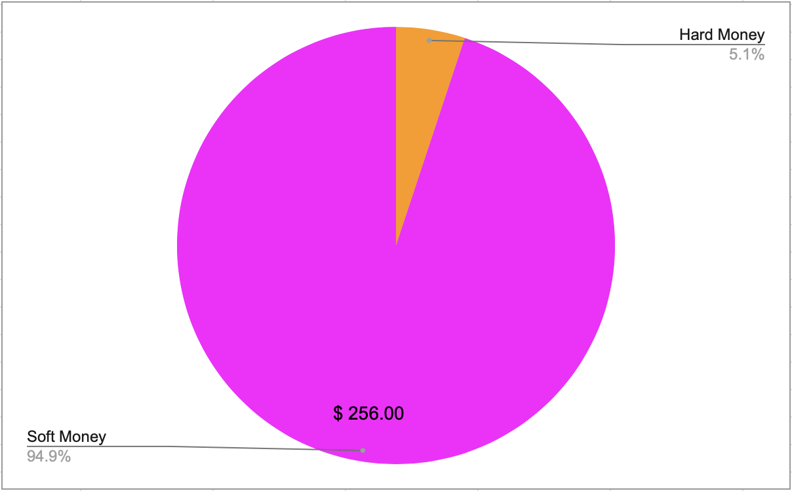

#### *Chart 24: Friday Soft Money Breakdown (Breakfast v. Lunch)*
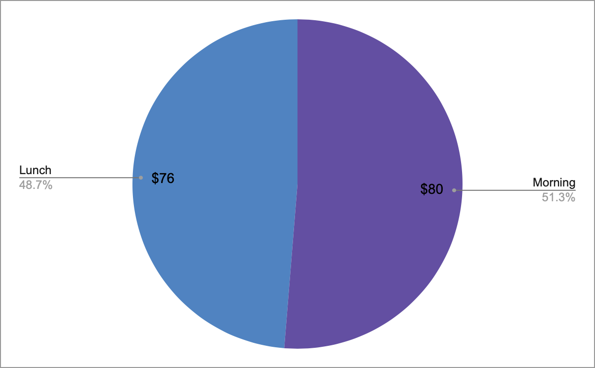

#### *Chart 25: Friday Overall Breakdown (Items)*
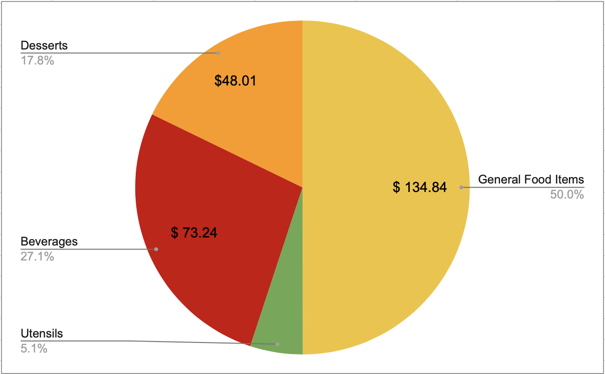

#### *Chart 26: Friday Soft Money Breakdown (Student by Student)*
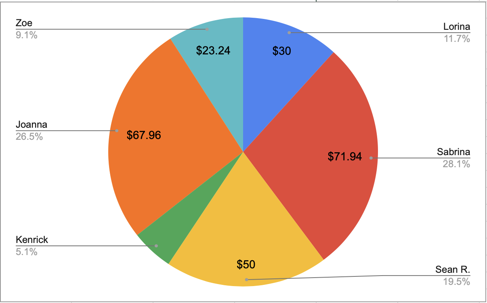

On Friday, the majority of expenses again came from soft money, as all hard money was spent on utensils. Soft money was distributed nearly equally between the morning and lunch events, with slightly more allocated to the morning events, consistent with previous days. The largest contributors were Sabrina and Joanna, respectively. Sabrina’s spending was primarily on vegetable spring rolls, while Joanna’s expenses included chicken gyozas and the preparation of mini cakes.

Regarding the chart titled "Friday Soft Money Cost Breakdown (Morning v. Lunch)," the campaign did not track how many of each utensil were used at each time of day. Instead, the predetermined number of utensils, set the week before, were brought in and used for morning, with leftovers used for lunch; thus, the chart was conducted based on soft money only. Regarding the chart titled "Friday Soft Money Cost Breakdown (Student by Student)," the campaign prepared the chart only for soft money, as hard money expenditures were reimbursed, meaning students did not technically contribute anything.

### Overall Analysis

#### *Chart 27: Overall Breakdown (Day by Day)*
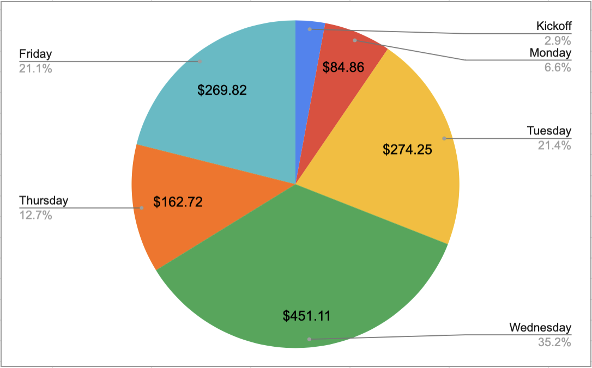

#### *Chart 28: Overall Breakdown (Item)*
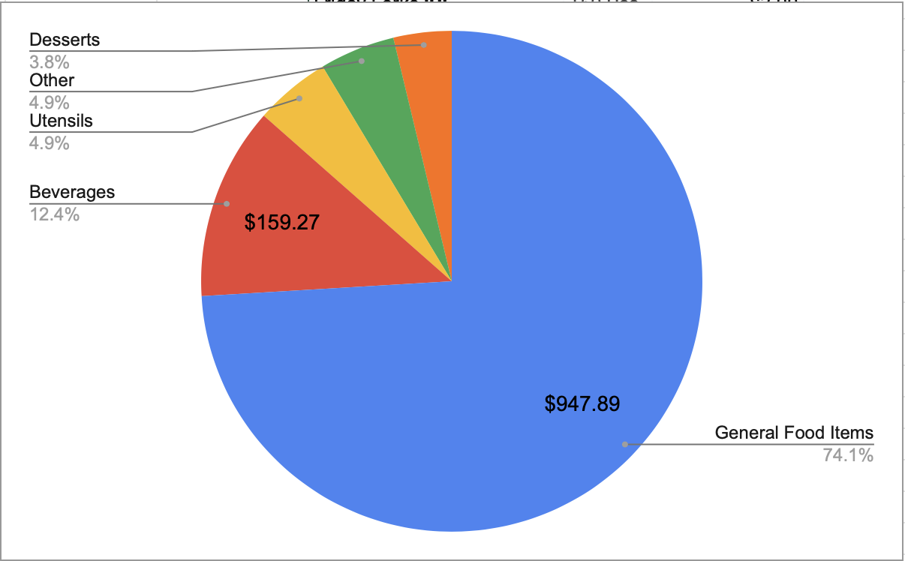

Throughout the week, the most money was spent on Wednesday and Thursday. This makes sense, as these were the days when pancakes and French toast were prepared by Sean R. at 3J’s, and the costs were based on the 3J’s menu, which may have been higher than typical market prices. The least money was spent on the kickoff day, which also makes sense because only hard money was used.

Looking at the breakdown by items, it’s not surprising either that general food items made up the largest portion of costs, since these items took the most time to prepare. Surprisingly, utensils were not the second-largest expense; beverages were. Using the lowest market price from 3J’s likely helped the campaign save a significant amount of money in that category.

#### *Chart 29: Cost per Elector (Overall, Soft, & Hard)*
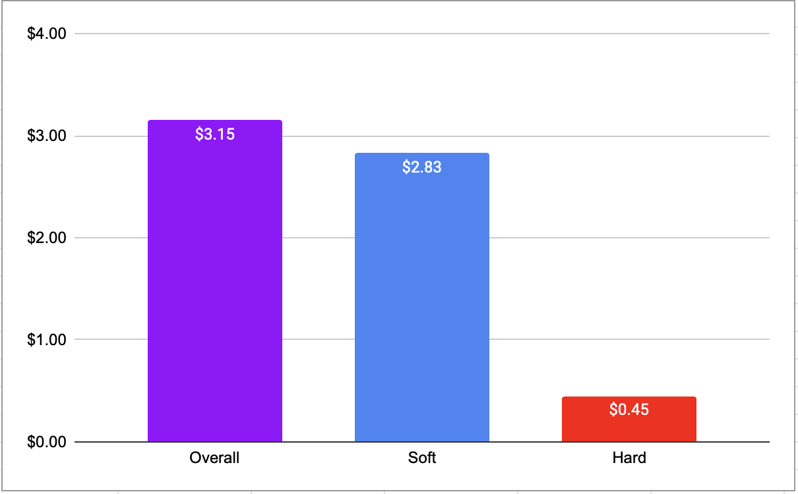

#### *Chart 30: Cost per Vote (Overall, Soft, & Hard)*
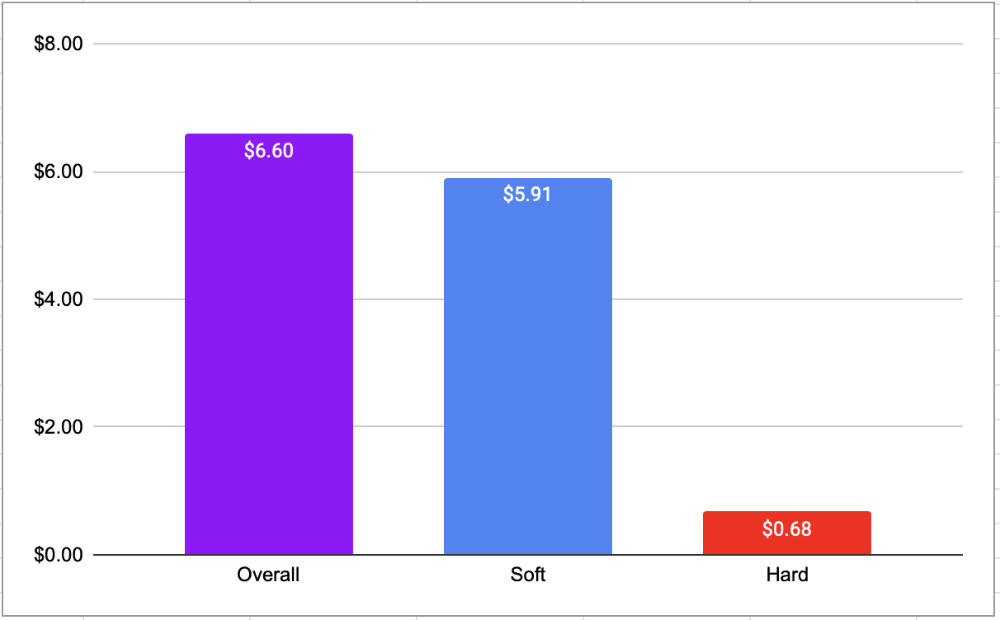

#### *Chart 31: Cost per Vote v. Cost per Elector*
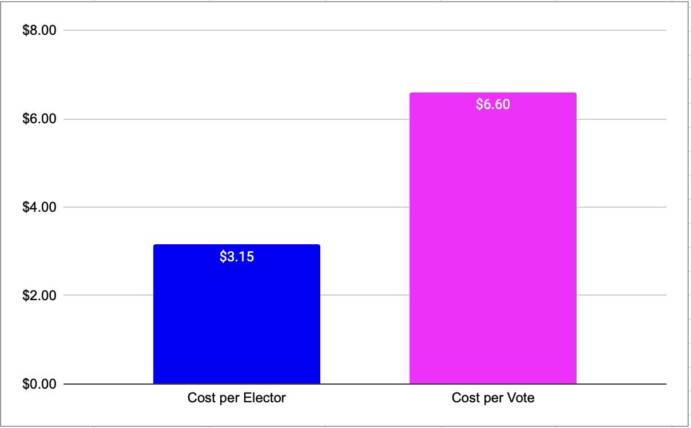

The overall cost per elector was $3.15. This was calculated by dividing the total campaign expenditure of $1280 by 406 votes. The soft money cost per elector was roughly $2.83; this was calculated by dividing the total campaign soft money expenditure, $1,147.35, by 406 votes. Finally, the hard money cost per elector was roughly $0.45; this was calculated by dividing the campaign hard money expenditure, $132.65, by 406 votes. 

The total cost per vote was $6.60. This was calculated by dividing the total campaign expenditure of $1280 by 194 votes. The soft money cost per vote was roughly $5.91, this was calculated by dividing the total campaign soft money expenditure, $1,147.35, by 194 votes. Finally, the hard money cost per elector was roughly $0.68, calculated by dividing the campaign's hard money expenditure of $132.65 by 194 votes. 

The cost per vote was more than double the cost per elector. To be exact, the cost per vote was 209.52% of the cost per elector.

### Reflection

Overall, the AOC campaign’s spending strategy was highly aggressive. A significant portion of soft money was used, potentially the largest expenditure in Masterman mock election history. Although the campaign did not win, the investment in morning and lunch events proved effective, as the campaign maintained a lead throughout most of the week.

Trends suggest, however, that a lack of spending on certain events, such as the debate, can result in a loss of momentum if no alternative strategies are employed. The campaign could have leveraged more cost-free methods of engagement, similar to the Shapiro campaign’s use of a hype video during the debate, to compensate for these gaps.

The reliance on soft money provided considerable advantages, allowing for more attractive and varied food items. The most significant benefit was the use of a commercial kitchen and professional recipes. Sean’s family café, 3J’s, provided space and resources, enabling the preparation of high-quality food items without violating campaign rules. This also allowed for bulk purchases of utensils at the lowest market price, which helped keep the campaign within budget.

There were, however, some drawbacks. Estimating prices based on the 3J’s menu likely inflated the soft money expenditures while underestimating the hard money costs. Additionally, the absence of receipts for some soft money purchases may have affected the accuracy of the estimates. It is also possible that accounting for labor costs could have offset some of these inflated figures. 

Another limitation was the delayed appointment of a treasurer, which resulted in two hard money receipts not being collected. While the total amounts were eventually accounted for, recreating receipts was less professional.
Overall, the campaign was successful from a financial perspective. The hard money limit was maintained and most spending estimates were accurate, demonstrating careful management of campaign funds.

### Links

https://docs.google.com/spreadsheets/d/1PM-EPtURX7MFFMzebiJvyhwLZupqaC1AEXoA8RS2Qfg/edit?gid=451289308#gid=451289308

https://docs.google.com/document/d/1JDIgkKf94FWgjRAueWTz3Zq5J5NEQlxqO_5_ZcYaQTU/edit?tab=t.0
