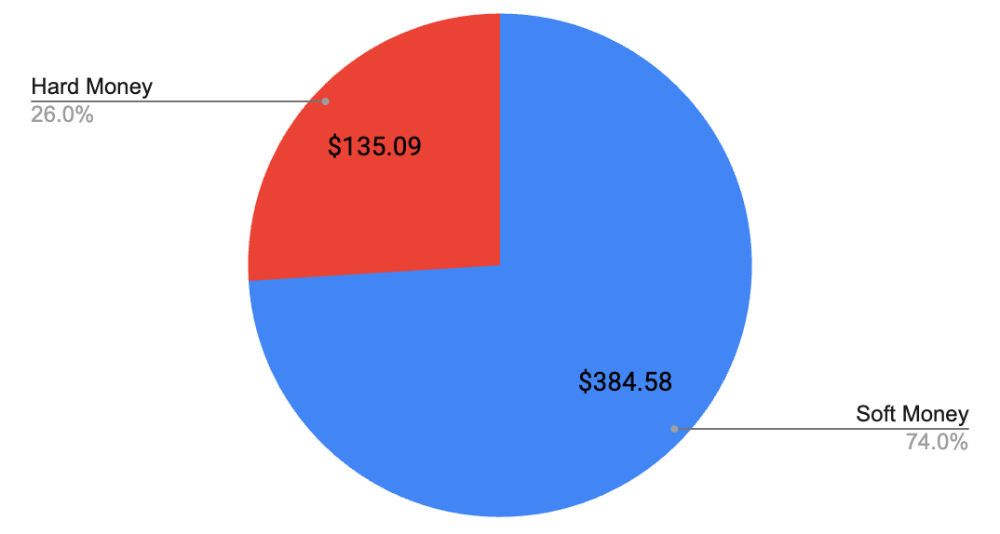
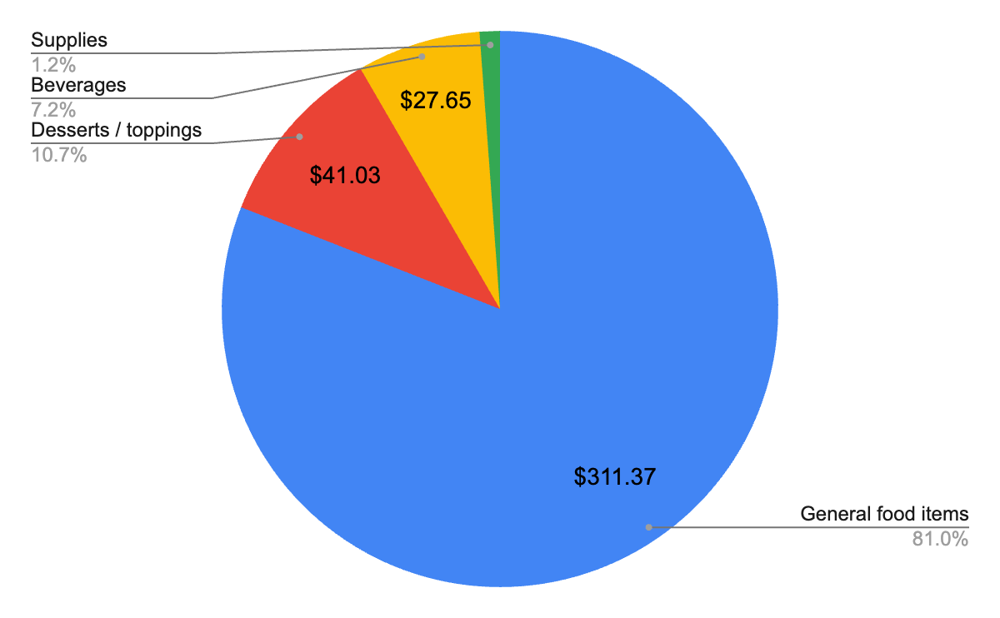
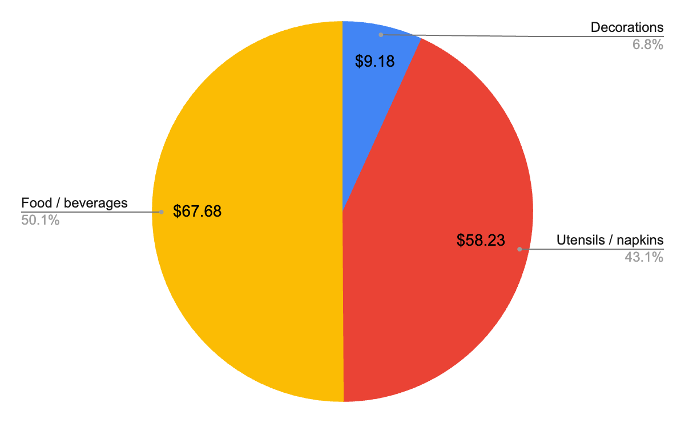
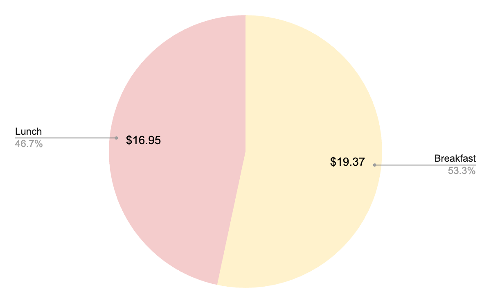
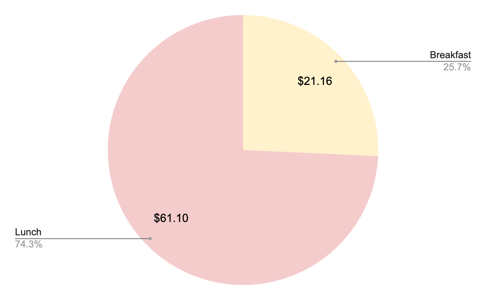
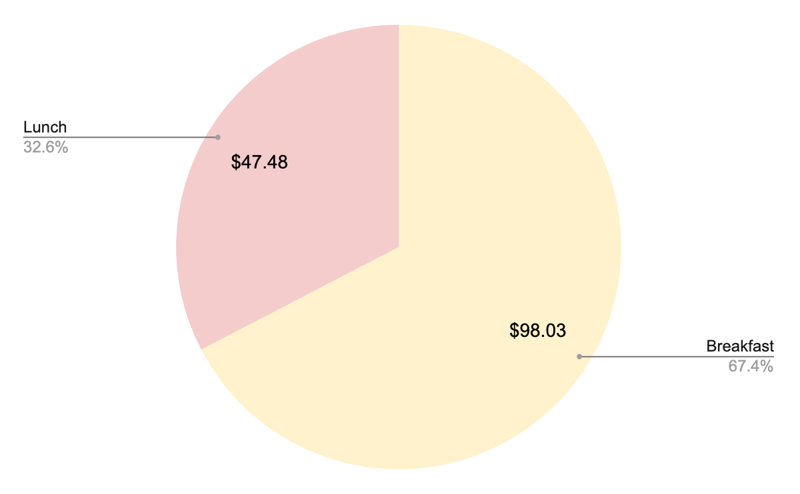
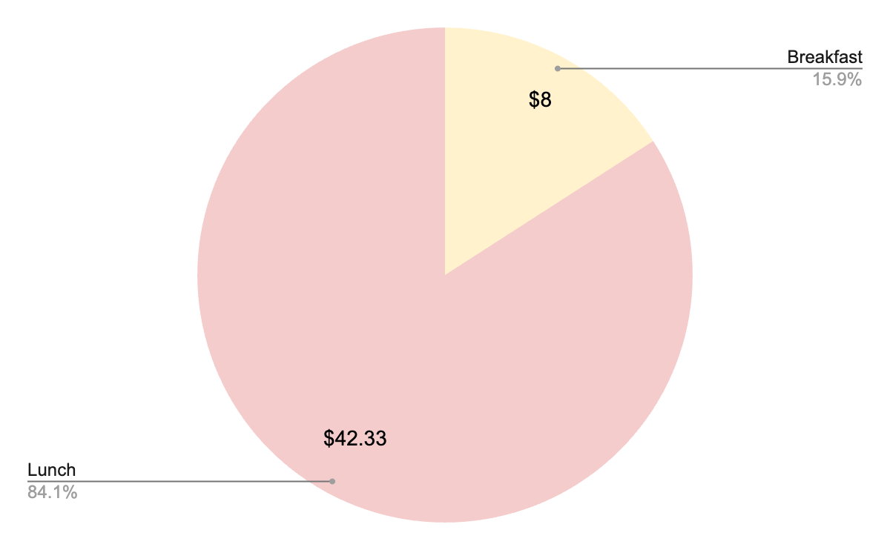
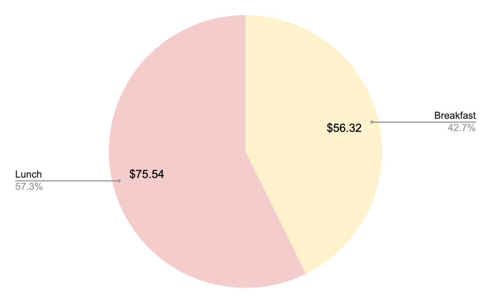
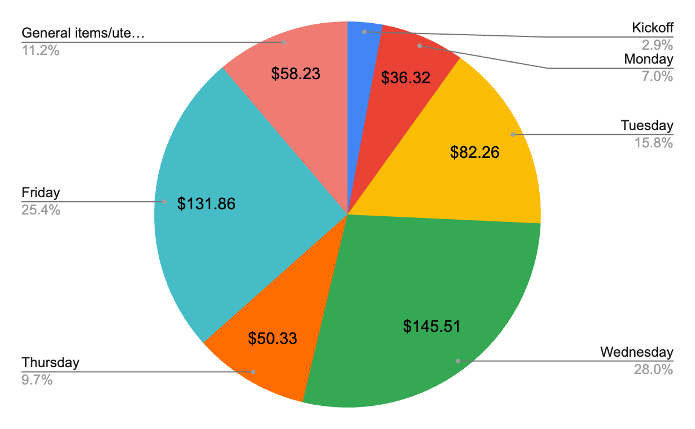

### Introduction

During the Mock Election of the 2025-2026 school year, each campaign selected a treasurer to track its hard and soft money spending. Hard money refers to store-bought, ready-made items without homemade components, such as candies, balloons, and plastic utensils. Soft money refers to items that either have homemade components or serve as toppings for homemade items. For example, whipped cream on top of hot chocolate, though purchased from a store, is classified as soft money. Other examples of soft money include Doritos used in walking tacos, oat milk used in matcha lattes, and packaged ramen that requires cooking. Kitchen appliances were used accordingly and weren’t included in the financial outlays. 

Unlike in the previous Mock Election, the hard money limit increased from $125 to $150 after an agreement between both campaigns. Although soft money remained unlimited, the treasurers were also responsible for tracking that expenditure in order to generate a better sense of overall campaign finance. One of the treasurers’ most important responsibilities was to make sure that their campaigns didn’t exceed the hard money limit, as that could result in financial strain, unfair advantages over the other campaign, and the electorate attending events for the food rather than the policies. It’s also worth noting that both campaigns made use of Mr. Gilligan’s inventory, where resources and services like utensils, construction paper, as well as black-and-white photocopying on letter papers were provided free of charge. 

When the treasurers couldn’t get a hold of a purchase receipt, they either replicated the price of a similar item or computed the price using standard market values. When determining these figures, an eight percent tax was also included for prepared foods, soft drinks, and non-food household items based on the treasurers’ best judgment of whether the items are generally taxable. These calculations are especially relevant to the plastic utensils that were purchased. 

Following this introduction are two detailed reports, one from each treasurer, providing organized records of campaign spending. These reports aim to provide transparency in campaign finances and to demonstrate that both campaigns complied with the established spending limits.

### Breakdown

#### *Chart 1: Financial Breakdown*

The total expenditure for the Shapiro campaign was $519.67, with soft money making up the majority of expenses. Specifically, soft money expenses amounted to $384.58, whereas hard money expenses amounted to $135.09. By emphasizing the use of soft money goods, the campaign’s Events Committee had the flexibility to be creative with the menu. This was especially true for items that required multiple components such as parfaits, quesadillas, and walking tacos, which served as incentives for student engagement. Most importantly, this approach ensured that the campaign stayed well within the $150 hard money budget and later allowed  the Events Committee to purchase ready-made foods for the final day of presentations, which took place in the auditorium and attracted a larger audience. 

While hard money only made up a little over a quarter of the total outlay, it was crucial to the success of the campaign, as there were limits to what can reasonably be made at home. This portion of the disbursement was dedicated to necessities like plastic utensils and common favorites such as the takeout pizzas for the final day. The campaign also made it its priority to take full advantage of the resources that were provided for free. 

The average soft money spending was $13.03, and the average hard money spending was $5.63, excluding the homemade muffins, whose price was determined using standard market value and was therefore inflated relative to the cost of their ingredients. 

The following pages specify campaign spending, which includes but aren’t limited to the breakdowns of soft money, hard money, as well as daily expenditures. Since receipts for many products weren’t submitted, the treasurer approximated the prices using standard market value. All of the sites in which these prices were derived are linked on the charts, with the dates for which these costs were accurate.

Please refer to this table as a legend for interpreting the subsequent charts.
<table>
    <tr>
        <th>Symbol</th>
        <th>Meaning</th>
    </tr>
    <tr>
        <td style="background-color: #D9EAD3;"></td>
        <td>Cost determined using standard market value</td>
    </tr>
    <tr>
        <td style="background-color: #D9D2E9;"></td>
        <td>A receipt was received for one item, but the price was replicated for similar items in which receipts were not received</td>
    </tr>
    <tr>
        <td style="background-color: #FFF2CC;"></td>
        <td>Breakfast</td>
    </tr>
    <tr>
        <td style="background-color: #F4CCCC;"></td>
        <td>Lunch</td>
    </tr>
    <tr>
        <td>*</td>
        <td>Tax (8%) was included in the cost calculation</td>
    </tr>
</table>

#### *Table 1: Soft Money*
<table>
  <thead>
    <tr>
      <th>Item</th>
      <th>Cost</th>
      <th>Calculations</th>
    </tr>
  </thead>
  <tbody>
    <tr>
      <td style="background-color: #D9EAD3;"><a href="https://www.shoprite.com/sm/pickup/rsid/3000/product/6-pack-blueberry-muffins-id-00208765000000" target="_blank">Muffins x72</a> (2/9/26) <b>[G]</b></td>
      <td>$71.88</td>
      <td>72(5.99/6)</td>
    </tr>
    <tr>
      <td style="background-color: #D9EAD3;"><a href="https://sameday.costco.com/store/costco/products/3392495-kirkland-signature-mac-and-cheese-each" target="_blank">Mac &amp; cheese x4</a> (2/9/26) <b>[G]</b></td>
      <td>$47.48</td>
      <td>11.87(4)</td>
    </tr>
    <tr>
      <td>Fruit <b>[G]</b></td>
      <td>$37.75</td>
      <td></td>
    </tr>
    <tr>
      <td style="background-color: #D9D2E9;">Cheese x3 <b>[G]</b></td>
      <td>$26.37</td>
      <td>3(8.79)</td>
    </tr>
    <tr>
      <td>Doritos (Red, Purple, Blue) <b>[G]</b></td>
      <td>$20.97</td>
      <td></td>
    </tr>
    <tr>
      <td style="background-color: #FFF2CC;">Tortilla x6 packs <b>[G]</b></td>
      <td>$20.22</td>
      <td>3.37(6)</td>
    </tr>
    <tr>
      <td>Ramen <b>[G]</b></td>
      <td>$16.95</td>
      <td></td>
    </tr>
    <tr>
      <td style="background-color: #D9EAD3;"><a href="https://www.aldi.us/product/73-27-ground-beef-roll-3-lb-0000000000001966" target="_blank">Ground beef (3lbs)</a> (2/9/26) <b>[G]</b></td>
      <td>$16.49</td>
      <td>1(16.49)</td>
    </tr>
    <tr>
      <td>Syrup x2 <b>[D]</b></td>
      <td>$15.38</td>
      <td></td>
    </tr>
    <tr>
      <td style="background-color: #D9EAD3;"><a href="https://www.walmart.com/ip/Great-Value-Chicken-Fried-Rice-20-oz-Frozen/1185511192?wl13=5891&selectedSellerId=0&wmlspartner=wlpa" target="_blank">Fried rice x2</a> (3/12/26) <b>[G]</b></td>
      <td>$13.84</td>
      <td>2(6.92)</td>
    </tr>
    <tr>
      <td style="background-color: #D9EAD3;"><a href="https://giantfoodstores.com/product/stonyfield-organic-probiotic-whole-milk-strawberry-yogurt-32-oz-tub/148541" target="_blank">Yogurt x2</a> (2/9/26) <b>[G]</b></td>
      <td>$12.58</td>
      <td>2(6.29)</td>
    </tr>
    <tr>
      <td>Pancake / waffle mix <b>[G]</b></td>
      <td>$11.99</td>
      <td></td>
    </tr>
    <tr>
      <td>Whipped cream <b>[D]</b></td>
      <td>$11.98</td>
      <td></td>
    </tr>
    <tr>
      <td style="background-color: #D9EAD3;"><a href="https://www.amazon.com/Tenzo-Tea-Organic-Sweetened-Ceremonial/dp/B0DB2S93XM" target="_blank">Matcha</a> (2/9/26) <b>[B]</b></td>
      <td>$9.99</td>
      <td>1(9.99)</td>
    </tr>
    <tr>
      <td style="background-color: #D9EAD3;"><a href="https://www.amazon.com/Swiss-Miss-Chocolate-Flavor-Canister/dp/B08WJK65XT" target="_blank">Hot cocoa mix</a> (2/9/26) <b>[B]</b></td>
      <td>$7.49</td>
      <td>1(7.49)</td>
    </tr>
    <tr>
      <td style="background-color: #D9EAD3;"><a href="https://giantfoodstores.com/product/bear-naked-peanut-butter-granola-12-oz-bag/224926" target="_blank">Granola</a> (2/9/26) <b>[D]</b></td>
      <td>$5.99</td>
      <td>1(5.99)</td>
    </tr>
    <tr>
      <td style="background-color: #D9EAD3;"><a href="https://www.amazon.com/Syruvia-Vanilla-Syrup-Coffee-Vanilla-Infused/dp/B0CGBLVQVG" target="_blank">Sweetener</a> (2/9/26) <b>[D]</b></td>
      <td>$5.99</td>
      <td>1(5.99)</td>
    </tr>
    <tr>
      <td>Tortilla chips <b>[G]</b></td>
      <td>$5.98</td>
      <td></td>
    </tr>
    <tr>
      <td>Oatmilk <b>[B]</b></td>
      <td>$5.39</td>
      <td></td>
    </tr>
    <tr>
      <td style="background-color: #D9EAD3;"><a href="https://giantfoodstores.com/product/our-brand-vitamin-d-whole-milk-1-gallon/58049" target="_blank">Milk</a> (2/9/26) <b>[B]</b></td>
      <td>$4.78</td>
      <td>1(4.78)</td>
    </tr>
    <tr>
      <td style="background-color: #D9EAD3;"><a href="https://giantfoodstores.com/product/pam-original-canola-oil-blend-no-stick-cooking-spray-6-oz-can/7819" target="_blank">Pam</a> (2/9/26)* <b>[S]</b></td>
      <td>$4.53</td>
      <td>1.08(4.19)</td>
    </tr>
    <tr>
      <td style="background-color: #D9EAD3;"><a href="https://giantfoodstores.com/product/organic-tomatoes-on-the-vine-3-4-ct-1-bunch/219357" target="_blank">Tomato</a> (2/9/26) <b>[G]</b></td>
      <td>$4.49</td>
      <td>1(4.49)</td>
    </tr>
    <tr>
      <td style="background-color: #D9EAD3;"><a href="https://giantfoodstores.com/product/our-brand-salad-shreds-shredded-iceberg-lettuce-family-size-16-oz-bag/327996" target="_blank">Lettuce</a> (2/9/26) <b>[G]</b></td>
      <td>$2.49</td>
      <td>1(2.49)</td>
    </tr>
    <tr>
      <td style="background-color: #D9EAD3;"><a href="https://giantfoodstores.com/product/our-brand-sour-cream-16-oz-tub/57587" target="_blank">Sour cream</a> (2/9/26) <b>[G]</b></td>
      <td>$1.89</td>
      <td>1(1.89)</td>
    </tr>
    <tr>
      <td style="background-color: #D9EAD3;"><a href="https://giantfoodstores.com/product/our-brand-mini-marshmallows-10.5-oz-bag/287264" target="_blank">Marshmallows</a> (2/9/26) <b>[D]</b></td>
      <td>$1.69</td>
      <td>1(1.69)</td>
    </tr>
  </tbody>
</table>

The bolded letters in the brackets correspond to the categories in Chart 2, and they indicate the sector their corresponding item is represented on the pie chart. [G] refers to “General food items,” [D] refers to “Desserts / toppings,” [B] refers to “Beverages,” and [S] refers to “Supplies.” 

Only one receipt was received that depicted the cost of a bag of shredded cheese, which was $8.79. As a result, that price was replicated for two other purchases of a similar type of cheese. The same applies to the tortillas, which cost $3.37 per pack. 

Most of these standard-value items were tax-exempt, with the only exception being Pam, as denoted by the asterisk. The most expensive single purchase was the muffins, totaling $71.88 for 72 servings, but this isn’t necessarily true. The batches were baked by campaign members, yet the price was calculated using standard market value. This inflated the estimated cost compared to what the ingredients themselves would’ve totaled. Another item that was subjected to similar estimations was the macaroni and cheese, which has the second highest cost on the chart. All the other items were relatively inexpensive, though fruits were surprisingly pricy.

#### *Chart 2: Soft Money Percentage Breakdown*

A more detailed breakdown of the soft money spending depicts that over 90 percent of the expenditure within the category went towards food items like desserts, toppings, and other general consumables. This made sense. The campaign presentations and other events were hosted early in the morning or during lunch periods, so breakfast and lunch staples like muffins and walking tacos were offered to incentivize voters, as they could attend the sessions without missing out on meals.

#### *Table 2: Hard Money*
<table>
  <thead>
    <tr>
      <th>Item</th>
      <th>Cost</th>
      <th>Calculations</th>
    </tr>
  </thead>
  <tbody>
    <tr>
      <td>Cheese pizzas x3 <b>[F]</b></td>
      <td>$57.4</td>
      <td></td>
    </tr>
    <tr>
      <td>Bowls (100), forks (336), spoons (144) <b>[U]</b></td>
      <td>$27.1</td>
      <td></td>
    </tr>
    <tr>
      <td>Plates (140 count) <b>[U]</b></td>
      <td>$12.94</td>
      <td></td>
    </tr>
    <tr>
      <td>Balloons <b>[D]</b></td>
      <td>$9.18</td>
      <td></td>
    </tr>
    <tr>
      <td style="background-color: #D9D2E9;">Cups (300 count) <b>[U]</b></td>
      <td>$8.62</td>
      <td>2(4.31)</td>
    </tr>
    <tr>
      <td>Bowls (48 count) <b>[U]</b></td>
      <td>$6.46</td>
      <td></td>
    </tr>
    <tr>
      <td>Candies <b>[F]</b></td>
      <td>$5.98</td>
      <td></td>
    </tr>
    <tr>
      <td>Soda (2 bottles) <b>[F]</b></td>
      <td>$4.3</td>
      <td></td>
    </tr>
    <tr>
      <td>Napkins <b>[U]</b></td>
      <td>$3</td>
      <td></td>
    </tr>
    <tr>
      <td style="background-color: #D9EAD3;"><a href="https://www.amazon.com/disposable-plastic-food-prep-safety-gloves/dp/B08D7457XZ" target="_blank">Food gloves (5 pairs)</a> (2/9/26) <b>[U]*</b></td>
      <td>$0.11</td>
      <td>(0.01(10))1.08</td>
    </tr>
    <tr>
      <td>Forks (~200), plates (~100), cups (~100) <b>[U]</b></td>
      <td>Free</td>
      <td>Mr. Gilligan's inventory</td>
    </tr>
    <tr>
      <td>Flyers, tape, markers, construction paper <b>[U]</b></td>
      <td>Free</td>
      <td>Mr. Gilligan's inventory</td>
    </tr>
  </tbody>
</table>

The bolded letters in the brackets correspond to the categories in Chart 3. Similar to these indications on Chart 2, they are in place to depict the sector their corresponding item is represented on the pie chart. [F] refers to “Food / beverages,” [U] refers to “Utensils / napkins,” and [D] refers to “Decorations.” 

Similar to the tortillas and cheese above, the cost of the cups was replicated at $4.31 for 150 cups.

#### *Chart 3: Hard Money Percentage Breakdown*

Similar to the “Soft Money” section, a significant portion of the spending went towards food, but that was due to the fact that the campaign was initially fiscally conservative in terms of hard money spending. One of the campaign’s plans was to splurge on the final day when presentations would take place in the auditorium and thus attract a larger audience. As a result, members ordered pizza and bought soft drinks. Out of the $67.68 in the “Food / beverages” section, $61.70 were spent on the final day of campaigning, which accounted for over 91% of the spendings in that sector. 

Aside from that, other major hard money components were utensils and napkins. Though the campaign was able to get a lot of those from Mr. Gilligan’s inventory, members still chose to buy a number of those items to make sure that there was enough.

#### *Table 3: Kickoff*
<table>
    <thead>
        <tr>
            <th>Item</th>
            <th>Cost</th>
        </tr>
    </thead>
    <tbody>
        <tr>
            <td>Balloons</td>
            <td>$9.18</td>
        </tr>
        <tr>
            <td>Candles</td>
            <td>$5.98</td>
        </tr>
    </tbody>
</table>

The campaign launched with relatively minimal but necessary spending, as its purpose was to introduce Josh Shapiro, increase his name recognition, and create a welcoming atmosphere.

#### *Chart 4: Monday*

#### *Table 4: Monday*
<table>
    <thead>
        <tr>
            <th>Item</th>
            <th>Cost</th>
        </tr>
    </thead>
    <tbody>
        <tr style="background-color: #FFF2CC;">
            <td>Pancake mix (Alan)</td>
            <td>$11.99</td>
        </tr>
        <tr style="background-color: #FFF2CC;">
            <td>Syrup (Daniel)</td>
            <td>$7.38</td>
        </tr>
        <tr style="background-color: #F4CCCC;">
            <td>Ramen (Xin, Ruiying)</td>
            <td>$16.95</td>
        </tr>
    </tbody>
</table>

Monday’s spending focused on convenient and rather inexpensive foods, allowing the campaign to get a sense of how the events would run while conserving resources for future events.

#### *Chart 5: Tuesday*

#### *Table 5: Tuesday*
<table>
    <thead>
        <tr>
            <th>Item</th>
            <th>Cost</th>
        </tr>
    </thead>
    <tbody>
        <tr style="background-color: #FFF2CC;">
            <td>Whipped cream</td>
            <td>$11.98</td>
        </tr>
        <tr style="background-color: #FFF2CC;">
            <td><a href="https://www.amazon.com/Swiss-Miss-Chocolate-Flavor-Canister/dp/B08WJK65XT" target="_blank">Hot cocoa mix</a> (2/9/26)</td>
            <td>$7.49</td>
        </tr>
        <tr style="background-color: #FFF2CC;">
            <td><a href="https://giantfoodstores.com/product/our-brand-mini-marshmallows-10.5-oz-bag/287264" target="_blank">Marshmallows</a> (2/9/26)</td>
            <td>$1.69</td>
        </tr>
        <tr style="background-color: #F4CCCC;">
            <td>Doritos (Red, Purple, Blue)</td>
            <td>$20.97</td>
        </tr>
        <tr style="background-color: #F4CCCC;">
            <td><a href="https://www.aldi.us/product/73-27-ground-beef-roll-3-lb-0000000000001966" target="_blank">Ground beef (3lbs)</a> (2/9/26)</td>
            <td>$16.49</td>
        </tr>
        <tr style="background-color: #F4CCCC;">
            <td>Cheese</td>
            <td>$8.79</td>
        </tr>
        <tr style="background-color: #F4CCCC;">
            <td>Tortilla chips (Linda)</td>
            <td>$5.98</td>
        </tr>
        <tr style="background-color: #F4CCCC;">
            <td><a href="https://giantfoodstores.com/product/organic-tomatoes-on-the-vine-3-4-ct-1-bunch/219357" target="_blank">Tomato</a> (2/9/26)</td>
            <td>$4.49</td>
        </tr>
        <tr style="background-color: #F4CCCC;">
            <td><a href="https://giantfoodstores.com/product/our-brand-salad-shreds-shredded-iceberg-lettuce-family-size-16-oz-bag/327996" target="_blank">Lettuce</a> (2/9/26)</td>
            <td>$2.49</td>
        </tr>
        <tr style="background-color: #F4CCCC;">
            <td><a href="https://giantfoodstores.com/product/our-brand-sour-cream-16-oz-tub/57587" target="_blank">Sour cream</a> (2/9/26)</td>
            <td>$1.89</td>
        </tr>
    </tbody>
</table>

Unlike Monday, Tuesday’s lunch menu included walking tacos. This attempt to attract attendees required a greater investment in the day’s lunch, explaining the rather costly sector and why there was such a big disparity between breakfast and lunch spendings.

#### *Chart 6: Wednesday*

#### *Table 6: Wednesday*
<table>
    <thead>
        <tr>
            <th>Item</th>
            <th>Cost</th>
        </tr>
    </thead>
    <tbody>
        <tr style="background-color: #FFF2CC;">
            <td><a href="https://www.shoprite.com/sm/pickup/rsid/3000/product/6-pack-blueberry-muffins-id-00208765000000" target="_blank">Muffins</a> (2/9/26)</td>
            <td>$71.88</td>
        </tr>
        <tr style="background-color: #FFF2CC;">
            <td><a href="https://www.amazon.com/Tenzo-Tea-Organic-Sweetened-Ceremonial/dp/B0DB2S93XM" target="_blank">Matcha</a> (2/9/26)</td>
            <td>$9.99</td>
        </tr>
        <tr style="background-color: #FFF2CC;">
            <td><a href="https://www.amazon.com/Syruvia-Vanilla-Syrup-Coffee-Vanilla-Infused/dp/B0CGBLVQVG" target="_blank">Sweetener</a> (2/9/26)</td>
            <td>$5.99</td>
        </tr>
        <tr style="background-color: #FFF2CC;">
            <td>Oatmilk</td>
            <td>$5.39</td>
        </tr>
        <tr style="background-color: #FFF2CC;">
            <td><a href="https://giantfoodstores.com/product/our-brand-vitamin-d-whole-milk-1-gallon/58049" target="_blank">Milk</a> (2/9/26)</td>
            <td>$4.78</td>
        </tr>
        <tr style="background-color: #F4CCCC;">
            <td><a href="https://sameday.costco.com/store/costco/products/3392495-kirkland-signature-mac-and-cheese-each" target="_blank">Mac &amp; Cheese x4</a> (2/9/26)</td>
            <td>$47.48</td>
        </tr>
    </tbody>
</table>

The highest breakfast spending occurred on Wednesday, due to the combination of an item and a beverage. This increased spending was also due to the fact that the muffins were homemade, but their price was calculated using standard market value. Compared to the breakfast, the food provided during the lunch event was significantly cheaper, despite also being homemade and calculated using standard market value.

#### *Chart 7: Thursday*

#### *Table 7: Thursday*
<table>
    <thead>
        <tr>
            <th>Item</th>
            <th>Cost</th>
        </tr>
    </thead>
    <tbody>
        <tr style="background-color: #FFF2CC;">
            <td>Syrup</td>
            <td>$8</td>
        </tr>
        <tr style="background-color: #FFF2CC;">
            <td>Waffle mix</td>
            <td>Used leftover pancake mix</td>
        </tr>
        <tr style="background-color: #F4CCCC;">
            <td>Tortilla x6</td>
            <td>$20.22</td>
        </tr>
        <tr style="background-color: #F4CCCC;">
            <td>Cheese x2</td>
            <td>$17.58</td>
        </tr>
        <tr style="background-color: #F4CCCC;">
            <td><a href="https://giantfoodstores.com/product/pam-original-canola-oil-blend-no-stick-cooking-spray-6-oz-can/7819" target="_blank">Pam</a> (2/9/26)</td>
            <td>$4.53</td>
        </tr>
    </tbody>
</table>

The lowest breakfast spending occurred on Thursday because the pancake mix from earlier in the week was reused, reducing the need for additional purchases. Though the lunch items had to be purchased, the choice to repurpose leftover pancake mix to make waffles demonstrates the campaign’s efforts to maximize resources and minimize spending.

#### *Chart 8: Friday*

#### *Table 8: Friday*
<table>
    <thead>
        <tr>
            <th>Item</th>
            <th>Cost</th>
        </tr>
    </thead>
    <tbody>
        <tr style="background-color: #FFF2CC;">
            <td>Fruit (Dylan)</td>
            <td>$37.75</td>
        </tr>
        <tr style="background-color: #FFF2CC;">
            <td><a href="https://giantfoodstores.com/product/stonyfield-organic-probiotic-whole-milk-strawberry-yogurt-32-oz-tub/148541" target="_blank">Yogurt</a> (2/9/26)</td>
            <td>$12.58</td>
        </tr>
        <tr style="background-color: #FFF2CC;">
            <td><a href="https://giantfoodstores.com/product/bear-naked-peanut-butter-granola-12-oz-bag/224926" target="_blank">Granola</a> (2/9/26)</td>
            <td>$5.99</td>
        </tr>
        <tr style="background-color: #F4CCCC;">
            <td>Cheese pizzas x3</td>
            <td>$57.4</td>
        </tr>
        <tr style="background-color: #F4CCCC;">
            <td><a href="https://www.walmart.com/ip/Great-Value-Chicken-Fried-Rice-20-oz-Frozen/1185511192" target="_blank">Fried rice</a> (3/12/26)</td>
            <td>$13.84</td>
        </tr>
        <tr style="background-color: #F4CCCC;">
            <td>Soda</td>
            <td>$4.3</td>
        </tr>
    </tbody>
</table>

Friday was the final day of campaign events. In a final attempt to cater to the electorate, the campaign decided to splurge, which explains the relatively higher spending for both breakfast and lunch as well as the food variety. Another reason for the increased expenditure was that the lunch event took place in the school’s auditorium instead of a classroom, so campaign members anticipated more voters to show up and therefore provided more food. In addition, it was determined that popular favorite foods were a great way to incentivize the electorate to attend the event and engage with the campaign, which allowed students to have a final opportunity to formally hear policies that would benefit Shapiro.

#### *Table 9: General Utensils and Items*
<table>
    <thead>
        <tr>
            <th>Item</th>
            <th>Cost</th>
        </tr>
    </thead>
    <tbody>
        <tr>
            <td>Bowls (100), forks (336), spoons (144)</td>
            <td>$27.1</td>
        </tr>
        <tr>
            <td>Plates (140 count)</td>
            <td>$12.94</td>
        </tr>
        <tr>
            <td>Cups (300 count)</td>
            <td>$8.62</td>
        </tr>
        <tr>
            <td>Bowls (48 count)</td>
            <td>$6.46</td>
        </tr>
        <tr>
            <td>Napkins</td>
            <td>$3</td>
        </tr>
        <tr>
            <td><a href="https://www.amazon.com/disposable-plastic-food-prep-safety-gloves/dp/B08D7457XZ" target="_blank">Food gloves x5 pairs</a> (2/9/26)</td>
            <td>$0.11</td>
        </tr>
        <tr>
            <td>Forks (~200), plates (~100), cups (~100)</td>
            <td>Mr. Gilligan</td>
        </tr>
        <tr>
            <td>Flyers, tape, information cards</td>
            <td>Mr. Gilligan</td>
        </tr>
    </tbody>
</table>

General utensils and serving supplies were essential for distributing food safely and efficiently during campaign events. These items also ensured that the electorate could receive and consume the food in a reasonable manner. Additional supplies such as flyers, tape, and photocopied information cards were provided by Mr. Gilligan, which helped reduce the campaign’s expenses while enhancing Shapiro’s name recognition.

#### *Table 10: Debate and Election*
<table>
    <thead>
        <tr>
            <th>Item</th>
            <th>Cost</th>
        </tr>
    </thead>
    <tbody>
        <tr>
            <td>Tape, markers, construction paper</td>
            <td>N/A, Mr. Gilligan</td>
        </tr>
        <tr>
            <td>Milk crates for ballot boxes</td>
            <td>N/A, Mr. Gilligan</td>
        </tr>
        <tr>
    </tbody>
</table>

The debate and election were managed without additional cost to the campaign, as their materials were provided by Mr. Gilligan.

#### *Table 11: Cost/Elector and Cost/Vote*
<table>
    <thead>
        <tr>
            <th>Category</th>
            <th>Cost</th>
            <th>Calculation</th>
        </tr>
    </thead>
    <tbody>
        <tr>
            <td>Cost per elector</td>
            <td>$1.28</td>
            <td>519.67/406</td>
        </tr>
        <tr>
            <td>Cost per vote</td>
            <td>$2.4</td>
            <td>519.67/212</td>
        </tr>
        <tr>
    </tbody>
</table>

According to this data, the cost per elector is significantly less than the cost per vote: the latter is 107.63% greater.

#### *Chart 9: Overall Breakdown*

This chart details the overall spending throughout the campaign, with most of the spending concentrated on Wednesday ($145.51) and Friday (131.86). The Debate and Election Day had no cost, as all of the items that were used were provided to the campaign for free. Reflecting the campaign’s goals to initially be fiscally conservative on hard money, the Kickoff only made up 2.9% of the total spending.